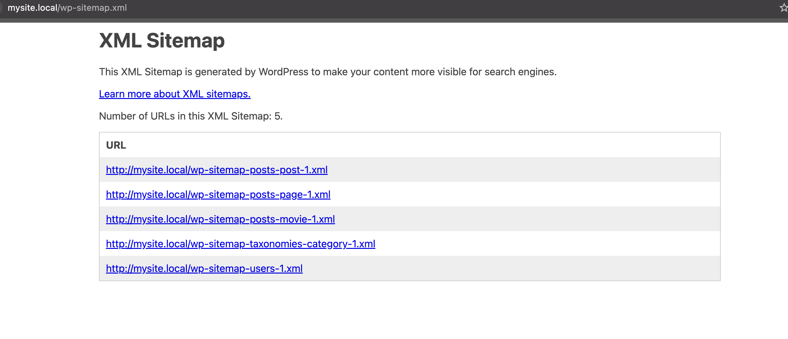

# Sitemaps in WordPress: A Comprehensive Overview

## What is a Sitemap?
A sitemap is an XML file that provides a structured list of pages on a website by helping search engines discover and crawl content more efficiently. It acts as a roadmap of your website's structure, containing important metadata about each page.
Since WordPress 5.5, there's a built-in XML sitemap generator that:

* Automatically creates sitemaps for posts, pages, and custom post types
* Dynamically updates as content is added, modified, or deleted
* Provides basic SEO and indexing support out of the box

However, this default sitemap lacks customization options, which is why many users opt for plugins like Yoast SEO or Jetpack to generate more comprehensive sitemaps.

You can view the current sitemap generated by WordPress by visiting yourdomain.com/sitemap.xml in your browser.


## Sitemaps in Headless WordPress
Headless WordPress environments introduce unique challenges for sitemap generation:

* **Separation of content management and frontend rendering**: In traditional WordPress setups, content management and frontend rendering are integrated. However, in headless environments, WordPress acts as a backend CMS, while the frontend is handled by frameworks like Next.js. This separation requires custom solutions for sitemap generation.

* **Dynamic routes**: Dynamic routes in frameworks like Next.js may not be directly accessible or easily discoverable by search engines.

* **Need for custom sitemap generation and management**: Due to the decoupling of backend and frontend, traditional WordPress sitemap plugins might not work seamlessly. Therefore, custom approaches are needed to generate and manage sitemaps effectively.

To address those, there are some proposed solutions for headless sitemap implementation:

1. **Proxying Sitemaps from Backend to Frontend**

Approach: This approach maintains WordPress's native sitemap generation capabilities while ensuring proper frontend URLs are used. It involves creating a route in your frontend application that proxies requests to the WordPress backend sitemap.

Example Code:

```javascript
// pages/[...sitemap].js
export async function GET(request, { params }) {
  const { sitemap } = params;
  const sitemapFile = Array.isArray(sitemap) ? sitemap.join('/') : sitemap;
  
  const wpSitemapUrl = `${process.env.WORDPRESS_URL}/wp-sitemap${sitemapFile ? `-${sitemapFile}` : ''}.xml`;
  
  try {
    const response = await fetch(wpSitemapUrl);
    const sitemapContent = await response.text();
    
    const transformedContent = sitemapContent.replace(
      new RegExp(process.env.WORDPRESS_URL, 'g'),
      process.env.FRONTEND_URL
    );
    
    return new Response(transformedContent, {
      headers: {
        'Content-Type': 'application/xml',
      },
    });
  } catch (error) {
    console.error('Error fetching sitemap:', error);
    return new Response('Sitemap not found', { status: 404 });
  }
}
```

This route will serve the WordPress `sitemap.xml` in your Next.js application dynamically.

- **Pros**
    * Leverages WordPress's built-in sitemap generation capabilities
    * Works seamlessly with SEO plugins like Yoast SEO or All in One SEO
    * Simple implementation that requires minimal code
    * Automatically updates when content changes in WordPress

- **Cons**
    * Limited flexibility for custom frontend routes not defined in WordPress
    * Requires proper URL transformation to replace backend URLs with frontend URLs
    * May require additional handling for caching and performance 
    * May propagate any errors experienced in WordPress when proxying the sitemap.xml

2. **Generating a Sitemap from GraphQL Content**

Approach: This approach involves fetching all available post and page info via GraphQL and generating a custom sitemap. This can be implemented using either server-side rendering (SSR) or static generation strategies. However since, WPGraphQL returns maximum 100 node per page trying to fetch all available post or pages on a large site might be problematic and slow. See [pagination limits in wp-graphql](https://www.wpgraphql.com/docs/known-limitations#pagination-limits).

Example implementation using Next.js and WPGraphQL:

```javascript
import { gql } from '@apollo/client';
import { client } from '../lib/apolloClient';

// Function to fetch all posts from WordPress
async function fetchAllPosts() {}

// Similar function for pages
async function fetchAllPages() {}

export async function generateSitemap() {
  const [posts, pages] = await Promise.all([
    fetchAllPosts(),
    fetchAllPages(),
  ]);
  const allContent = [
    ...data.posts.nodes.map(post => ({ 
      slug: `posts/${post.slug}`, 
      modified: post.modified 
    })),
    ...data.pages.nodes.map(page => ({ 
      slug: page.slug, 
      modified: page.modified 
    })),
    // Add custom frontend routes here
    { slug: '', modified: new Date().toISOString() }, // Homepage
    { slug: 'about-us', modified: new Date().toISOString() },
  ];
  const sitemap = `<?xml version="1.0" encoding="UTF-8"?>
    <urlset xmlns="http://www.sitemaps.org/schemas/sitemap/0.9">
      ${allContent.map(item => `
        <url>
          <loc>${process.env.FRONTEND_URL}/${item.slug}</loc>
          <lastmod>${item.modified}</lastmod>
        </url>
      `).join('')}
    </urlset>
  `;
  return sitemap;
}
export async function getServerSideProps({ res }) {
  const sitemap = await generateSitemap();
  
  res.setHeader('Content-Type', 'application/xml');
  res.write(sitemap);
  res.end();
  
  return { props: {} };
}

export async function GET() {
  const sitemap = await generateSitemap();
  
  return new Response(sitemap, {
    headers: {
      'Content-Type': 'application/xml',
    },
  });
}
```
- **Pros**
    * Complete control over sitemap structure and content
    * Ability to include custom frontend routes not defined in WordPress
    * Easy integration with Next.js data fetching methods

- **Cons**: 
    * More complex implementation than proxying
    * Requires manual updates to include new content types or custom routes
    * May require pagination handling for large sites
    * Doesn't leverage WordPress SEO plugin sitemap enhancements
    * Increasing the GraphQL limits may cause performance issues on resource-constrained WordPress instances.

3. **Hybrid Approach: Fetching, Parsing, and Enhancing Existing Sitemaps**

Approach: This approach (currently used by Faust) fetches the existing WordPress sitemaps, parses them, and enhances them with additional frontend routes. This provides the benefits of WordPress's sitemap generation while allowing for customization.

```javascript
import { DOMParser } from 'xmldom';

export async function GET() {
  const response = await fetch(`${process.env.WORDPRESS_URL}/wp-sitemap.xml`);
  const sitemapIndex = await response.text();
  
  const parser = new DOMParser();
  const xmlDoc = parser.parseFromString(sitemapIndex, 'text/xml');
  const sitemapUrls = Array.from(xmlDoc.getElementsByTagName('loc')).map(
    node => node.textContent
  );
  
  const processedSitemaps = await Promise.all(
    sitemapUrls.map(async (url) => {
      const sitemapResponse = await fetch(url);
      const sitemapContent = await sitemapResponse.text();
      
      return sitemapContent.replace(
        new RegExp(process.env.WORDPRESS_URL, 'g'),
        process.env.FRONTEND_URL
      );
    })
  );
  
  const frontendRoutesSitemap = `
    <?xml version="1.0" encoding="UTF-8"?>
    <urlset xmlns="http://www.sitemaps.org/schemas/sitemap/0.9">
      <url>
        <loc>${process.env.FRONTEND_URL}/custom-route</loc>
        <lastmod>${new Date().toISOString()}</lastmod>
      </url>
      <!-- Add more custom routes as needed -->
    </urlset>
  `;
  
  const combinedSitemap = `
    <?xml version="1.0" encoding="UTF-8"?>
    <sitemapindex xmlns="http://www.sitemaps.org/schemas/sitemap/0.9">
      ${processedSitemaps.map((_, index) => `
        <sitemap>
          <loc>${process.env.FRONTEND_URL}/sitemaps/wp-sitemap-${index}.xml</loc>
        </sitemap>
      `).join('')}
      <sitemap>
        <loc>${process.env.FRONTEND_URL}/sitemaps/frontend-routes.xml</loc>
      </sitemap>
    </sitemapindex>
  `;
  
  return new Response(combinedSitemap, {
    headers: {
      'Content-Type': 'application/xml',
    },
  });
}
```

- **Pros**
    * Combines the best of both approaches
    * Leverages WordPress SEO plugin enhancements
    * Allows for custom frontend routes
    * Provides flexibility for complex sitemap requirements

- **Cons**
    * Most complex implementation of the three approaches.
    * Requires handling multiple sitemap files
    * May have performance implications if not properly cached
