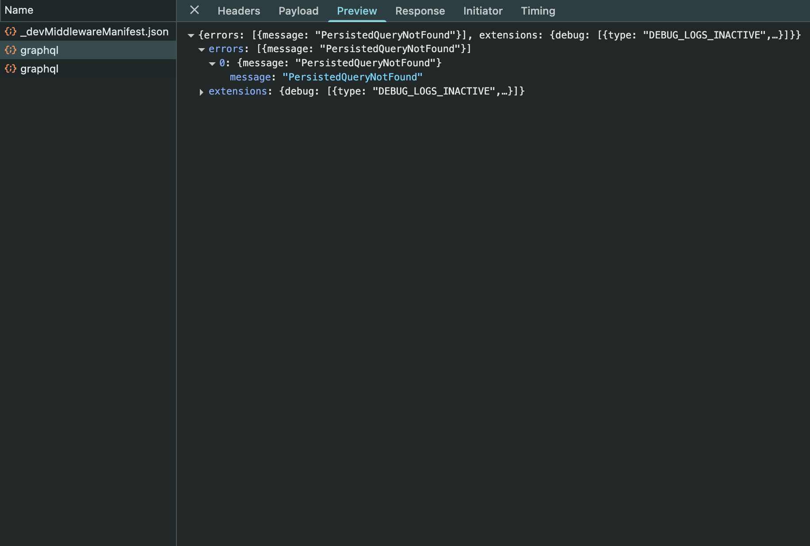
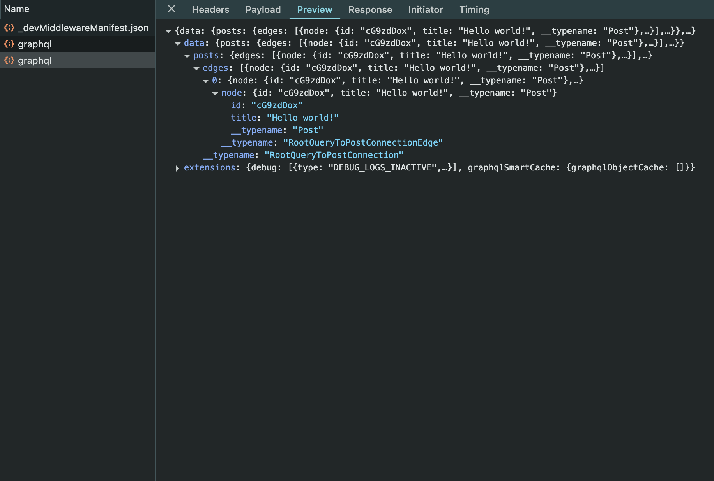
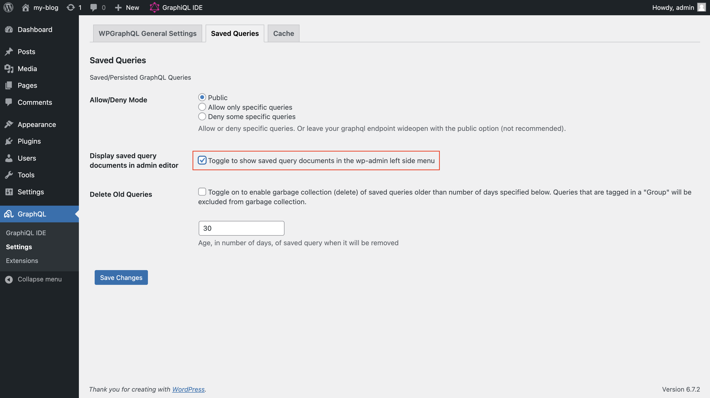
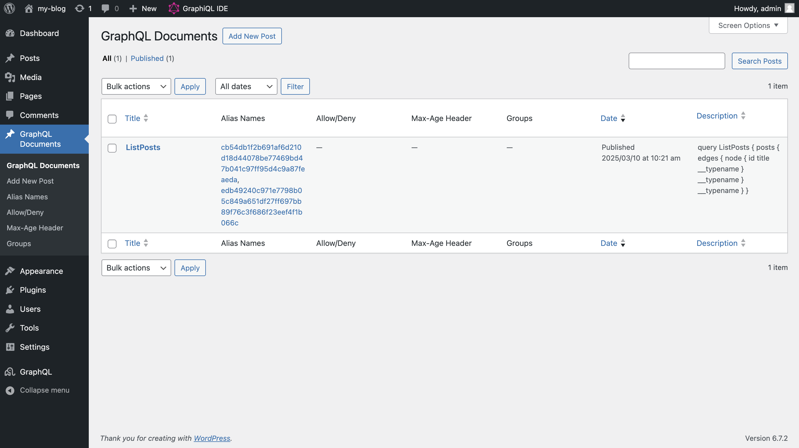
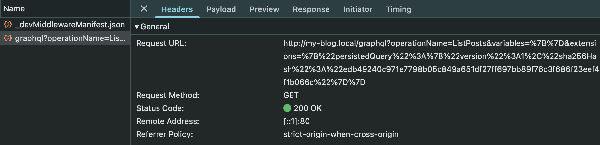

## Overview

GraphQL queries can use very detailed and long queries to get the appropriate data fields. These queries can increase the latency and put strain on the network. Automatic Persisted Queries (APQ) provides an effective solution to this issue, by hashing the queries and sending the hashes for repeated queries instead of sending the full query string.

To benefit APQ in your headless WordPress project both your front-end and WordPress setup should support this functionality.

On the front-end side [Apollo Client](https://www.apollographql.com/docs/react) provides an easy-to-use solution out-of-the box. On the WordPress side, installing [WPGraphQL Smart Cache](https://wordpress.org/plugins/wpgraphql-smart-cache/) plugin along with [WPGraphQL](https://wordpress.org/plugins/wp-graphql/) will suffice.

This guide covers how to implement APQ with Apollo Client and WPGraphQL Smart Cache. In this guide we will use Next.js with pages router to handle the front-end implementation.

> [!NOTE]  
> Automatic Persisted Queries only helps you to reduce your request size. This technique don't cache the response you get from the server.

## 0. Prerequisites

1. A WordPress installation with
   - [WPGraphQL plugin](https://wordpress.org/plugins/wp-graphql/)
   - [WPGraphQL Smart Cache plugin](https://wordpress.org/plugins/wpgraphql-smart-cache/)
2. Next.js project using Pages Router with
   - [Apollo Client package](https://www.apollographql.com/docs/react/get-started)

## 1. Setting up Apollo Client

To enable APQ in your Next.js project you need to update the configuration of your Apollo Client.

First you need to install a hashing library to be able to create a hash for the queries.

```bash
npm install js-sha256
```

Now you can create your link chain with the help of the `createPersistedQueryLink` function.

```javascript
import { ApolloClient, InMemoryCache, HttpLink } from "@apollo/client";
import { createPersistedQueryLink } from "@apollo/client/link/persisted-queries";
import { sha256 } from "js-sha256";

const persistedQueryLink = createPersistedQueryLink({ sha256 });
const httpLink = new HttpLink({
  uri: "https://your-wordpress-url.com/graphql",
});

const client = new ApolloClient({
  cache: new InMemoryCache(),
  link: persistedQueryLink.concat(httpLink),
});
```

## 2. Testing the queries

Let's create a client-side query to test the APQ. Create a new Next.js page with the code below:

```javascript
const LIST_POSTS = gql`
  query ListPosts {
    posts {
      edges {
        node {
          id
          title
        }
      }
    }
  }
`;

export default function Component() {
  const { data } = useQuery(LIST_POSTS);

  return <></>;
}
```

Open the Network tab on your browser and go to the page you've created. You should see two GraphQL queries.

The first query shows the attempt to retrieve the persisted query. But as this is the first time this query has been sent, WordPress returns an error of `PersistedQueryNotFound`.



Client makes the second query upon receiving this error. The second query sends the full query along with a sha256 hash of the same query.



Now we know that WordPress saved this query with the provided hash. Second time, when we make the exact same query, the client will just send the sha256 hash instead of the full query string.

## 3. Managing persisted queries on WordPress

You can check and manage persisted queries individually on `wp-admin` as well. To enable this feature, you need to enable the query documents menu from the Saved Queries tab in the WPGraphQL settings menu.



After saving the changes GraphQL Documents menu will appear on the left side menu. You can see the ListPosts query we've made before here.



## 4. Using GET requests for persisted queries

Apollo Client uses POST requests for both queries and mutations, making it trickier to apply effective caching. But as persisted queries are fixed-length hashes we can safely use GET queries for that purpose. This way we can use all of the caching benefits GET queries provide.

Apollo Client provides a simple setting to enable this feature. You need to include `useGETForHashedQueries: true` in the client instance. Note that this option enables GET requests **only for persisted queries**.

Your updated Apollo Client instance should look like this:

```javascript
const persistedQueryLink = createPersistedQueryLink({
  sha256,
  useGETForHashedQueries: true,
});
const httpLink = new HttpLink({
  uri: "https://your-wordpress-url.com/graphql",
});

const client = new ApolloClient({
  cache: new InMemoryCache(),
  link: persistedQueryLink.concat(httpLink),
});
```

On the Network tab you should see your query being sent as a GET request.


