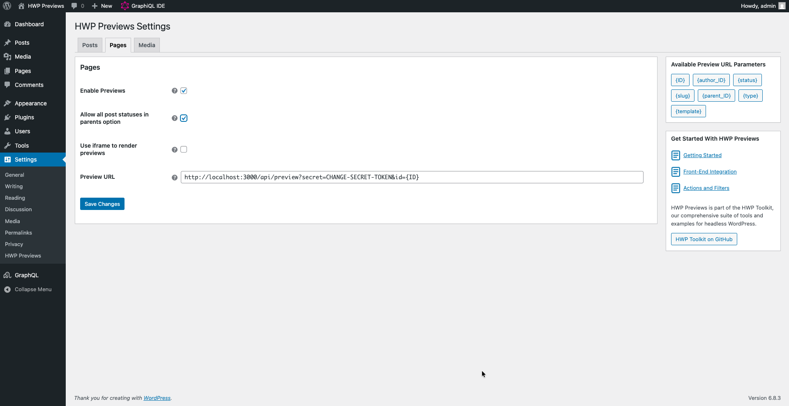
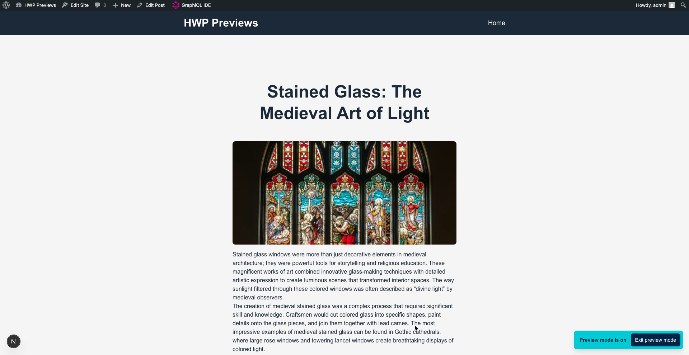

## Overview

This guide shows you how to configure preview URLs for your headless WordPress site using HWP Previews. You'll set up preview links that redirect from WordPress to your front-end application with the necessary context data.

> [!TIP]
> Want to see HWP Previews in action first? Check out the working examples in the `examples/` directory that demonstrate integration with WP GraphQL and REST API. You can run them locally using `wp-env` to test the plugin functionality before configuring your own setup.

## Prerequisites

- HWP Previews plugin installed and activated
- A running front-end application with a preview endpoint

## 1. Access the settings page

1. Log into your WordPress admin dashboard
2. Navigate to **Settings > HWP Previews**


You'll see tabs for each public post type on your site (Posts, Pages, and any custom post types).

## 2. Configure a post type

### a. Enable previews for the post type

1. Click on the tab for the post type you want to configure (e.g., "Posts")
2. Check the "Enable HWP Previews" box

> [!NOTE]  
> If you have Faust.js installed, this option will be enabled by default for all post types.

### b. Set the preview URL template

In the "Preview URL Template" field, enter your front-end preview endpoint URL with dynamic parameters:

```
https://mysite.com/api/preview?id={ID}&type={type}&status={status}
```

Available parameters:

- `{ID}` - Post ID
- `{author_ID}` - Post author's user ID
- `{status}` - Post status (draft, pending, etc.)
- `{slug}` - Post slug
- `{parent_ID}` - Parent post ID (for hierarchical types)
- `{type}` - Post type slug
- `{template}` - Template filename

The parameters sidebar shows descriptions for each available parameter.


### c. Choose the preview mode

Select how you want previews to display:

- **Iframe mode**: Check "Load Previews in Iframe" to display previews within the WordPress editor
- **New tab mode**: Leave unchecked to open previews in a new browser tab

For iframe mode to work, your front-end must not set restrictive `X-Frame-Options` headers.

### d. Optional: Configure hierarchical post types (Pages only)

For hierarchical post types like Pages, you can allow draft posts to be parents by checking "Allow All Statuses as Parent" and saving changes, which lets you build page hierarchies before publishing content.



## 3. Save your settings

Click the "Save Changes" button at the bottom of the page.

## 4. Test the preview

1. Open any post of the configured type in the editor
2. Make a change to the content
3. Click the "Preview" button

If configured correctly:
- **Iframe mode**: The preview loads within the editor
- **New tab mode**: A new tab opens with your front-end preview URL

The URL will include the dynamic parameters you specified, for example:
```
https://mysite.com/api/preview?id=42&type=post&status=draft
```



## Troubleshooting common issues

### Preview button doesn't redirect

Check that:
- The "Enable HWP Previews" checkbox is checked for that post type
- You've saved your settings
- The Preview URL Template field is not empty

### Iframe preview shows a blank screen

Your front-end may be blocking iframe embedding. Either:
- Make sure your front-end can properly handle authentication to show draft content
- Configure your front-end to allow embedding from your WordPress domain
- Switch to new tab mode by unchecking "Load Previews in Iframe"
- Make sure you 

### Dynamic parameters show "PARAMETER_NOT_FOUND"

This happens when you use a parameter that doesn't exist. Verify:
- Parameter names are spelled correctly
- Parameters are wrapped in curly braces: `{ID}` not `ID`
- The parameter is available (check the parameters sidebar)
