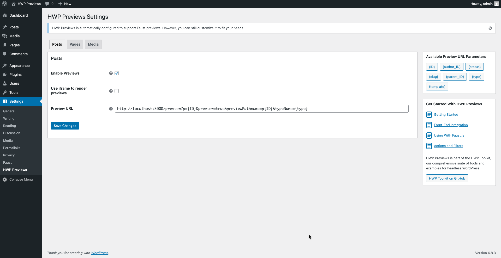

## Overview

This guide shows you how to use HWP Previews with Faust.js. The integration happens automatically when both plugins are installed.

## Prerequisites

- [Faust.js](https://wordpress.org/plugins/faustwp/) plugin installed and activated

## 1. Install HWP Previews

1. Install and activate the HWP Previews plugin
2. Navigate to **Settings > HWP Previews**

HWP Previews automatically detects Faust.js and configures itself to work with Faust's preview system.

### Automatic setup

When HWP Previews detects Faust.js, it:

1. Enables previews for all public post types
2. Sets the preview URL template to match Faust's expected format:
   ```
   {FAUST_FRONTEND_URI}/preview?p={ID}&preview=true&previewPathname=p{ID}&typeName={type}
   ```
3. Removes Faust.js's native preview link filter to prevent conflicts
4. Disables Faust's redirect functionality for preview URLs
5. Shows an admin notice on the settings page confirming the integration

The `{FAUST_FRONTEND_URI}` is automatically pulled from your Faust.js settings. If not configured, it defaults to `http://localhost:3000`.

### Authentication
HWP Previews handles preview URL generation, but authentication remains the responsibility of your Faust front-end application. Continue using [Faust.js authentication](https://faustjs.org/docs/how-to/authentication/) to access draft content in previews.

## 2. Verify the integration

1. Go to **Settings > HWP Previews**
2. Check any post type tab (Posts, Pages, etc.)
3. Verify that:
   - "Enable HWP Previews" is checked
   - The Preview URL Template contains your Faust front-end URL



## 3. Test previews

1. Open any post in the WordPress editor
2. Click the "Preview" button
3. You should be redirected to your Faust front-end preview endpoint

The preview URL will look like:
```
https://your-faust-site.com/preview?p=42&preview=true&previewPathname=p42&typeName=post
```
