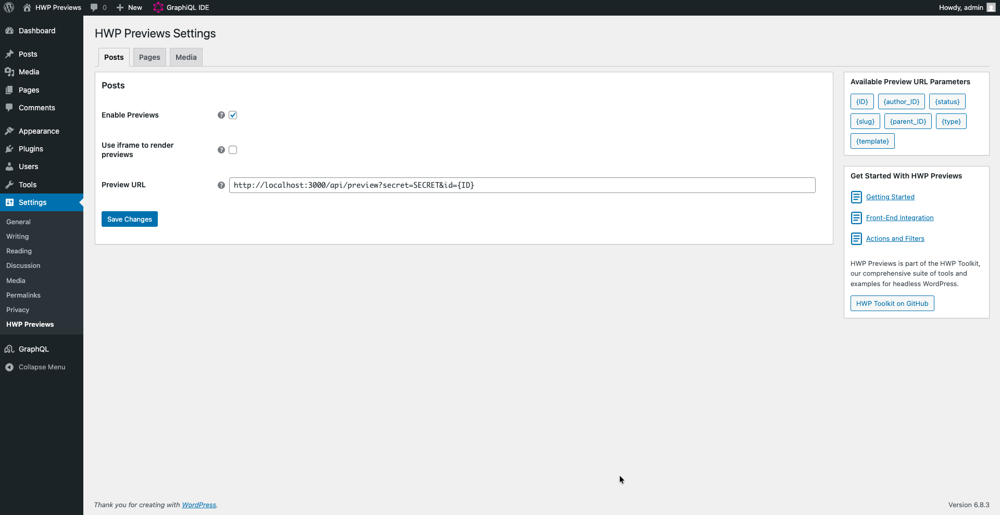

## Introduction

**HWP Previews** is a headless preview solution for WordPress that provides fully configurable preview URLs via a settings interface.

This plugin bridges the preview gap in headless WordPress architectures, allowing content creators to preview their changes in the front-end application before publishing.

## Table of Contents

* [Key Features](#key-features)
* [Setup](#setup)
* [Project Structure](#project-structure)
* [Configuration](#configuration)
* [Front-End Integration](#front-end-integration)
* [Using With Faust.js](#using-with-faustjs)
* [Documentation](#documentation)
* [Contributing](#contributing)

## Key Features

### Framework Agnostic

The plugin works with any front-end framework (Next.js, Nuxt, React, Vue, etc.) and data-fetching method (WPGraphQL, REST API, or custom endpoints).

### Per Post Type Configuration

Configure preview behavior independently for each public post type:

* Enable or disable previews
* Define custom URL templates with dynamic parameters
* Choose between iframe or new tab preview modes
* Allow draft posts as parents for hierarchical types

### Dynamic URL Templates

Use placeholder tokens to build context-rich preview URLs:

* `{ID}` - Post ID
* `{author_ID}` - Post author's user ID
* `{status}` - Post status (draft, pending, etc.)
* `{slug}` - Post slug
* `{parent_ID}` - Parent post ID (for hierarchical types)
* `{type}` - Post type slug
* `{template}` - Template filename

### Extensible Architecture

Extend the plugin through WordPress hooks and filters to add custom parameters, modify settings, or integrate with other plugins.

### Faust.js Integration

Automatic integration with Faust.js that pre-configures preview URLs and removes conflicts while maintaining existing workflows.

***

## Setup

Once the plugin is installed and activated, you can configure it under Settings > HWP Previews.

By default, no post types are configured unless you have Faust.js installed, which triggers automatic configuration.

### Quick Start

| Step | Action | Description |
| ---- | ------ | ----------- |
| 1 | Navigate to Settings | Go to **Settings > HWP Previews** in WordPress admin |
| 2 | Choose a post type | Click the tab for the post type (Posts, Pages, etc.) |
| 3 | Enable previews | Check "Enable HWP Previews" |
| 4 | Set preview URL | Enter your front-end preview endpoint with parameters |
| 5 | Save and test | Save changes and click Preview on any post |

### Basic Configuration

For each public post type, you can configure:

* **Enable HWP Previews**: Master switch to enable preview functionality for the post type
* **Preview URL Template**: The URL template with dynamic parameters that redirects to your front-end
* **Load Previews in Iframe**: Display preview within the WordPress editor or open in a new tab
* **Allow All Statuses as Parent**: (Hierarchical types only) Allow draft/pending posts as parents



> [!NOTE]  
> Settings are cached for performance. Changes may require clearing your object cache.

## Project Structure

```text
hwp-previews/
├── src/                        # Main plugin source code
│   ├── Admin/                  # Admin settings, menu, and settings page logic
│   │   └── Settings/           # Settings fields and form manager
│   ├── Hooks/                  # WordPress hooks and filters
│   ├── Integration/            # Framework integrations (Faust.js)
│   ├── Preview/                # Preview URL resolver, parameters, and services
│   ├── Plugin.php              # Main plugin class (entry point)
│   └── Autoloader.php          # PSR-4 autoloader
├── examples/                   # Example front-end integrations
│   ├── hwp-preview-wpgraphql/  # Next.js + WPGraphQL example
│   └── hwp-preview-rest/       # Next.js + REST API example
├── tests/                      # Test suites
│   ├── wpunit/                 # WPBrowser/Codeception unit tests
└─  └── e2e/                    # End-to-end tests
```

***

## Front-End Integration

HWP Previews is framework and API agnostic. You can integrate it with any front-end application and data-fetching method (WPGraphQL, REST API, or custom endpoints).

### Example Implementations

We provide working examples in the `examples/` directory:

* **[hwp-preview-wpgraphql](https://github.com/wpengine/hwptoolkit/tree/main/plugins/hwp-previews/examples/hwp-preview-wpgraphql)**: Next.js with WPGraphQL using Draft Mode
* **[hwp-preview-rest](https://github.com/wpengine/hwptoolkit/tree/main/plugins/hwp-previews/examples/hwp-preview-rest)**: Next.js App Router with REST API

### Framework-Specific Preview Guides

To implement previews from scratch, refer to your framework's documentation:

* [Next.js Draft Mode (Pages Router)](https://nextjs.org/docs/pages/guides/draft-mode)
* [Next.js Draft Mode (App Router)](https://nextjs.org/docs/app/guides/draft-mode)
* [Nuxt usePreviewMode](https://nuxt.com/docs/api/composables/use-preview-mode)

## Using With Faust.js

HWP Previews automatically integrates with [Faust.js](https://faustjs.org/) when both plugins are active. See the [Integrate with Faust.js](how-to/integrate-with-faust/index.md) guide for details.

## Documentation

### How-to guides

* [Configure Previews](how-to/configure-previews/index.md)
* [Integrate with Faust.js](how-to/integrate-with-faust/index.md)

### Explanation

* [Core Concepts](explanation/core-concepts/index.md)

## Contributing

If you feel like something is missing or you want to add documentation, we encourage you to contribute! Please check out our [Contributing Guide](https://github.com/wpengine/hwptoolkit/blob/main/CONTRIBUTING.md) for more details.
