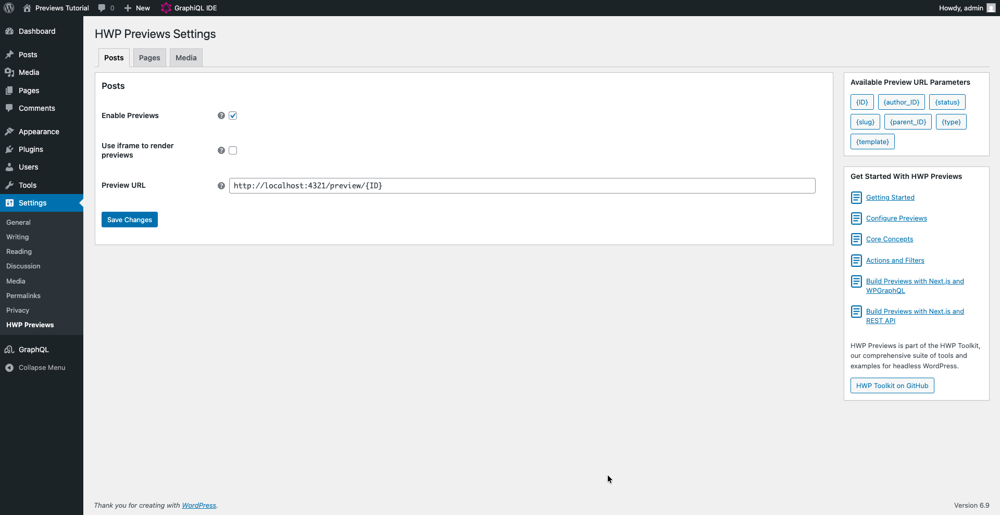
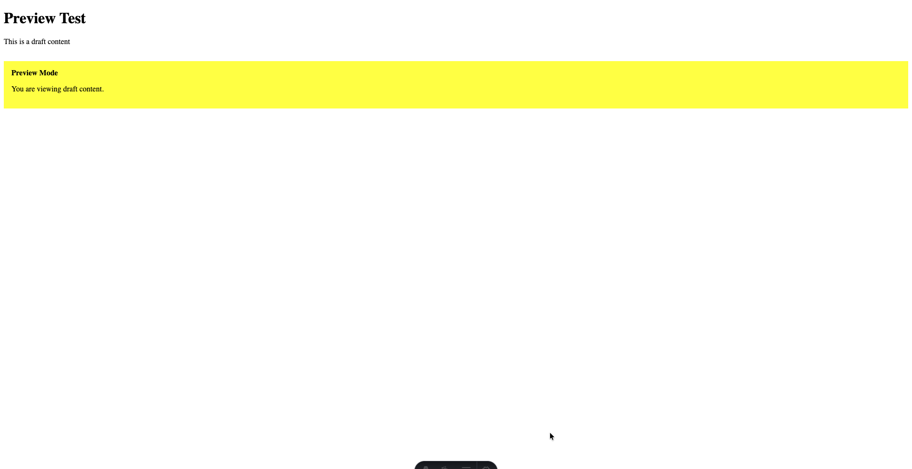

In this tutorial, we will build an Astro application that displays WordPress content and enables preview functionality for draft posts. By the end, you will have a working headless WordPress setup where clicking "Preview" in WordPress opens your draft content in Astro.

We will use Astro's server-side rendering, TanStack Query for GraphQL data fetching, and WordPress Application Passwords for authentication.

## What you'll build

By following this tutorial, you will create:

- An Astro application that fetches WordPress content via GraphQL
- A dynamic catch-all route that handles preview requests
- Preview functionality that shows draft content when you click "Preview" in WordPress
- Authentication using WordPress Application Passwords

## Prerequisites

Before starting, make sure you have:

- Node.js 18 or higher installed
- A WordPress site with HWP Previews and **WPGraphQL plugins installed**
- Basic familiarity with Astro and JavaScript

## Step 1: Create the Astro application

First, we will create a new Astro project.

Open your terminal and run:

```bash
npm create astro@latest my-wordpress-preview
```

When prompted, select:

- How would you like to start your new project? **Empty**
- Install dependencies? **Yes**
- Initialize a new git repository? **Yes** (optional)

Navigate into your project:

```bash
cd my-wordpress-preview
```

You should now see a basic Astro project structure with a `src` directory.

## Step 2: Configure Astro for server-side rendering

We need to enable server-side rendering (SSR) in Astro to handle preview requests dynamically.

Open `astro.config.mjs` and update it:

```javascript
import { defineConfig } from "astro/config";

export default defineConfig({
  output: "server",
});
```

Notice how we set `output` to `'server'`. This tells Astro to render pages on-demand rather than at build time, which is necessary for previews.

## Step 3: Install TanStack Query

We will use TanStack Query to fetch data from WordPress via GraphQL.

Install the required package:

```bash
npm install @tanstack/query-core
```

Notice that your `package.json` now includes this new dependency.

## Step 4: Create the GraphQL fetcher

Now we will create a function to fetch data from WordPress GraphQL endpoint.

Create a new file `src/lib/graphql.js`:

```javascript
const GRAPHQL_URL = "index.php?graphql";
const graphqlApi = new URL(GRAPHQL_URL, import.meta.env.PUBLIC_WORDPRESS_URL).href;

export async function fetchGraphQL(query, variables = {}, isPreview = false) {
  const headers = {
    "Content-Type": "application/json",
  };

  // Add authentication only for preview requests
  if (isPreview) {
    const username = import.meta.env.WP_USERNAME;
    const password = import.meta.env.WP_APP_PASSWORD;
    const auth = Buffer.from(`${username}:${password}`).toString("base64");
    headers.Authorization = `Basic ${auth}`;
  }

  const response = await fetch(graphqlApi, {
    method: "POST",
    headers,
    body: JSON.stringify({
      query,
      variables,
    }),
  });

  if (!response.ok) {
    throw new Error(`GraphQL request failed: ${response.statusText}`);
  }

  const json = await response.json();

  if (json.errors) {
    throw new Error(json.errors.map((e) => e.message).join(", "));
  }

  return json.data;
}
```

This creates a fetcher function that sends GraphQL requests to your WordPress endpoint. Notice how authentication headers are only added when `isPreview` is true.

## Step 5: Create environment variables

Create a `.env` file in your project root:

```bash
PUBLIC_WORDPRESS_URL=http://your-wordpress-site.com

WP_USERNAME=admin           # WordPress username which you created Application Password for
WP_APP_PASSWORD=****        # WordPress Application Password
```

Use your actual WordPress URL and username here. We will cover the Application Password in a later step.

## Step 6: Create the content fetcher

We will create a function that fetches both published and preview content using TanStack Query.

Create `src/lib/getContent.js`:

```javascript
import { QueryClient } from "@tanstack/query-core";
import { fetchGraphQL } from "./graphql.js";

const queryClient = new QueryClient();

const SEED_QUERY = `
  query GetSeedNode($id: ID! = 0, $uri: String! = "", $asPreview: Boolean = false) {
    nodeByUri(uri: $uri) @skip(if: $asPreview) {
      __typename
      uri
      id
      ... on NodeWithTitle {
        title
      }
      ... on NodeWithContentEditor {
        content
      }
      ... on ContentNode {
        databaseId
      }
    }

    contentNode(id: $id, idType: DATABASE_ID, asPreview: true) @include(if: $asPreview) {
      __typename
      uri
      id
      ... on NodeWithTitle {
        title
      }
      ... on NodeWithContentEditor {
        content
      }
      ... on ContentNode {
        databaseId
      }
    }
  }
`;

export async function getContent({ uri, id, asPreview = false }) {
  return queryClient.fetchQuery({
    queryKey: ["content", asPreview ? id : uri, asPreview],
    queryFn: async () => {
      const data = await fetchGraphQL(SEED_QUERY, { uri, id, asPreview }, asPreview);
      return asPreview ? data.contentNode : data.nodeByUri;
    },
  });
}
```

This function uses TanStack Query to fetch and cache content. The query uses GraphQL directives (`@skip` and `@include`) to conditionally fetch either published content via `nodeByUri` or preview content via `contentNode`. Notice how the query key changes based on whether it's a preview request.

## Step 7: Create the catch-all route

Now we will create a dynamic route that handles all requests, including previews.

Create `src/pages/[...uri].astro`:

```astro
---
import { getContent } from '../lib/getContent.js';

const { uri = '/' } = Astro.params;

// Check if this is a preview request by looking for /preview/ in the path
const isPreview = uri.startsWith('preview/');
const postId = isPreview ? uri.replace('preview/', '') : undefined;

// Fetch the content from WordPress
let node;
try {
  node = await getContent({
    uri,
    id: postId,
    asPreview: isPreview,
  });
} catch (error) {
  console.error('Error fetching content:', error);
  return new Response('Content not found', { status: 404 });
}

if (!node) {
  return new Response('Content not found', { status: 404 });
}
---

<!DOCTYPE html>
<html lang="en">
  <head>
    <meta charset="UTF-8" />
    <meta name="viewport" content="width=device-width" />
    <title>{node.title}</title>
  </head>
  <body>
    <main>
      <article>
        <h1 set:html={node.title} />
        <div set:html={node.content} />
        {isPreview && (
          <div style="background: yellow; padding: 1rem; margin-top: 2rem;">
            <strong>Preview Mode</strong>
            <p>You are viewing draft content.</p>
          </div>
        )}
      </article>
    </main>
  </body>
</html>
```

Notice how this single route handles both regular content and previews. When the URL path starts with `/preview/`, it extracts the post ID from the path and fetches preview content. Otherwise, it fetches published content using the URI. TanStack Query automatically caches the results to improve performance.

## Step 8: Generate a WordPress Application Password

Now we need to create an Application Password in WordPress for authentication.

1. Log into your WordPress admin
2. Go to Users > Profile
3. Scroll down to "Application Passwords"
4. Enter a name like "Astro Preview"
5. Click "Add Application Password"


Copy the generated password (it will look like `xxxx xxxx xxxx xxxx xxxx xxxx`). You will not be able to see it again.

Update your `.env` file with this password:

```bash
WP_APP_PASSWORD=xxxx xxxx xxxx xxxx xxxx xxxx
```

## Step 9: Configure HWP Previews in WordPress

We will now configure the preview URL in WordPress to point to your Astro app.

1. In WordPress admin, go to Settings > HWP Previews
2. Click the "Posts" tab
3. Check "Enable HWP Previews"
4. In the Preview URL Template field, enter:
   ```
   http://localhost:4321/preview/{ID}
   ```
5. Click "Save Changes"



Notice how we use `/preview/{ID}` in the URL path. This works reliably for draft posts which may not have a slug yet. WordPress will automatically replace `{ID}` with the actual post ID. The presence of `/preview/` in the path will signal that this is a preview request.

## Step 10: Start your application

Start the Astro development server:

```bash
npm run dev
```

You should see output indicating the server is running at `http://localhost:4321`.

## Step 11: Test the preview

Now we will test that previews work correctly.

1. In WordPress, create or edit a post
2. Make some changes but do not publish
3. Click the "Preview" button

You should be redirected to your Astro application showing your draft content. Notice the yellow banner at the bottom indicating you're in preview mode.



If you see your draft content with the preview banner, congratulations! Your preview system is working.

## What you've learned

Through building this application, you have learned:

- How to set up Astro with server-side rendering for dynamic content
- How to use TanStack Query to fetch data from WordPress GraphQL API
- How to authenticate preview requests using WordPress Application Passwords
- How WordPress query parameters control preview behavior

## Next steps

Now that you have a working preview system, you can:

- Add support for Pages and custom post types
- Create a proper layout component for consistent styling
- Add loading states and better error handling
- Implement the WordPress template hierarchy for different content types
- Deploy your application to a hosting platform that supports SSR

For a more complete example with template hierarchy support, see the [full Astro example](https://github.com/wpengine/hwptoolkit/tree/main/plugins/hwp-previews/examples/hwp-preview-astro) which includes these additional features.
