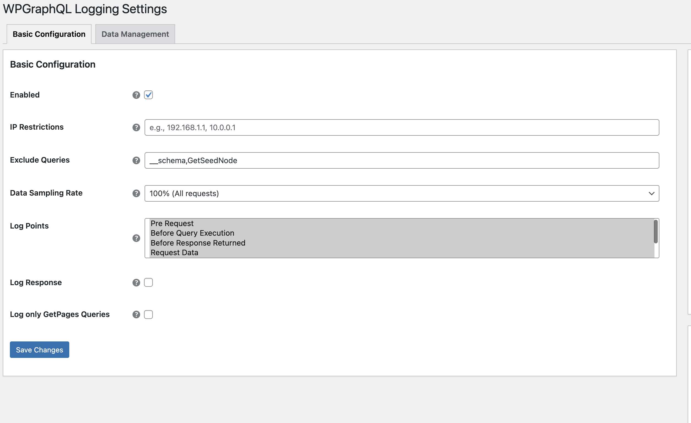

In this guide, you will learn how to extend the WPGraphQL Logging plugin's admin interface by adding custom settings fields and integrating them with the logging system.

We will demonstrate how to create a new checkbox field in the admin settings, retrieve its value programmatically, and use it to control logging behavior through custom rules. This approach is useful for adding application-specific configuration options, creating conditional logging scenarios, or providing users with granular control over what gets logged in their GraphQL operations.

## Step 1 - Add Settings Field

Add a field to an existing tab using the provided filters. Common tabs are `basic_configuration` and `data_management`.


```php
<?php

use WPGraphQL\Logging\Admin\Settings\Fields\Tab\BasicConfigurationTab;
use \WPGraphQL\Logging\Admin\Settings\Fields\Field\CheckboxField;

add_filter( 'wpgraphql_logging_basic_configuration_fields', function( $fields ) {
    $fields['log_only_get_pages_query'] = new CheckboxField(
        'log_only_get_pages_query',
        BasicConfigurationTab::get_name(),
        __( 'Log only GetPages Queries', 'my-plugin' )
    );
    return $fields;
});
```


*Example of a custom checkbox field added to the Basic Configuration tab*


Notes:

* DataManagementTab available too
* Field classes available: `CheckboxField`, `TextInputField`, `SelectField`, `TextIntegerField`.
* Data stored in the wp_option `wpgraphql_logging_settings`

e.g.
```php
<?php
use WPGraphQL\Logging\Admin\Settings\ConfigurationHelper;

$configuration = ConfigurationHelper::get_instance();
$option_key = $configuration->get_option_key();
$option_values = $configuration->get_option_value('log_only_get_pages_query');

```

## Step 2: Implement Custom Rule

Using the Rule Manager, we will add a custom rule to see if this is checked, and if so make sure the query contains `GetPages`.

First, let's create the rule. This class will implement the `LoggingRuleInterface` and contain the logic to check our custom setting.

```php
<?php

namespace MyPlugin\Logging;

use WPGraphQL\Logging\Logger\Api\LoggingRuleInterface;

class PageQueryRule implements LoggingRuleInterface {

    public function passes( array $config, ?string $query_string = null ): bool {

		// Check if enabled.
		$enabled = $config['log_only_get_pages_query'] ? (bool)$config['log_only_get_pages_query'] : false;
		if ( ! $enabled ) {
			return true;
		}

        return stripos( $query_string, 'GetPages' ) !== false;
    }

	public function get_name(): string {
        // Ensure this is unique
        return 'log_only_page_queries';
    }
}
```

### Step 3: Add Rule to the Rule Manager

Next, we need to add this rule to the `RuleManager` using the `wpgraphql_logging_rules` filter in your plugin's main file or functions.php.

```php
<?php

use MyPlugin\Logging\PageQueryRule;

add_filter( 'wpgraphql_logging_rules', function( $default_rules ) {
	$default_rules[] = new PageQueryRule();
    return $default_rules;
}, 10, 1);
```


We should now log queries with `GetPages` in the query e.g.

```gql
query GetPages($first: Int) {
  pages(first: $first) {
    nodes {
      title
      uri
    }
  }
}
```

## Contributing

We welcome and appreciate contributions from the community. If you'd like to help improve this documentation, please check out our [Contributing Guide](https://github.com/wpengine/hwptoolkit/blob/main/CONTRIBUTING.md) for more details on how to get started.
