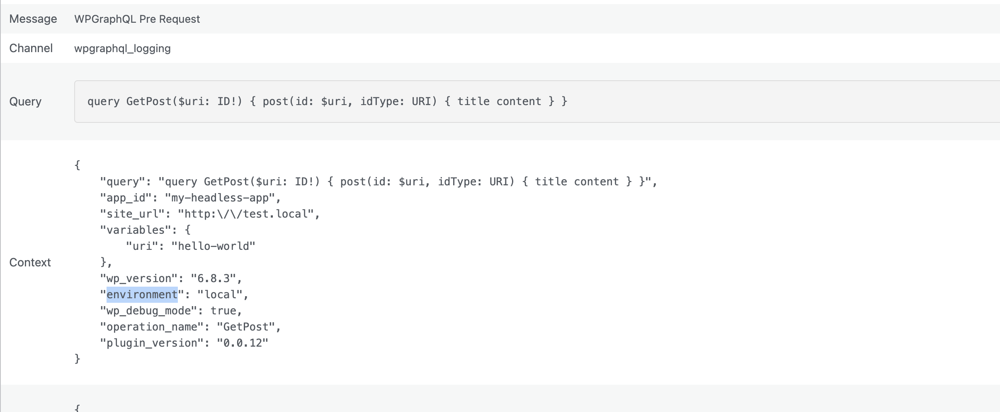

## Overview

This guide shows you how to transform an event and modify context and level for an event.

> \[!NOTE]
> See the [Events Reference](../../reference/events/index.md) for available built-in events and their mappings.


*Example of custom context data being added to a WPGraphQL event log entry*

## Example: Add Context Data and Change the Monolog Level

Use the `WPGraphQL\Logging\Plugin::transform()` helper to mutate the event payload before it is logged and emitted.

```php
<?php
use WPGraphQL\Logging\Plugin;
use WPGraphQL\Logging\Events\Events;
use Monolog\Level;

// Add custom context to the PRE_REQUEST event
add_action( 'init', function() {
    Plugin::transform( Events::PRE_REQUEST, function( array $payload ): array {
        $payload['context']['environment'] = wp_get_environment_type();
        $payload['context']['app_id']      = 'my-headless-app';

        // Optional: change the log level for this specific event
        $payload['level'] = Level::Error;

        return $payload;
    }, 10 );
} );
```

You can target any event constant from `WPGraphQL\Logging\Events\Events`, for example:

* `Events::PRE_REQUEST` (maps to `do_graphql_request`)
* `Events::BEFORE_GRAPHQL_EXECUTION` (maps to `graphql_before_execute`)
* `Events::BEFORE_RESPONSE_RETURNED` (maps to `graphql_return_response`)
* `Events::REQUEST_DATA` (filter `graphql_request_data`)
* `Events::REQUEST_RESULTS` (filter `graphql_request_results`)
* `Events::RESPONSE_HEADERS_TO_SEND` (filter `graphql_response_headers_to_send`)

## Contributing

We welcome and appreciate contributions from the community. If you'd like to help improve this documentation, please check out our [Contributing Guide](https://github.com/wpengine/hwptoolkit/blob/main/CONTRIBUTING.md) for more details on how to get started.
