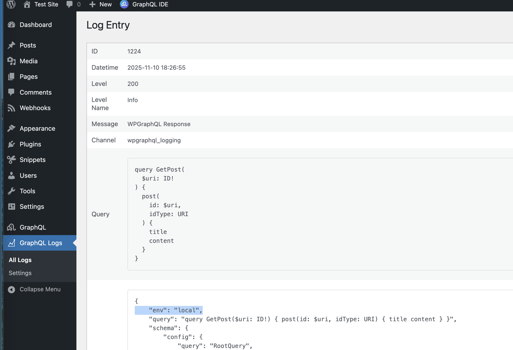

## Overview

The plugin exposes a lightweight pub/sub bus around key WPGraphQL lifecycle events and bridges them to standard WordPress actions/filters. You can:

* Subscribe (read-only) to observe event payloads
* Transform payloads before core code logs and emits them
* Publish your own custom events for your app/plugins

> \[!NOTE]
> See the [Events Reference](../../reference/events/index.md) for available built-in events and their mappings.

## Core concepts

* Subscribe (read-only): `Plugin::on( $event, callable $listener, $priority )`
* Transform (mutate): `Plugin::transform( $event, callable $transform, $priority )`
* Emit (publish): `Plugin::emit( $event, array $payload )`

Priorities run ascending (lower numbers first). Transforms must return the updated payload array; subscribers receive the payload and do not return.

## Example 1: Subscribe to an event

```php
<?php

use WPGraphQL\Logging\Plugin;
use WPGraphQL\Logging\Events\Events;


add_action( 'init', function() {
    Plugin::on( Events::PRE_REQUEST, function( array $payload ): void {
        $context = $payload['context'] ?? [];
        $path = WP_CONTENT_DIR;
		error_log(json_encode($context, JSON_PRETTY_PRINT),3, $path . '/debug.json');
    }, 10 );
} );
```

This will save the pre-request context data into your wp-content directory in a `debug.json` file.

e.g.

```json
{
    "query": "query GetPost($uri: ID!) {\n  post(id: $uri, idType: URI) {\n    title\n    content\n  }\n}",
    "variables": {
        "uri": "hello-world"
    },
    "operation_name": "GetPost"
}
```


## Example 2: Transform an event payload

The example below adds the WordPress environment variable to the context payload before the response is returned.

```php
<?php

use WPGraphQL\Logging\Plugin;
use WPGraphQL\Logging\Events\Events;

// 2) Transform the payload before it is logged/emitted by core code
add_action( 'init', function() {
    Plugin::transform( Events::BEFORE_RESPONSE_RETURNED, function( array $payload ): array {
        // Note you can change either the context or level
        $payload['context']['env']       = wp_get_environment_type();

        return $payload;
    }, 5 );
} );
```




### Example 3: Emit your own event

You can emit custom events from anywhere in your codebase, but a common use case is to emit an event from within a WPGraphQL resolver. This allows you to create specific log entries or trigger actions based on the execution of your GraphQL operations.

For example, you could emit an event after a specific mutation has been resolved:

```php
<?php
use WPGraphQL\Logging\Plugin;

register_graphql_mutation( 'myCustomMutation', [
    'inputFields'         => [
		'myField' => [
			'type'        => 'String',
			'description' => __( 'A field for my mutation.', 'my-textdomain' ),
		],
	],
	'outputFields'        => [
		'success' => [
			'type'        => 'Boolean',
			'description' => __( 'Whether or not the mutation was successful.', 'my-textdomain' ),
		],
	],
    'resolve' => function( $root, $args, $context, $info ) {
        // Do mutation logic...
        $result = ['success' => true];

        // Emit a custom event
        Plugin::emit( 'my_plugin/my_custom_mutation_resolved', [
            'context' => [
                'input' => $args['input'],
                'result' => $result
            ],
        ] );

        return $result;
    }
] );
```

## Contributing

We welcome and appreciate contributions from the community. If you'd like to help improve this documentation, please check out our [Contributing Guide](https://github.com/wpengine/hwptoolkit/blob/main/CONTRIBUTING.md) for more details on how to get started.
