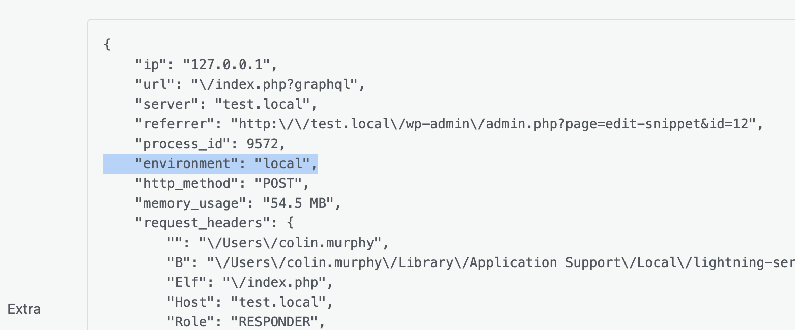

## Overview

This guide shows you how to add a custom processor and add the current WordPress environment variable to the extra data.

### What is a Processor?

Processors in Monolog add or transform data on each log record before handlers write it. They can modify the `context` or `extra` arrays on a record. See [Monolog documentation](https://seldaek.github.io/monolog/doc/02-handlers-formatters-processors.html).

### Step 1: Create a processor class

Create a PHP class that implements `Monolog\Processor\ProcessorInterface` and returns the updated `LogRecord`.

```php
<?php
namespace MyPlugin\Logging;

use Monolog\LogRecord;
use Monolog\Processor\ProcessorInterface;

class EnvironmentProcessor implements ProcessorInterface {
    public function __invoke( LogRecord $record ): LogRecord {
        $record->extra['environment'] = wp_get_environment_type();
        return $record;
    }
}
```

### Step 2: Register the processor globally

Use the `wpgraphql_logging_default_processors` filter to add your processor to all logger instances.

```php
<?php
add_filter( 'wpgraphql_logging_default_processors', function( array $processors ) {
    $processors[] = new \MyPlugin\Logging\EnvironmentProcessor();
    return $processors;
});
```

### (Optional) Per-instance registration

Register the processor for a specific logger channel by passing it to `LoggerService::get_instance()`.

```php
<?php
use WPGraphQL\Logging\Logger\LoggerService;

$logger = LoggerService::get_instance( 'env_channel', null, [ new \MyPlugin\Logging\EnvironmentProcessor() ] );
$logger->info( 'Environment test' );
```

You should see `environment` in the log record's `extra` data (e.g. in the Logs admin UI or your chosen handler output).



## Contributing

We welcome and appreciate contributions from the community. If you'd like to help improve this documentation, please check out our [Contributing Guide](https://github.com/wpengine/hwptoolkit/blob/main/CONTRIBUTING.md) for more details on how to get started.
