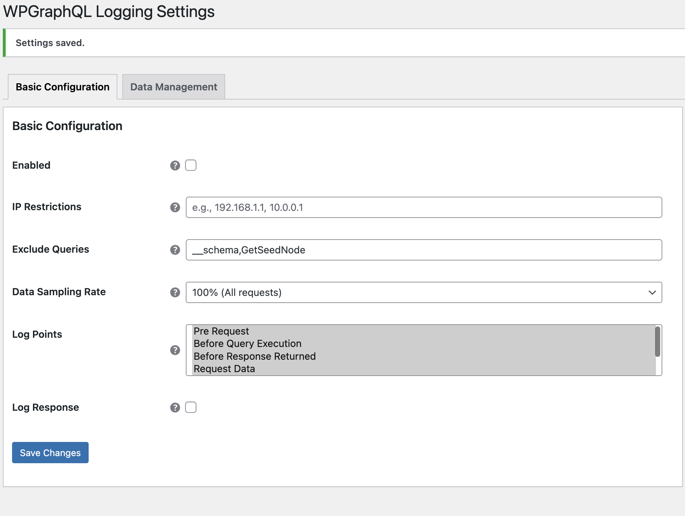
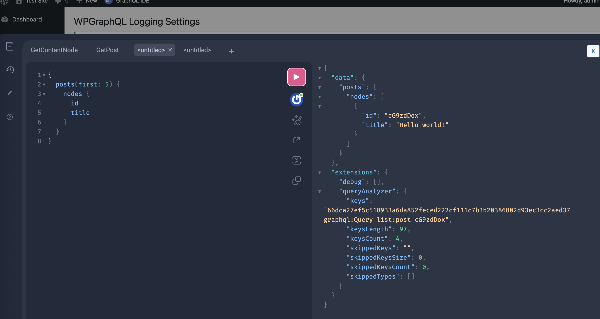
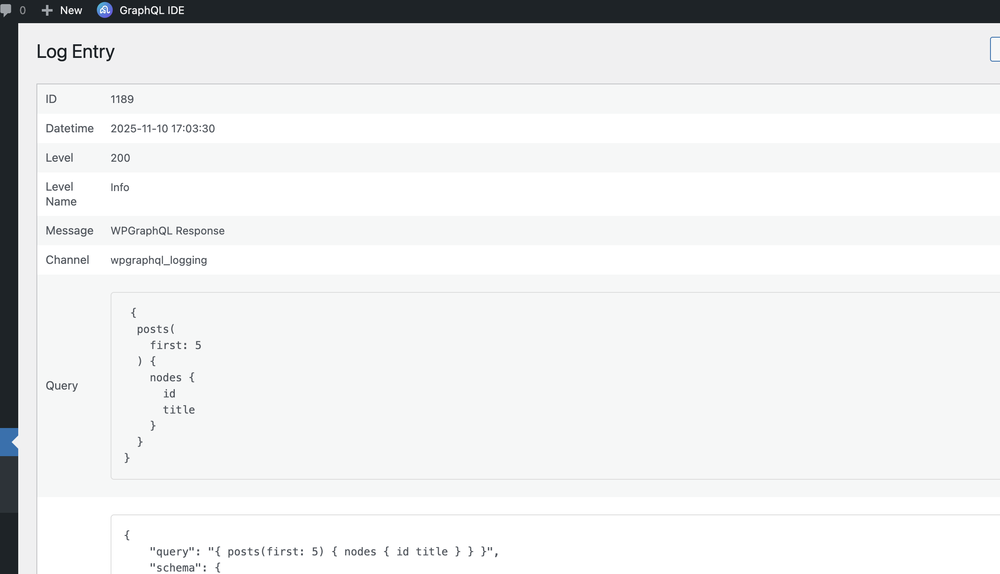

## Overview

This guide shows how to create a custom logging rule that only passes when the GraphQL query contains a specific substring (like "GetPost"), and how to register it with the RuleManager.

### What is a Rule?

Rules implement [`WPGraphQL\Logging\Logger\Rules\LoggingRuleInterface`](https://github.com/wpengine/hwptoolkit/blob/main/plugins/wpgraphql-logging/src/Logger/Api/LoggingRuleInterface.php) and are evaluated by the [`RuleManager`](https://github.com/wpengine/hwptoolkit/blob/main/plugins/wpgraphql-logging/src/Logger/Rules/RuleManager.php). All rules must pass for logging to proceed.

Interface reference (methods):

* `passes( array $config, ?string $query_string ): bool`
* `get_name(): string`

> \[!NOTE]
> The query will be only logged if all rules pass.

## Option 1: Add a new rule

Firstly create a class that implements the interface and returns true only if the query contains a given substring.

```php
<?php
namespace MyPlugin\Logging\Rules;

use WPGraphQL\Logging\Logger\Api\LoggingRuleInterface;

class ContainsStringRule implements LoggingRuleInterface {
    public function __construct( private readonly string $needle ) {}

    public function passes( array $config, ?string $query_string = null ): bool {
        if ( ! is_string( $query_string ) || '' === trim( $query_string ) ) {
            return false; // No query => fail
        }
        return stripos( $query_string, $this->needle ) !== false;
    }

    public function get_name(): string {
        // Ensure unique name per rule; adjust if you need multiple variants
        return 'contains_string_rule';
    }
}
```

We then need to register the rule with the RuleManager. Use the `wpgraphql_logging_rule_manager` filter to add your rule. This runs when the logger helper initializes rules.

```php
<?php
add_filter( 'wpgraphql_logging_rule_manager', function( $rule_manager ) {
    // Only pass when the query contains the word "GetPost"
    $rule_manager->add_rule( new \MyPlugin\Logging\Rules\ContainsStringRule( 'GetPost' ) );
    return $rule_manager;
});
```

Assuming all other rules are passing, If you query

```gql
{
  posts(first: 5) {
    nodes {
      id
      title
    }
  }
}
```

This data will not be logged.

However if you query:

```gql
query GetPost($uri: ID!) {
  post(id: $uri, idType: URI) {
    title
    content
  }
}
```

where the $uri is a valid post slug, then it should log the data into WPGraphQL Logging Plugin.

## Option 2: Remove rules from the RuleManager

You can also remove default rules from the RuleManager using the `wpgraphql_logging_rules` filter. This filter runs before rules are added to the manager, allowing you to modify the array of rules.

In this example, we will disable the plugin but remove the rule for checking whether the plugin is enabled or not.

```php
<?php
use WPGraphQL\Logging\Logger\Rules\EnabledRule;

add_filter( 'wpgraphql_logging_rules', function( array $rules ) {
    foreach ( $rules as $i => $rule ) {
        if ( $rule instanceof EnabledRule ) {
            unset( $rules[ $i ] );
        }
    }
    return array_values( $rules );
} );
```

The result should be if you have unchecked "Enabled" under Basic Configuration, the event should be logged providing it passes other rules.

## Screenshots

### Enabled Setting - Disabled



### Query



### Admin Logs View



The query was logged even with the enabled checkbox unchecked as we removed the default rule.

## Contributing

We welcome and appreciate contributions from the community. If you'd like to help improve this documentation, please check out our [Contributing Guide](https://github.com/wpengine/hwptoolkit/blob/main/CONTRIBUTING.md) for more details on how to get started.
