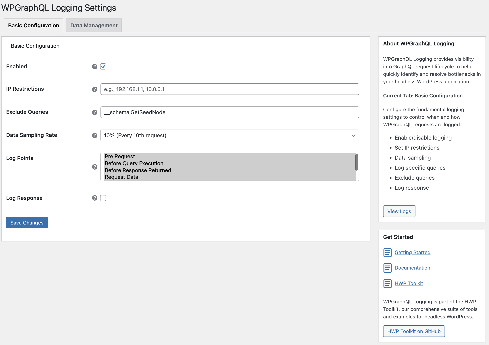
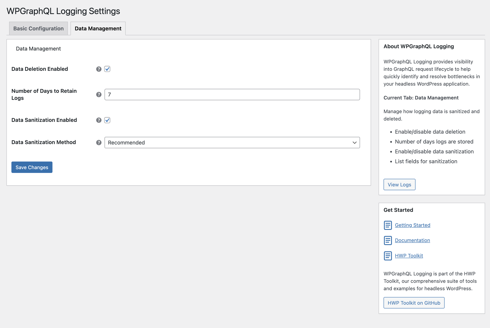
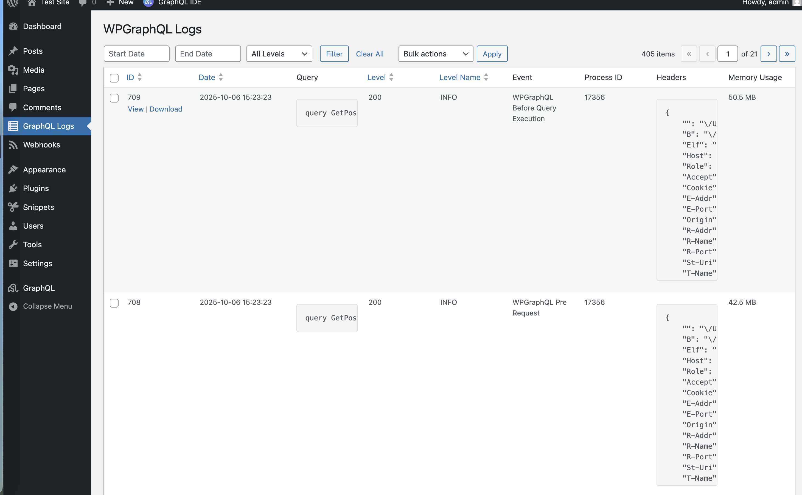
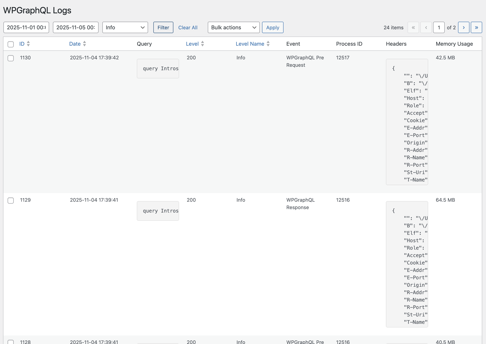

# WPGraphQL Logging Plugin

WPGraphQL Logging is a comprehensive logging utility for WPGraphQL. It provides detailed insights into the GraphQL lifecycle, from initial request to final response, helping developers debug queries, monitor performance, and secure their applications. This plugin is built to be extensible, allowing you to customize everything from data storage to logging rules.

## Table of Contents

- [Project Structure](#project-structure)
- [Key Features](#key-features)
- [Setup](#setup)
- [Basic Configuration](#basic-configuration)
- [Viewing Logs](#viewing-logs)
- [Uninstallation and Data Cleanup](#uninstallation-and-data-cleanup)
- [How-to Guides](#how-to-guides)
- [Reference](#reference)

---


## Project Structure

```text
wpgraphql-logging/
├── assets/                     # Main plugin assets for CSS and JS
├── src/                        # Main plugin source code
│   ├── Admin/                  # Admin settings, menu, and settings page logic
│   │   └── Settings/           # Admin settings functionality for displaying and saving data.
│   ├── Events/                 # Event logging, pub/sub event manager for extending the logging.
│   ├── Logger/                 # Logger service, Monolog handlers & processors
│   │   ├── Api/                # Api interfaces for fetching and writing log data
│   │   ├── Database/           # Database entity and helper
│   │   ├── Handlers/           # Monolog WordPress database handler for logging data
│   │   ├── Processors/         # Monolog processors for data sanitization and request headers
│   │   ├── Rules/              # Rules and RuleManager to decide whether to log a query
│   │   ├── Scheduler/          # Automated data cleanup and maintenance tasks
│   │   └── Store/              # Log storage service
│   ├── Plugin.php              # Main plugin class (entry point)
│   └── Autoloader.php          # PSR-4 autoloader
├── tests/                      # All test suites
│   ├── e2e/                    # End-to-end tests
│   └── wpunit/                 # WPBrowser/Codeception unit tests
├── [wpgraphql-logging.php]
├── [activation.php]
├── [composer.json]
├── [deactivation.php]
├── [CHANGELOG.md]
└── [README.md]
```

---

## Key Features

- **End-to-end GraphQL lifecycle logging**
  - **Pre Request** (`do_graphql_request`): captures `query`, `variables`, `operation_name`.
  - **Before Execution** (`graphql_before_execute`): snapshots request `params`.
  - **Before Response Returned** (`graphql_return_response`): inspects `response`; auto-elevates level to Error when GraphQL `errors` are present (adds `errors` to context).
  - **Request Data** (`graphql_request_data`): filters and logs the raw `query`, `variables`, and `operationName` from the request body.
  - **Response Headers** (`graphql_response_headers_to_send`): filters response headers, adds `X-WPGraphQL-Logging-ID` for traceability.
  - **Request Results** (`graphql_request_results`): filters and logs the final `response`; auto-elevates level to Error when GraphQL `errors` are present.

- **Developer-friendly pub/sub and transform system**
  - Programmatic API: `Plugin::on($event, $listener)`, `Plugin::transform($event, $callable)`, `Plugin::emit($event, $payload)`.
  - Prioritized execution: lower priority runs earlier for both subscribers and transforms.
  - WordPress bridges: actions `wpgraphql_logging_event_{event}` and filters `wpgraphql_logging_filter_{event}` to integrate with standard hooks.
  - Safe-by-default: exceptions in listeners/transforms are caught and logged; they do not break the pipeline.
  - See: Reference › Events (`docs/reference/events.md`) and How‑to guides (`docs/how-to/events_pub_sub.md`, `docs/how-to/events_add_context.md`).

- **Extensible Monolog pipeline**
  - Default handler: `WordPressDatabaseHandler` stores logs in `{$wpdb->prefix}wpgraphql_logging`.
  - Add handlers via filter `wpgraphql_logging_default_handlers` (e.g., file, Slack, HTTP, etc.).
  - Add processors via filter `wpgraphql_logging_default_processors` (e.g., enrich records with user/site data).
  - Customize `default_context` via `wpgraphql_logging_default_context`.
  - Use `LoggerService::get_instance()` to build custom channels, handlers, processors.

- **Configurable rule-based logging**
  - Built-in rules: enabled toggle, IP restrictions, exclude queries, sampling rate, null query guard, response logging toggle.
  - All rules are orchestrated by a `RuleManager` ensuring logs only emit when all rules pass.
  - Extend rules: hook `wpgraphql_logging_rule_manager` to add custom `LoggingRuleInterface` implementations.

- **Automated data management**
  - **Daily cleanup scheduler**: removes old logs based on retention.
  - **Configurable retention period**: choose days to keep (default 7).
  - **Manual cleanup**: trigger from the admin UI.
  - **Data sanitization**: built-in `DataSanitizationProcessor` removes/anonymizes/truncates sensitive fields with recommended or custom rules.

- **Admin UI for operations**
  - Logs list view with filters (level, date range) and CSV export.
  - Bulk delete actions and visibility controls.

- **Composable and testable architecture**
  - Clear separation: Events bus, Logger service, Rules, Processors, Handlers.
  - Designed for extension via interfaces, filters, and helper APIs.

---

## Setup

Once the plugin is installed and activated, you can configure the plugin under GraphQL Logs -> Settings.

>[!IMPORTANT]
> Once activated, the plugin will install default configuration and activate logging with data sampling set at 10%.

When you install for the first time it sets the following default configuration:

**Basic Configuration**
- Enabled = true
- Exclude Queries = `__schema,GetSeedNode` - To exclude introspection and Faust Seed Node queries.
- Data Sampling = 10% - Log only 10% of the queries.
- Log Points - Selects all

**Data Management**

- Data Deletion Enabled = true
- Number of Days to Retain Logs = 7
- Data Sanitization Enabled = true
- Data Sanitization Method = Recommended


### Basic Configuration



- **Enabled**: The master switch to turn logging on or off.
- **IP Restrictions**: A comma-separated list of IPv4/IPv6 addresses. When set, only requests originating from these IPs will be logged. This is particularly useful for developers who wish to log only their own queries.
- **Exclude Queries**: A comma-separated list of GraphQL query or mutation names to be excluded from logging. This helps reduce noise by ignoring frequent or uninteresting operations.
- **Data Sampling Rate**: A dropdown to select the percentage of requests that will be logged. This is useful for managing log volume on high-traffic sites by only capturing a sample of the total requests.
- **Log Points**: A multi-select field to choose the specific WPGraphQL lifecycle events for which data should be logged.
- **Log Response**: A toggle to determine whether the GraphQL response body should be included in the log. Disabling this can reduce the size of your log data.

>[!NOTE]
> Logging enablement is determined by a set of rules managed by a `RuleManager`. All rules must pass to log a request. See the Logger reference for the RuleManager hook: [wpgraphql_logging_rule_manager](reference/logging.md#trait-loggerlogginghelper).


### Data Management



- **Enable Data Deletion**: A toggle to enable a daily WP-Cron job that automatically deletes old log entries based on the retention period.
- **Log Retention Period**: Specify the number of days to keep log data before it is automatically deleted.
- **Enable Data Sanitization**: The master switch to turn data sanitization on or off. When enabled, sensitive data is cleaned from logs before being stored.
- **Data Sanitization Method**: Choose between two sanitization methods:
	- **Recommended Rules (Default)**: Uses pre-configured rules to automatically sanitize common sensitive fields in WordPress and WPGraphQL. The following fields are sanitized by either removing them or anonymizing their values:
		- `request.app_context.viewer.data` (User data object)
		- `request.app_context.viewer.allcaps` (User capabilities)
		- `request.app_context.viewer.cap_key` (Capability keys)
		- `request.app_context.viewer.caps` (User capability array)
		- `variables.username` (WP `user_login`)
		- `variables.password` (User password)
		- `variables.email` (User email)
	- **Custom Rules**: Define your own sanitization rules by specifying fields to anonymize, remove, or truncate.


## Viewing Logs

Once setup, you can view logs under GraphQL Logs -> All Logs. The admin screen is a custom implementation of the WordPress `WP_List_Table` class and provides several powerful features for managing your logs.



### Downloading Logs

You can download the logs in CSV format.

```csv
ID,Date,Level,"Level Name",Message,Channel,Query,Context,Extra
5293,"2025-10-06 15:41:34",200,INFO,"WPGraphQL Response",wpgraphql_logging,"{ posts(first: 10) ...""memory_peak_usage"":""18 MB""}"
```


### Filtering Logs

You can filter logs by:
1. Level
2. Start Date
3. End Date



### Bulk Actions

You can delete selected logs or all logs using the bulk action controls.


## Uninstallation and Data Cleanup

By default, WPGraphQL Logging preserves all logged data when the plugin is deactivated to prevent accidental data loss. If you want to completely remove all plugin data (including database tables) when deactivating the plugin, you must explicitly enable this behavior.

### Enabling Database Cleanup on Deactivation

To enable automatic database cleanup when the plugin is deactivated, add the following constant to your `wp-config.php` file or in a must-use plugin:

```php
define( 'WP_GRAPHQL_LOGGING_UNINSTALL_PLUGIN', true );
```

> [!WARNING]
> **Data Loss Warning**: When `WP_GRAPHQL_LOGGING_UNINSTALL_PLUGIN` is defined as `true`, deactivating the plugin will permanently delete all logged data and drop the plugin's database tables. This action is irreversible.


## How to Guides

### Logging

- [How to Add a New Handler (File Logging)](how-to/add-new-handler/index.md)
- [How to Add a New Processor](how-to/logger_add_new_processor.md)
- [How to Add a New Rule (Query must contain string)](how-to/logger_add_new_rule.md)
- [How to replace the database log service](how-to/logger_replace_log_store_service.md)

### Events
- [How to use the Events pub/sub system](how-to/events_pub_sub.md)
- [How to add context data to a logged WPGraphQL event](how-to/events_add_context.md)


### Admin
- [How to add a new Settings tab to WPGraphQL Logging](how-to/admin_add_new_tab.md)
- [How to add a new field to an existing tab and query it](how-to/admin_add_fields.md)
- [How to add a new column to the Logs admin grid](how-to/admin_add_view_column.md)


### Testing
- [How to run the test suites](how-to/run_tests.md)


## Reference

- Admin: [Actions/Filters](reference/admin.md)
- Events: [Actions/Filters](reference/events.md)
- Logging: [Actions/Filters](reference/logging.md)

## Contributing

If you feel like something is missing or you want to add documentation, we encourage you to contribute! Please check out our [Contributing Guide](https://github.com/wpengine/hwptoolkit/blob/main/CONTRIBUTING.md) for more details.
