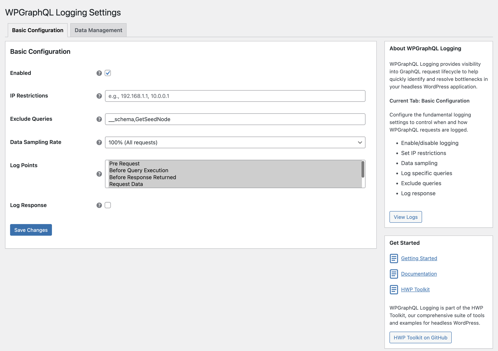
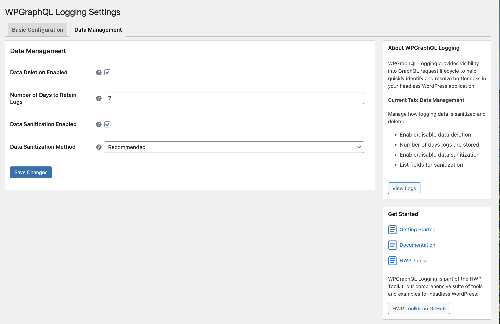
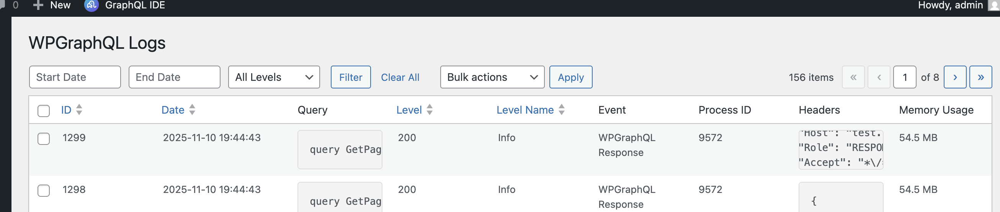

**WPGraphQL Logging Plugin** provides **observability and visibility** into the **GraphQL request and event lifecycle**.

This allows users to **quickly identify** and **resolve performance issues** and bottlenecks within their headless WordPress application.

## Key Features

### WPGraphQL Event Lifecycle

The plugin captures key events for the WPGraphQL event lifecycle (configurable)

* **Pre Request**
* **Before Execution**
* **Before Response Return**
* **Request Data**
* **Response Headers**
* **Request Results**

### Pub/Sub Event System

Built with developers and plugins in mind, the plugin allows users to listen to individual events and transform or collect data from those events.

### Monolog Implementation

The plugin is built using the PHP logging library [Monolog](https://github.com/Seldaek/monolog) with a default handler to log data to the database. The plugin can easily be extended to add, change or remove default processors and handlers.

### Rule based logging

The plugin determines whether to log an event based on a set rules defined in a rule manager. This is built to be easily extended by users to customize or add their own rules.

### Data Management

The plugin provides comprehensive data management capabilities, allowing you to configure which fields should be removed, truncated, or anonymized to protect sensitive information.

### Admin UI

The plugin delivers a admin UI with some filtering of logs around dates or level and the ability to download logs in CSV format.

***

## Setup

Once the plugin is installed and activated, you can configure the plugin under GraphQL Logs -> Settings.

By default the following settings are pre-configured.

### Basic Configuration

| Setting         | Default Value          | Description                                          |
| --------------- | ---------------------- | ---------------------------------------------------- |
| Enabled         | true                   | Master switch to enable/disable logging              |
| Exclude Queries | `__schema,GetSeedNode` | To exclude introspection and Faust Seed Node queries |
| Data Sampling   | 10%                    | Log only 10% of the queries                          |
| Log Points      | Selects all            | Which lifecycle events to log                        |

### Data Management

| Setting                       | Default Value | Description                           |
| ----------------------------- | ------------- | ------------------------------------- |
| Data Deletion Enabled         | true          | Enable automatic log cleanup          |
| Number of Days to Retain Logs | 7             | How long to keep logs before deletion |
| Data Sanitization Enabled     | true          | Enable data sanitization              |
| Data Sanitization Method      | Recommended   | Which sanitization rules to apply     |

### Basic Configuration



* **Enabled**: The master switch to turn logging on or off.
* **IP Restrictions**: A comma-separated list of IPv4/IPv6 addresses. When set, only requests originating from these IPs will be logged.
* **Exclude Queries**: A comma-separated list of GraphQL query or mutation names to be excluded from logging.
* **Data Sampling Rate**: A dropdown to select the percentage of requests that will be logged.
* **Log Points**: A multi-select field to choose the specific WPGraphQL lifecycle events for which data should be logged.
* **Log Response**: A toggle to determine whether the GraphQL response body should be included in the log.

### Data Management



* **Data Deletion Enabled**: Enable data deletion daily via the WP-Cron schedule.
* **Number of Days to Retain Logs**: Number of days logged should be stored.
* **Data Sanitization Enabled**: Enable data sanitization.
* **Data Sanitization Method**: Choose between two sanitization methods (default is recommended)
  * **Recommended Rules (Default)**: The following fields will be removed from the event data.
    * `request.app_context.viewer.data`
    * `request.app_context.viewer.allcaps`
    * `request.app_context.viewer.cap_key`
    * `request.app_context.viewer.caps`
    * `variables.username`
    * `variables.password`
    * `variables.email`
  * **Custom Rules**: Define your own sanitization rules by specifying fields to anonymize, remove, or truncate.

## Project Structure

```text
wpgraphql-logging/
├── assets/                     # Main plugin assets for CSS and JS
├── src/                        # Main plugin source code
│   ├── Admin/                  # Admin settings, menu, and settings page logic
│   │   └── Settings/           # Admin settings functionality for displaying and saving data.
│   ├── Events/                 # Event logging, pub/sub event manager for extending the logging.
│   ├── Logger/                 # Logger service, Monolog handlers & processors
│   │   ├── Api/                # Api interfaces for fetching and writing log data
│   │   ├── Database/           # Database entity and helper
│   │   ├── Handlers/           # Monolog WordPress database handler for logging data
│   │   ├── Processors/         # Monolog processors for data sanitization and request headers
│   │   ├── Rules/              # Rules and RuleManager to decide whether to log a query
│   │   ├── Scheduler/          # Automated data cleanup and maintenance tasks
│   │   └── Store/              # Log storage service
│   ├── Plugin.php              # Main plugin class (entry point)
│   └── Autoloader.php          # PSR-4 autoloader
├── tests/                      # All test suites
│   ├── e2e/                    # End-to-end tests
│   └── wpunit/                 # WPBrowser/Codeception unit tests
├── [wpgraphql-logging.php]
├── [activation.php]
├── [composer.json]
├── [deactivation.php]
├── [CHANGELOG.md]
└── [README.md]
```

## Viewing Logs

Once setup, you can view logs under GraphQL Logs -> All Logs. The admin screen is a custom implementation of the WordPress `WP_List_Table` class and provides several powerful features for managing your logs.



### Downloading Logs

You can download individual logs in CSV format.

**Example**

```csv
ID,Date,Level,"Level Name",Message,Channel,Query,Context,Extra
5293,"2025-10-06 15:41:34",200,INFO,"WPGraphQL Response",wpgraphql_logging,"{ posts(first: 10) ...""memory_peak_usage"":""18 MB""}"
```

### Filtering Logs

You can also filter logs with the following filters:

1. Level
2. Start Date
3. End Date

> \[!NOTE]
> Indexes have been added to the level and datetime column for the database handler to help improve performance.


### Bulk Actions

You can delete selected logs or all logs using the bulk action controls.

## Uninstallation

By default, WPGraphQL Logging preserves all logged data when the plugin is deactivated to prevent accidental data loss.

If you would like to remove all logged data, you must set the PHP constant before you uninstall the plugin:

```php
define( 'WP_GRAPHQL_LOGGING_UNINSTALL_PLUGIN', true );
```

> \[!WARNING]
> **Data Loss Warning**: When `WP_GRAPHQL_LOGGING_UNINSTALL_PLUGIN` is defined as `true`, deactivating the plugin will permanently delete all logged data and drop the plugin's database tables. This action is irreversible.

## Contributing

If you feel like something is missing or you want to add documentation, we encourage you to contribute! Please check out our [Contributing Guide](https://github.com/wpengine/hwptoolkit/blob/main/CONTRIBUTING.md) for more details.
