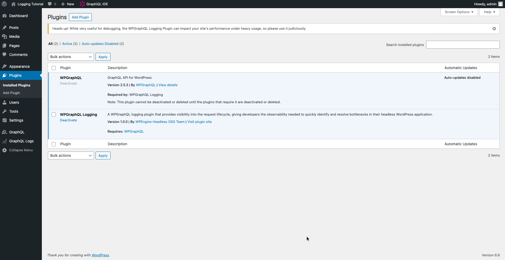
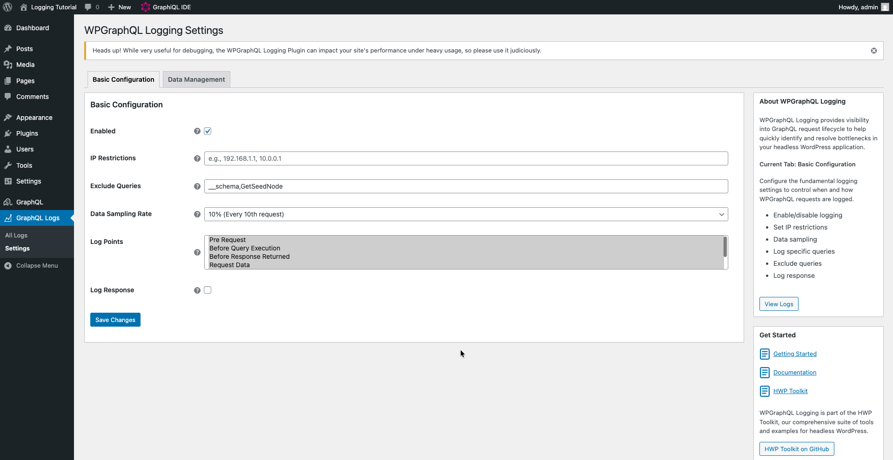
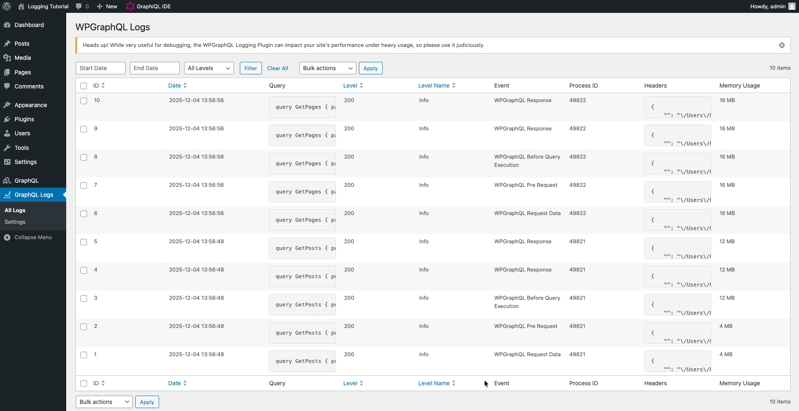
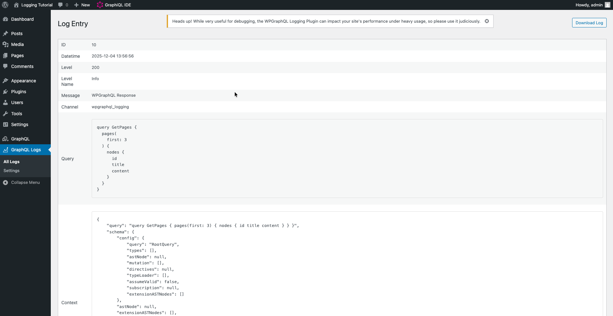
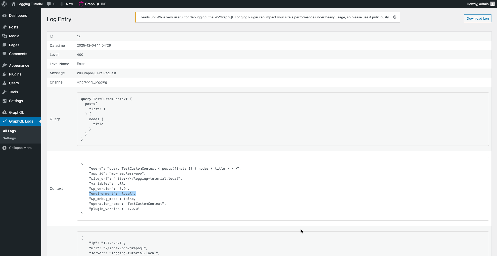

In this tutorial, you will install and configure the WPGraphQL Logging plugin to track GraphQL queries in your WordPress site. By the end, you will have a working logging system that captures query data, and you will know how to extend it with custom context data.

We will use WPGraphQL IDE to run queries, view logs in the WordPress admin, and write PHP code to extend the plugin's functionality.

> [!TIP]
> This tutorial assumes you're working with a local WordPress development environment. If you don't have one, you can set one up using [Local](https://localwp.com/).

## What you'll build

By following this tutorial, you will create:

* A working WPGraphQL Logging setup that tracks GraphQL queries
* Custom context data added to logs using the event system
* A configured admin interface to view and filter logged queries

## Prerequisites

Before starting, make sure you have:

* WordPress 6.5 or higher installed
* PHP 8.1.2 or higher
* WPGraphQL 2.3 or higher installed and activated
* Basic familiarity with WordPress, WPGraphQL, and PHP
* The ability to add PHP code to a custom plugin or theme's functions.php

## Step 1: Install the WPGraphQL Logging plugin

First, we will install the WPGraphQL Logging plugin. Since this plugin extends WPGraphQL, make sure you have WPGraphQL installed and activated before proceeding.

Download the latest release from the GitHub repository:

Visit <https://github.com/wpengine/hwptoolkit/releases/latest/download/wpgraphql-logging.zip> and download the plugin zip file.

Install and activate the plugin through your WordPress admin.



## Step 2: Configure the logging plugin

Now we will configure the logging settings to start capturing queries.

In WordPress admin, go to GraphQL Logs > Settings.

You should see the Basic Configuration tab with several settings. Notice the default configuration:

* **Enabled**: Checked (logging is on)
* **Exclude Queries**: `__schema,GetSeedNode` (to skip introspection queries)
* **Data Sampling Rate**: 10% (only logs 10% of queries by default)
* **Log Points**: All events selected



Let's adjust the sampling rate so we see logs more consistently:

1. Find the "Data Sampling Rate" dropdown
2. Change it to "100% (All requests)"
3. Scroll down and click "Save Changes"

You should see a success message confirming your settings were saved.

## Step 3: Generate log entries

Now we will run some GraphQL queries to generate log data.

Go back to GraphQL > GraphiQL IDE.

Run the following query:

```graphql
query GetPosts {
  posts(first: 3) {
    nodes {
      id
      title
      date
    }
  }
}
```

Click the "Play" button. You should see your posts in the response.

Now run a different query:

```graphql
query GetPages {
  pages(first: 3) {
    nodes {
      id
      title
      content
    }
  }
}
```

Notice how we're running queries with named operations (`GetPosts` and `GetPages`). These names will help us identify queries in the logs.

## Step 4: View your logs

Let's look at the logged query data.

In WordPress admin, go to GraphQL Logs > All Logs.

You should see a table displaying your logged queries. Each row represents one GraphQL query execution.



Notice the information captured for each log entry:

* **Date**: When the query was executed
* **Query**: The query itself (GetPosts, GetPages)
* **Level**: The log level (usually INFO for successful queries)
* **Event**: Which point in the request lifecycle was logged

Click on any log entry to see more details. You should see a detail view with the full query text, variables (if any), and additional context data.



## Step 5: Add custom context data to logs

Now we will extend the logging system by adding custom context data to each log entry.

The plugin uses an event system that allows you to transform log payloads before they're saved. We will subscribe to an event and add custom data.

> [!TIP]
> For more detailed information about the event system and available events, see the [How To: Add Data to an Event](../../how-to/event-add-context/index.md) guide.

Create a custom plugin file or add to your theme's `functions.php`:

```php
<?php
use WPGraphQL\Logging\Plugin;
use WPGraphQL\Logging\Events\Events;
use Monolog\Level;

// Add custom context to the PRE_REQUEST event
add_action( 'init', function() {
    Plugin::transform( Events::PRE_REQUEST, function( array $payload ): array {
        $payload['context']['environment'] = wp_get_environment_type();
        $payload['context']['app_id']      = 'my-headless-app';

        // Optional: change the log level for this specific event
        $payload['level'] = Level::Error;

        return $payload;
    }, 10 );
} );
```

This code subscribes to the `PRE_REQUEST` event and adds custom context data to the log:
* `environment`: The current WordPress environment type (production, staging, development, or local)
* `app_id`: A custom identifier for your application (useful when logging from multiple apps)
* `level`: Changes the log level to Error for this event (optional demonstration)

The transform function runs during the `init` action, modifying the payload before it's logged. Notice how we use the `Plugin::transform()` helper method and the `Events::PRE_REQUEST` constant to target a specific lifecycle event.

Save your file and refresh your WordPress site to ensure the code is loaded.

## Step 6: Test the custom context data

Let's verify that our custom context data is being added to logs.

Go back to GraphQL > GraphiQL IDE and run another query:

```graphql
query TestCustomContext {
  posts(first: 1) {
    nodes {
      title
    }
  }
}
```

Now go to GraphQL Logs > All Logs.

You should see your new `TestCustomContext` queries. Find the one with "WPGraphQL Pre Request" event and click on it to view the details.

In the context data section, you should now see your custom fields:



Notice how your custom data appears alongside the default context data like memory usage and request information. Also note that the log level changed to "Error" because we modified it in the transform function. This demonstrates how easily you can extend the logging system to capture application-specific data and even modify logging behavior dynamically.

## Next steps

Now that you have a working WPGraphQL Logging setup and understand how to extend it, you can:

* Add more sophisticated custom context data based on your application's needs - see [How To: Add Data to an Event](../../how-to/event-add-context/index.md)
* Create custom rules that check configuration values or query patterns - see [How To: Add or Remove a Rule](../../how-to/logger-add-remove-rules/index.md)
* Export logs to CSV for offline analysis
* Configure data retention policies in the Data Management tab
* Add custom processors to transform log data - see [How To: Add a Processor](../../how-to/logger-add-processor/index.md)
* Implement custom handlers to send logs to external services - see [How To: Add a Handler](../../how-to/logger-add-handler/index.md)

For more details about extending the plugin, see the [How-To Guides](https://github.com/wpengine/hwptoolkit/tree/main/docs/plugins/wpgraphql-logging) which include guides for adding custom processors, handlers, and admin interface customizations.
