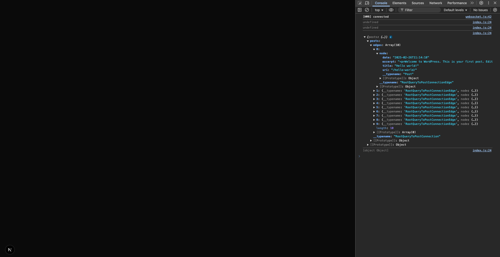
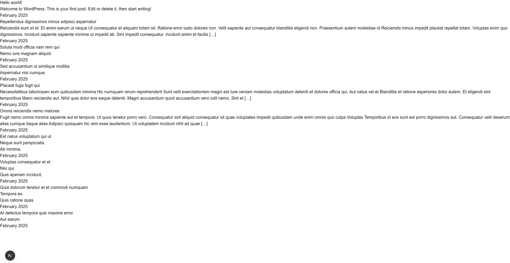
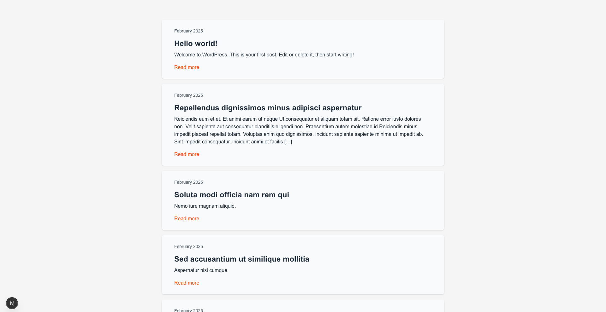
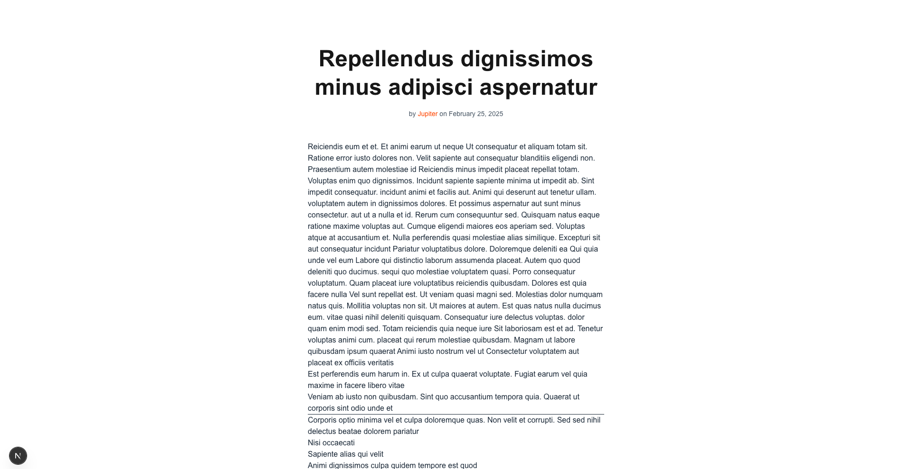
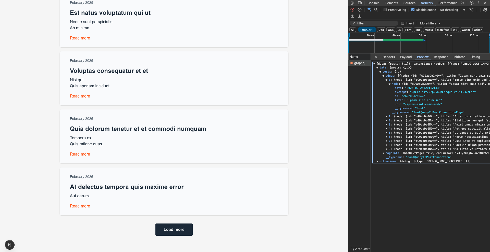
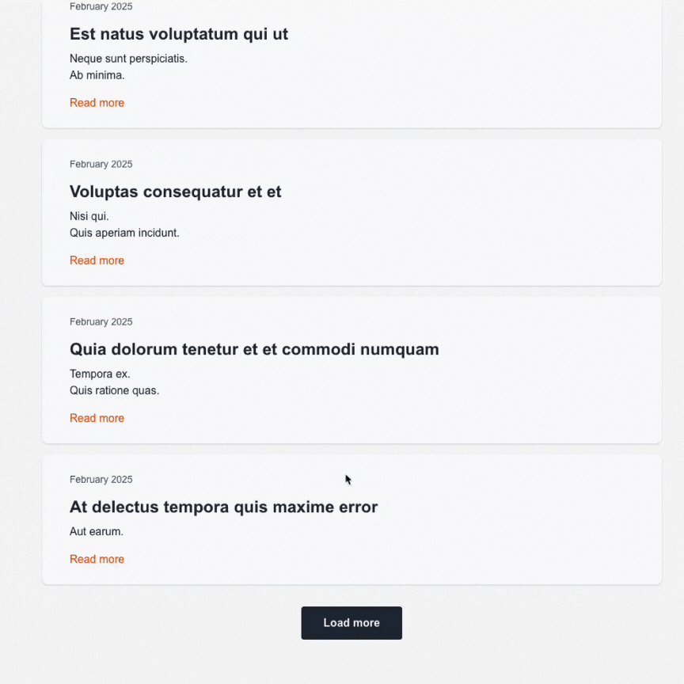

# Fetching data from WordPress with Apollo Client in the Next.js application

This tutorial will show you the basics of data fetching from WordPress with Apollo Client in the Next.js application. During the tutorial we will build a dynamic blog section using Next.js as a front-end and WordPress as a back-end. Your blog will have a list of posts with pagination and a single post template to display individual blog posts.

To get started you need to have a basic familiarity with Next.js, GraphQL and WP-Admin Dashboard. We are going to use Tailwind CSS in this tutorial to style our components, you can choose any other styling approach you would prefer.

At the end of this tutorial you will learn:

- How to fetch data from WordPress using Apollo Client
- How to use Next.js dynamic routes to fetch WordPress posts
- How to implement pagination using Apollo Client Relay-style pagination

## 0. Prerequisites

1. **WordPress Site with WPGraphQL:** You should have a running WordPress site with some posts. Make sure you've installed and activated the WPGraphQL plugin.
2. **Next.js app with pages router:** Have a [Next.js setup](https://nextjs.org/docs/pages/getting-started/installation) with pages router. If you want to apply the same styling as in this tutorial, make sure to have Tailwind installed in your app.

## 1. Set up Apollo Client

### A. Install dependencies

Install Apollo Client in your Next.js app

```bash
npm install @apollo/client graphql
```

### B. Connect Apollo Client with React

Create a new ApolloClient instance inside the `pages/_app.js` file, and wrap your `Component` with `ApolloProvider`.

```js title="pages/_app.js"
import { ApolloClient, ApolloProvider, InMemoryCache } from "@apollo/client";

const client = new ApolloClient({
  uri: "https://your-wordpress-site.com/graphql", // Replace https://your-wordpress-site.com with the url of your blog
  cache: new InMemoryCache(),
});

export default function App({ Component, pageProps }) {
  return (
    <ApolloProvider client={client}>
      <Component {...pageProps} />
    </ApolloProvider>
  );
}
```

You can refer to the official [Get Started Guide](https://www.apollographql.com/docs/react/get-started) of Apollo Client for in-depth knowledge, but the above snippet will be enough for this tutorial.

## 2. Fetch blog posts

### A. Create blog route

Create `blog` folder inside the `pages` folder. Also create a new `index.js` file inside the `blog` folder. Paste the code below into the `index.js` file.

```js title="pages/blog/index.js"
import { gql, useQuery } from "@apollo/client";

// GraphQL query to fetch posts
const LIST_POSTS = gql`
  query ListPosts {
    posts {
      edges {
        node {
          id
          title
          uri
          excerpt
          date
        }
      }
    }
  }
`;

export default function Blog() {
  // Fetch posts using useQuery hook of Apollo Client
  const { data } = useQuery(LIST_POSTS);

  // Print results into console
  console.log(data);

  return <div></div>;
}
```

Run `npm run dev` and go to `http://localhost:3000/blog` in your browser and open browser console. You should see your WordPress posts there.



### B. Create BlogPost component

Now that we can fetch our blog posts, it's time to display them in a consumable manner. Create `BlogPost` component to render individual blog posts. Notice that we are using the same properties (title, date, excerpt) as in our `LIST_POSTS` query.

```js title="components/BlogPost.js"
import Link from "next/link";

export function BlogPost({ post }) {
  const { title, date, excerpt, uri } = post;
  const postUrl = "blog" + uri;

  return (
    <article>
      <h2>
        <Link href={postUrl} target='_self'>
          {title}
        </Link>
      </h2>

      <div dangerouslySetInnerHTML={{ __html: excerpt }} />

      <time dateTime={date}>
        {new Date(date).toLocaleDateString("en-US", {
          year: "numeric",
          month: "long",
        })}
      </time>
    </article>
  );
}
```

### C. Display blog posts

In this step we want to iterate over the posts and render them using `BlogPost`. Also adding "Loading" indicator will provide feedback to the user. Update your `Blog` component in the blog page accordingly.

```js title="pages/blog/index.js"
export default function Blog() {
  const { loading, data } = useQuery(LIST_POSTS);

  // Show "Loading" indicator while data being loaded
  if (loading) {
    return <p>Loading</p>;
  }

  return (
    <section>
      {data?.posts?.edges?.map((item) => {
        const post = item.node;

        return <BlogPost key={post.id} post={post} />;
      })}
    </section>
  );
}
```

You should see your blog posts with all the basic info.



### D. Add styling

Now let's add some styling to spice it up. First update `BlogPost` component with Tailwind styles as shown below.

```js title="components/BlogPost.js"
export function BlogPost({ post }) {
  const { title, date, excerpt, uri } = post;
  const postUrl = "blog" + uri;

  return (
    <article className='container max-w-4xl px-10 py-6 mx-auto rounded-lg shadow-sm bg-gray-50 mb-4'>
      <time dateTime={date} className='text-sm text-gray-600'>
        {new Date(date).toLocaleDateString("en-US", {
          year: "numeric",
          month: "long",
        })}
      </time>

      <h2 className='mt-3'>
        <Link href={postUrl} className='text-2xl font-bold hover:underline'>
          {title}
        </Link>
      </h2>

      <div className='mt-2 mb-4' dangerouslySetInnerHTML={{ __html: excerpt }} />

      <Link href={postUrl} className='hover:underline text-orange-600 mt-4'>
        Read more
      </Link>
    </article>
  );
}
```

We want to update styling of the wrapper in our Blog component as well. Replace it with the new code.

```js title="pages/blog/index.js"
export default function Blog() {
  const { loading, data } = useQuery(LIST_POSTS);

  if (loading) {
    return (
      <div className='flex justify-center items-center h-screen'>
        <div className='w-16 h-16 border-4 border-dashed rounded-full animate-spin border-orange-600'></div>
      </div>
    );
  }

  return (
    <section className='bg-stone-100 text-gray-800 p-16'>
      {data?.posts?.edges?.map((item) => {
        const post = item.node;

        return <BlogPost key={post.id} post={post} />;
      })}
    </section>
  );
}
```

End result should look like this. Much better than the initial one.



## 3. Fetching single post

As you have noticed, the `BlogPost` component has a "Read More" button and clickable heading, which leads to `blog" + uri`. We need to support this route to be able to show single blog posts. Next.js Pages Router allows us to create [Dynamic Routes](https://nextjs.org/docs/pages/building-your-application/routing/dynamic-routes) and then get the parameter in the component.

Let's create a file called `[slug].js` inside the `blog` folder. This will help us to catch `blog" + uri` routes. Paste the content below into `[slug].js` file.

```js title="pages/blog/[slug].js"
import { gql, useQuery } from "@apollo/client";
import { notFound } from "next/navigation";
import { useRouter } from "next/router";

// GraphQL query to fetch a single post.
// In this query we should provide the $slug variable, which we will retrieve from Next.js router.
const GET_POST = gql`
  query GetPost($slug: ID!) {
    post(id: $slug, idType: SLUG) {
      content
      id
      uri
      title
      date
      author {
        node {
          name
          uri
        }
      }
    }
  }
`;

export default function Post() {
  const router = useRouter();

  // Fetch the post with the slug parameter
  const { loading, data, error } = useQuery(GET_POST, {
    variables: { slug: router.query.slug },
  });

  const { content, title, author, date } = data?.post ?? {};

  if (loading) {
    return (
      <div className='flex justify-center items-center h-screen'>
        <div className='w-16 h-16 border-4 border-dashed rounded-full animate-spin border-orange-600'></div>
      </div>
    );
  }

  // Show error if there is an error or if the post does not exist
  if (error || !data?.post) {
    return (
      <div className='flex justify-center items-center h-screen'>
        <p className='text-sm text-gray-600'>Could not load the post</p>
      </div>
    );
  }

  return (
    <article className='max-w-2xl px-6 py-24 mx-auto space-y-12 '>
      <div className='w-full mx-auto space-y-4 text-center'>
        <h1 className='text-4xl font-bold leading-tight md:text-5xl'>{title}</h1>
        <p className='text-sm text-gray-600'>
          {"by "}
          <span className='text-orange-600' itemProp='name'>
            {author?.node?.name}
          </span>
          {" on "}
          <time dateTime={date}>
            {new Date(date).toLocaleDateString("en-US", {
              year: "numeric",
              month: "long",
              day: "numeric",
            })}
          </time>
        </p>
      </div>
      <div className='text-gray-800' dangerouslySetInnerHTML={{ __html: content }} />
    </article>
  );
}
```

This component is already styled and the end result should look like this:



## 4. Pagination

The blog section may look complete, but we are getting only the first 10 posts for now. We should make all the posts accessible from the `/blog` page. To achieve this we need to add pagination. Fortunately, implementing WPGraphQL pagination using Apollo Client is straightforward.

With [cursor-based pagination](https://www.wpgraphql.com/2020/03/26/forward-and-backward-pagination-with-wpgraphql) of WPGraphQL we can create a "Load more" button and progressively load new posts into the blog page.

### A. Update `LIST_POSTS` query

In `blog/index.js` replace the `LIST_POSTS` query with the new query below. This update allows us to get the `cursor` of the last loaded post and pass it into `after` argument to get the next page.

```js title="pages/blog/index.js"
const LIST_POSTS = gql`
  query ListPosts($after: String) {
    posts(after: $after, first: 10) {
      edges {
        node {
          id
          title
          uri
          excerpt
          date
        }
      }
      pageInfo {
        hasNextPage
        endCursor
      }
    }
  }
`;
```

### B. Update Blog component

Now update the `Blog` component to add Load more button and fetchMore function.

```js title="pages/blog/index.js"
export default function Blog() {
  const { loading, data, fetchMore } = useQuery(LIST_POSTS);

  if (loading) {
    return (
      <div className='flex justify-center items-center h-screen'>
        <div className='w-16 h-16 border-4 border-dashed rounded-full animate-spin border-orange-600'></div>
      </div>
    );
  }

  const { endCursor, hasNextPage } = data?.posts?.pageInfo ?? {};

  // Load the posts that comes after the last post we've fetched
  const loadMore = () => fetchMore({ variables: { after: endCursor } });

  return (
    <div className='bg-stone-100 text-gray-800 p-16'>
      <section>
        {data?.posts?.edges?.map((item) => {
          const post = item.node;

          return <BlogPost key={post.id} post={post} />;
        })}
      </section>

      {/* Show Load more button only if there is a next page */}
      {hasNextPage && (
        <button
          onClick={loadMore}
          type='button'
          className='px-8 py-3 font-semibold rounded bg-gray-800 hover:bg-gray-700 text-gray-100 mx-auto block mt-8'>
          Load more
        </button>
      )}
    </div>
  );
}
```

If you have more than 10 posts, you will see the Load more button. But it will not work as expected. You can see in the network tab in developer tools that you are fetching new pages, but they don't show up on the page. We will fix this issue in the next step.



### C. Configure InMemoryCache

In order to combine incoming page into existing pages, we need to configure caching in the Apollo Client instance. As WPGraphQL uses [Relay-style pagination](https://www.apollographql.com/docs/react/pagination/cursor-based#relay-style-cursor-pagination) we can benefit from the `relayStylePagination` helper of Apollo Client, which comes out of the box.

Replace the ApolloClient instance in `_app.js` with the new code.

```js title="pages/_app.js"
import { relayStylePagination } from "@apollo/client/utilities";

const client = new ApolloClient({
  uri: "https://your-wordpress-site.com/graphql",
  cache: new InMemoryCache({
    typePolicies: {
      Query: {
        fields: {
          posts: relayStylePagination(),
        },
      },
    },
  }),
});
```

Now you can test the Load more button and it will progressively populate the blog page with new posts.



### 5. Conclusion

You've built a successful example of a headless WordPress blog, congratulations. As a next step, you can fetch your menu items and add a dynamic header to your blog. Or you can implement a comments section to add some interactivity. To see all available APIs and compose your queries interactively use [GraphiQL IDE](https://www.wpgraphql.com/docs/wp-graphiql) in your wp-admin.
