# HWP Toolkit Examples

This directory contains examples demonstrating how to use various features of the Headless WordPress Toolkit.

> **Feature Highlight:** Most examples include a `wp-env` setup, allowing you to fully configure your headless application with a single command. They also contain screenshots of the application.

## Astro Examples

| Title                                                                                | Description                                                                                 |
| ------------------------------------------------------------------------------------ | ------------------------------------------------------------------------------------------- |
| [template-hierarchy-data-fetching-urql](astro/template-hierarchy-data-fetching-urql) | Demonstrates template hierarchy and data fetching with Astro, URQL, and Headless WordPress. |

## Next.js Examples

| Title                                                                                 | Description                                                                                                                  |
| ------------------------------------------------------------------------------------- | ---------------------------------------------------------------------------------------------------------------------------- |
| [apollo-authentication](next/apollo-authentication)                                   | Showcases authentication with Next.js, Apollo Client, and Headless WordPress.                                                |
| [apollo-client-data-fetch](next/apollo-client-data-fetch)                             | Explores data fetching strategies and state management using Next.js, Apollo Client, and Headless WordPress.                 |
| [apollo-client-filesystem-routing](next/apollo-client-filesystem-routing)             | Integrates WPGraphQL and WPGraphQL for ACF with Next.js for a headless WordPress site.                                       |
| [client-app-router-fetch-data](next/client-app-router-fetch-data)                     | Uses Next.js App Router and fetch API to retrieve data from WordPress via WPGraphQL.                                         |
| [client-multisite-app-router-fetch-data](next/client-multisite-app-router-fetch-data) | Implements a multisite headless WordPress app with Next.js App Router and fetch API.                                         |
| [custom-sitemap-apollo](next/custom-sitemap-apollo)                                   | Generates a custom sitemap using Next.js, Apollo Client, and WPGraphQL with an extended plugin.                              |
| [custom-sitemap-vanilla-wpgraphql](next/custom-sitemap-vanilla-wpgraphql)             | Creates a custom sitemap using Next.js and WPGraphQL without extending its endpoints.                                        |
| [hybrid-sitemap-apollo](next/hybrid-sitemap-apollo)                                   | Fetches and transforms WordPress sitemaps for clean URL formatting with Next.js.                                             |
| [proxied-sitemap-apollo](next/proxied-sitemap-apollo)                                 | Provides a proxied sitemap by transforming WordPress XML sitemaps for SEO-friendly frontend URLs.                            |
| [proxied-graphql-debug](next/proxied-graphql-debug)                                   | Provides a proxied GraphQL API for development, enabling response inspection and query complexity analysis.                  |
| [render-blocks-pages-router](next/render-blocks-pages-router)                         | Renders WordPress Blocks with JSX in Next.js, including utilities for hierarchical block data.                               |
| [wp-theme-rendered-blocks](next/wp-theme-rendered-blocks)                             | Demonstrates how to fetch and apply WordPress Global Styles in a Next.js project using the `globalStylesheet` GraphQL field. |

## SvelteKit Examples

| Title                                                                                    | Description                                                                                     |
| ---------------------------------------------------------------------------------------- | ----------------------------------------------------------------------------------------------- |
| [template-hierarchy-data-fetching-urql](sveltekit/template-hierarchy-data-fetching-urql) | Demonstrates template hierarchy and data fetching with SvelteKit, URQL, and Headless WordPress. |

## Nuxt Examples

| Title                                                               | Description                                                                                                                                                           |
| ------------------------------------------------------------------- | --------------------------------------------------------------------------------------------------------------------------------------------------------------------- |
| [nuxt-headlesswp-gravity-forms](nuxt/nuxt-headlesswp-gravity-forms) | Shows you how to wire up a full headless WordPress backend—complete with Gravity Forms, WPGraphQL, and a pre-built "Questionnaire" form—alongside a Nuxt 3 front end. |

## Contributing

If you feel like something is missing or you want to add an example for another framework, we encourage you to contribute! Please check out our [Contributing Guide](https://github.com/wpengine/hwptoolkit/blob/main/CONTRIBUTING.md) for more details.

### Best practices for the new examples

You can copy on of existing examples to use it as a _skeleton_ of your new example. The guide below explains the key parts our standard example format.

1. **Project Structure**

   Organize your project with a clear separation between the frontend application and the WordPress environment configuration.

   ```bash
   .
   ├── example-app/          # Front-end code
   │   └── ...
   ├── .wp-env.json          # Configuration for the local WordPress environment
   └── wp-env/
       └── db/
           └── database.sql  # Initial database state
   ```

2. **Local WordPress with wp-env**

   Use wp-env to create a local, containerized WordPress environment. Create a .wp-env.json file in your project root and include all of the required plugins and config to make your example work:

   ```json
   {
     "phpVersion": "7.4",
     "plugins": ["https://github.com/wp-graphql/wp-graphql/releases/latest/download/wp-graphql.zip"],
     "config": {
       "WP_DEBUG": true
     },
     "mappings": {
       "db": "./wp-env/db",
       "wp-content/uploads": "./wp-env/uploads",
       ".htaccess": "./wp-env/setup/.htaccess"
     },
     "lifecycleScripts": {
       "afterStart": "wp-env run cli -- wp rewrite structure '/%postname%/' && wp-env run cli -- wp rewrite flush"
     }
   }
   ```

3. **Scripts**

   Scripts in your package.json help automate common tasks. You can use our standard scripts to achieve the recommended workflow..

   ```json
   "scripts": {
       "example:build": "npm run example:dev:install && npm run wp:start && npm run wp:db:import && npm run example:start",
       "example:dev:install": "cd example-app && npm install && cd ..",
       "example:start": "npm run wp:start && npm run example:dev",
       "example:stop": "npm run wp:stop",
       "example:prune": "wp-env destroy && npm run example:build && npm run example:start",
       "example:dev": "npm --prefix ./example-app run dev",
       "wp:start": "npm install && wp-env start",
       "wp:stop": "wp-env stop",
       "wp:destroy": "wp-env destroy --config ./wp-env/wp-env.json",
       "wp:db:query": "wp-env run cli -- wp db query",
       "wp:db:export": "wp-env run cli -- wp db export /var/www/html/db/database.sql",
       "wp:db:import": "wp-env run cli -- wp db import /var/www/html/db/database.sql",
       "wp-env": "wp-env"
   },
   ```

4. **Documentation (README.md)**

   A clear README.md with essential information would guide the new developers effectively and reduce the errors. Consider including the information below:

   - Prerequisites: Node.js, Docker.

   - Setup Steps: A simple list on how to clone, install dependencies, and run the start script.

   - Demo Credentials: Provide login details for the local WordPress admin (/wp-admin). Default for wp-env is admin / password.

   - Security implications, and other considerations for the users, if applicable.

   - Don't forget to include your example to this common README file as well, inside one of the tables above.

## Screenshots

> **Feature Highlight:** Here are some sample screenshots of the examples listed above.

### Apollo Authentication

<details>
    <summary>View Screenshots</summary>


</details>

### Apollo Client Data Fetch

<details>
    <summary>View Screenshots</summary>


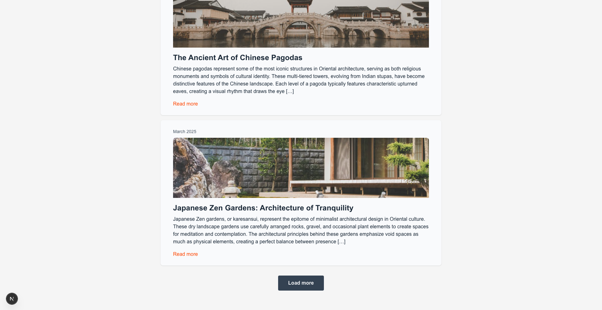

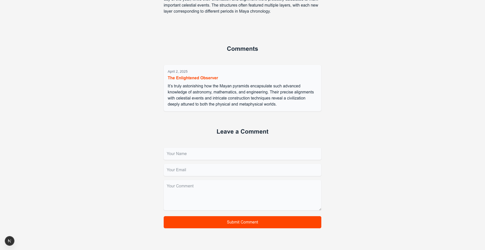


</details>

### Apollo Client Filesystem Routing

<details>
    <summary>View Screenshots</summary>


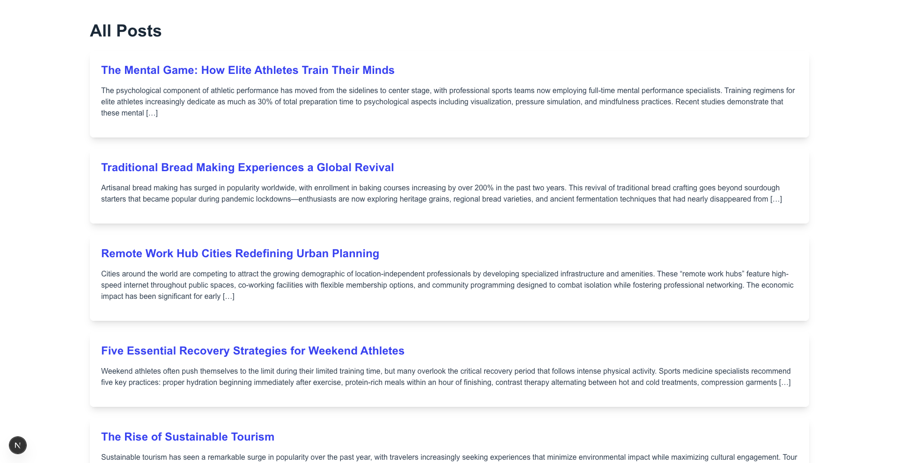


</details>

### Client App Router Fetch Data

<details>
    <summary>View Screenshots</summary>


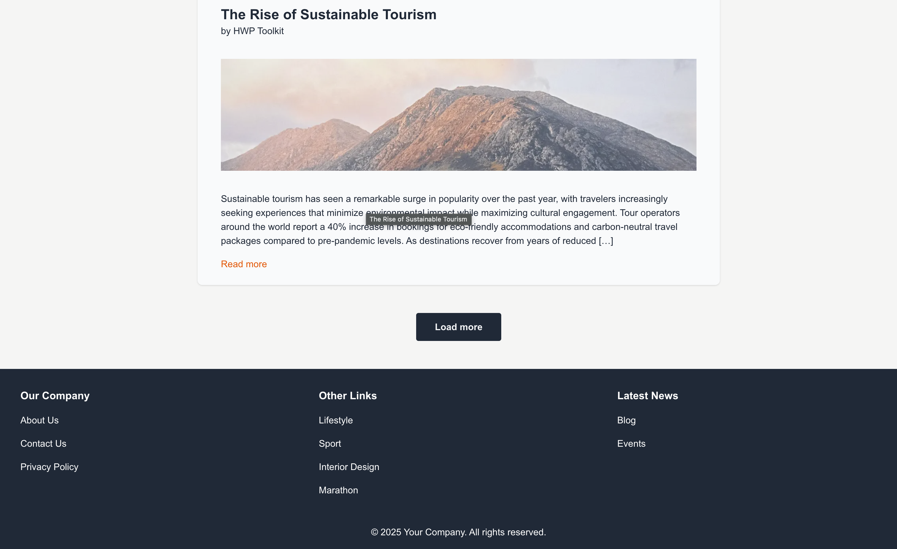
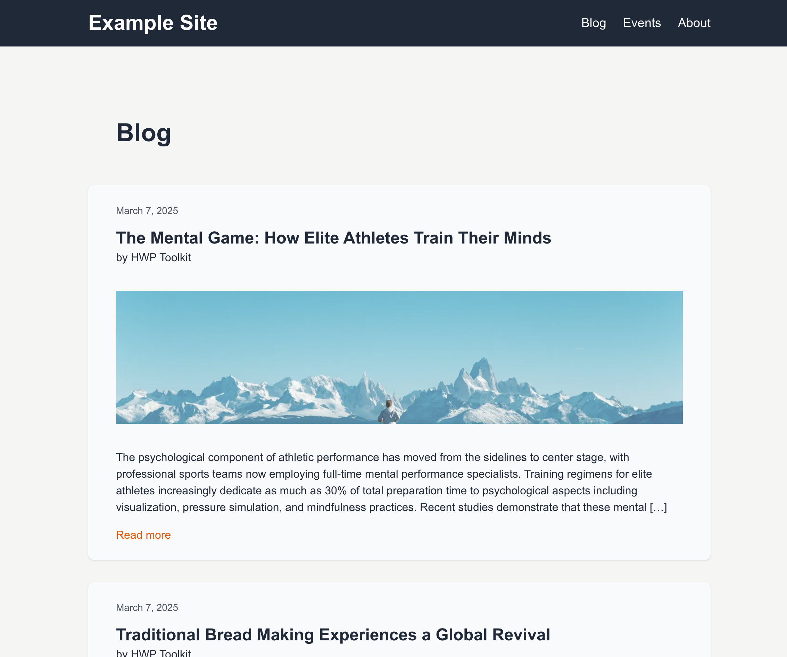


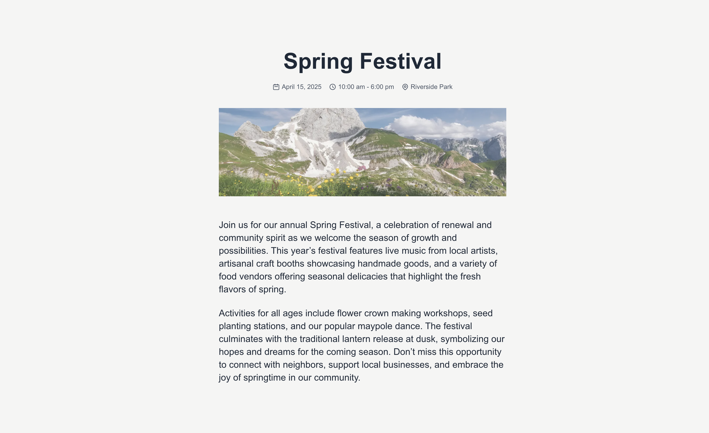

</details>

### Client Multisite App Router Fetch Data

<details>
    <summary>View Screenshots</summary>


</details>

### Custom Sitemap Apollo

<details>
    <summary>View Screenshots</summary>


</details>

### Custom Sitemap Vanilla WPGraphQL

<details>
    <summary>View Screenshots</summary>

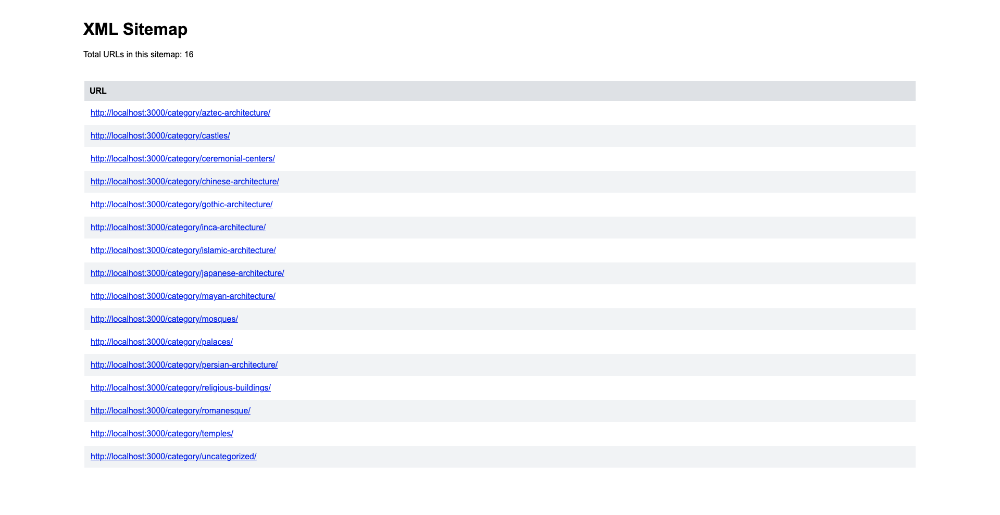

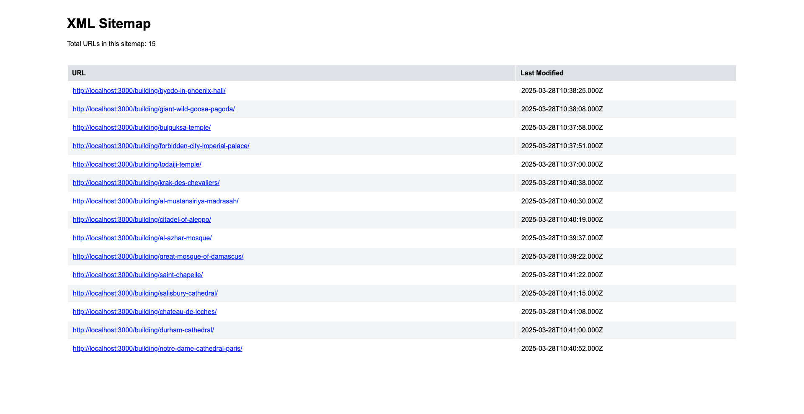

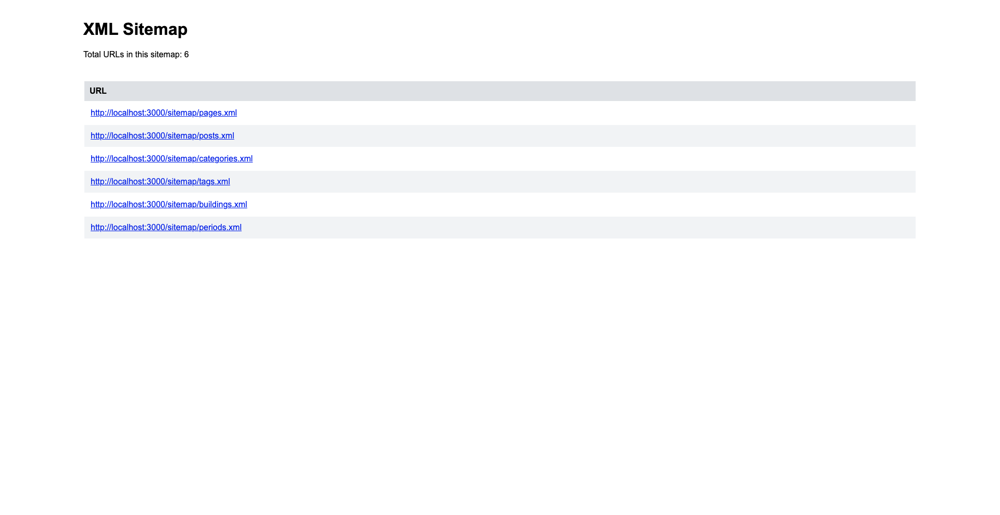


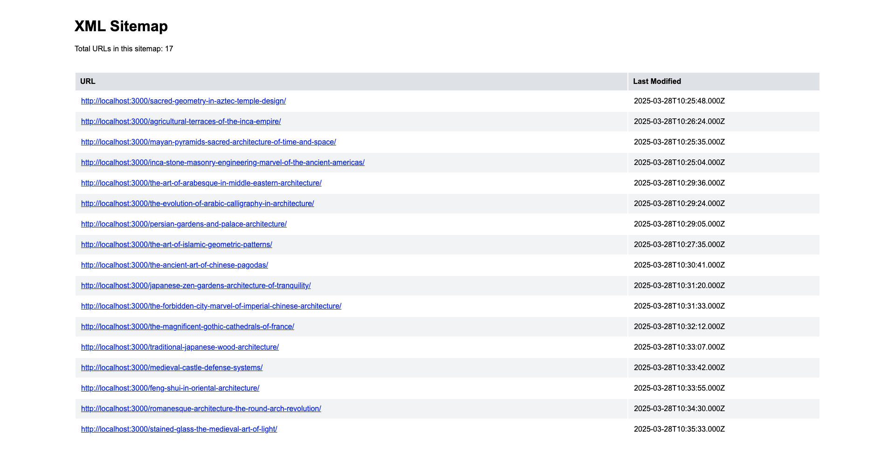

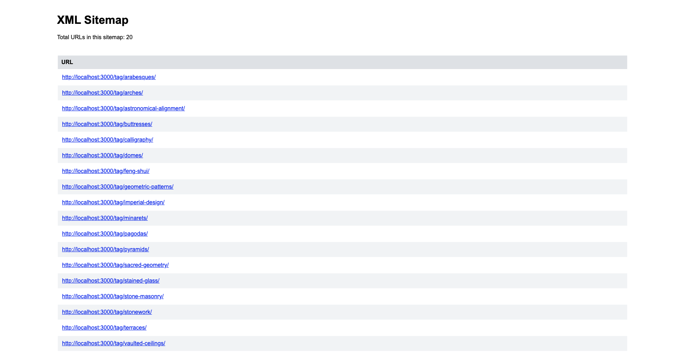

</details>
