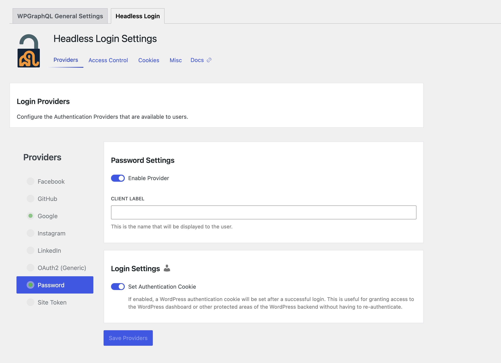

# Next.js pages Apollo Authentication

This is a [Next.js](https://nextjs.org) project bootstrapped with [`create-next-app`](https://nextjs.org/docs/pages/api-reference/create-next-app).

## Prerequisites

Before running this project, ensure you have the following:

*   **Node.js** (version 18 or higher recommended)
*   **npm**, **yarn**, **pnpm**, or **bun** package manager
*   A **WordPress** instance with the following plugins installed and configured:
    *   **WPGraphQL**
    *   **WPGraphQL Headless Login**

## WordPress Setup

1.  **Install Plugins:** In your WordPress admin dashboard, navigate to "Plugins" and install the following plugins:

    *   **WPGraphQL**: This plugin exposes your WordPress data via GraphQL.
    *   **WPGraphQL Headless Login**: This plugin enables authentication for headless WordPress setups.

2.  **Configure Headless Login:** After installing WPGraphQL Headless Login, go to the plugin's settings page (usually found under the "GraphQL" menu in your WordPress admin dashboard).  **Enable Credentials Authentication**.

    

## Environment Variables

Create a `.env` file in the root of your project with the following variable:

```
NEXT_PUBLIC_WORDPRESS_URL=<your_wordpress_url>
```

Replace `<your_wordpress_url>` with the URL of your WordPress instance (e.g., `https://your-wordpress-site.com`).  **Do not include a trailing slash.**

## Getting Started

1.  **Install Dependencies:**

    ```
    npm install
    # or
    yarn install
    # or
    pnpm install
    # or
    bun install
    ```

2.  **Run the Development Server:**

    ```
    npm run dev
    # or
    yarn dev
    # or
    pnpm dev
    # or
    bun dev
    ```

3.  **Access the Application:**

    Open [http://localhost:3000](http://localhost:3000) with your browser to see the result.
