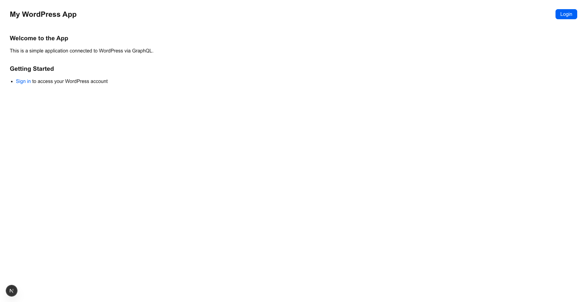
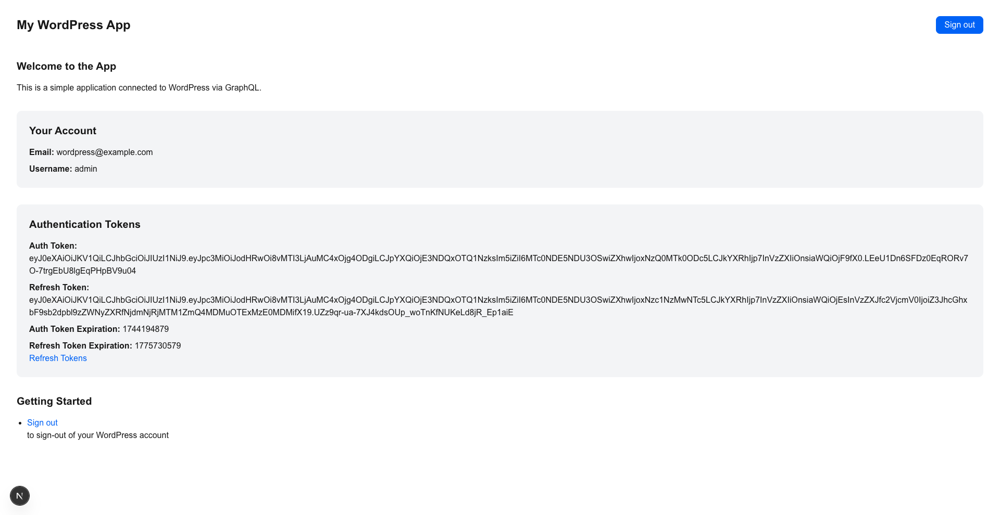
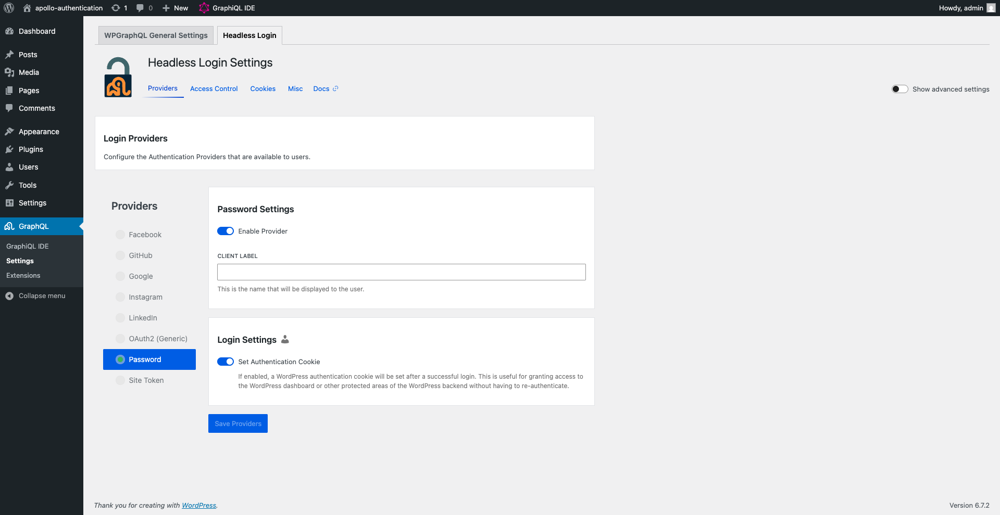

# Next.js pages Apollo Authentication

This example demonstrates authentication with username and password in a headless WordPress setup, running Next.js as a frontend framework. Example is using WPGraphQL and WPGraphQL Headless Login plugins to enable authentication features.

## Screenshots

After following the installation steps, you should have the example webpage as shown in the screenshots below:

|                                                 |                                                            |
| :---------------------------------------------: | :--------------------------------------------------------: |
| <br>Login page | <br>After login |

## Project Structure

```
.
├── example-app/                    # Next.js application folder containing frontend code
│   └── src/
│       ├── components/             # Reusable React components
│       ├── lib/                    # Apollo Client configuration, client and helpers
│       └── pages/                  # Next.js page routes
├── .wp-env.json                    # wp-env configuration file
└── wp-env
    └── db
        └── database.sql            # WordPress database including all demo data for the example
```

## Running the example with wp-env

### Prerequisites

- Node.js (v18+ recommended)
- [Docker](https://www.docker.com/) (if you plan on running the example see details below)

**Note** Please make sure you have all prerequisites installed as mentioned above and Docker running (`docker ps`)

### Setup Repository and Packages

- Clone the repo `git clone https://github.com/wpengine/hwptoolkit.git`
- Install packages `cd hwptoolkit && npm install`
- Setup a .env file under `examples/next/apollo-authentication/example-app` and add these values inside:

```
NEXT_PUBLIC_WORDPRESS_URL=http://localhost:8888
```

or run the command below:

```bash
echo "NEXT_PUBLIC_WORDPRESS_URL=http://localhost:8888" > examples/next/apollo-authentication/example-app/.env
```

### Build and start the application

- `cd examples/next/apollo-authentication`
- Then run `npm run example:build` will build and start your application.
- This does the following:
  - Starts up [wp-env](https://developer.wordpress.org/block-editor/getting-started/devenv/get-started-with-wp-env/)
  - Imports the database from [wp-env/db/database.sql](wp-env/db/database.sql)
  - Install Next.js dependencies for `example-app`
  - Runs the Next.js dev script

Congratulations, WordPress should now be fully set up.

| Frontend                                         | Admin                                                              |
| ------------------------------------------------ | ------------------------------------------------------------------ |
| [http://localhost:3000/](http://localhost:3000/) | [http://localhost:8888/wp-admin/](http://localhost:8888/wp-admin/) |

> **Note:** The login details for the admin is username "admin" and password "password"

### Command Reference

| Command               | Description                                                                                                             |
| --------------------- | ----------------------------------------------------------------------------------------------------------------------- |
| `example:build`       | Prepares the environment by starting WordPress, importing the database, and starting the application. |
| `example:dev`         | Runs the Next.js development server.                                                                                    |
| `example:dev:install` | Installs the required Next.js packages.                                                                                 |
| `example:start`       | Starts WordPress and the Next.js development server.                                                                    |
| `example:stop`        | Stops the WordPress environment.                                                                                        |
| `example:prune`       | Rebuilds and restarts the application by destroying and recreating the WordPress environment.                           |
| `wp:start`            | Starts the WordPress environment.                                                                                       |
| `wp:stop`             | Stops the WordPress environment.                                                                                        |
| `wp:destroy`          | Completely removes the WordPress environment.                                                                           |
| `wp:db:query`         | Executes a database query within the WordPress environment.                                                             |
| `wp:db:export`        | Exports the WordPress database to `wp-env/db/database.sql`.                                                             |
| `wp:db:import`        | Imports the WordPress database from `wp-env/db/database.sql`.                                                           |

> **Note** You can run `npm run wp-env` and use any other wp-env command. You can also see <https://www.npmjs.com/package/@wordpress/env> for more details on how to use or configure `wp-env`.

### Database access

If you need database access add the following to your wp-env `"phpmyadminPort": 11111,` (where port 11111 is not allocated).

You can check if a port is free by running `lsof -i :11111`

## Running the example with custom WordPress setup

### Prerequisites

Before running this project, ensure you have the following:

- **Node.js** (version 18 or higher recommended)
- **npm**, **yarn**, **pnpm**, or **bun** package manager
- A **WordPress** instance with the following plugins installed and configured:
  - **WPGraphQL**
  - **WPGraphQL Headless Login**

### WordPress Setup

1.  **Install Plugins:** In your WordPress admin dashboard, navigate to "Plugins" and install the following plugins:

    - **WPGraphQL**: This plugin exposes your WordPress data via GraphQL.
    - **WPGraphQL Headless Login**: This plugin enables authentication for headless WordPress setups.

2.  **Configure Headless Login:** After installing WPGraphQL Headless Login, go to the plugin's settings page (usually found under the "GraphQL" menu in your WordPress admin dashboard). **Enable Credentials Authentication**.

    

### Environment Variables

Create a `.env` file in the root of your project with the following variable:

```
NEXT_PUBLIC_WORDPRESS_URL=<your_wordpress_url>
```

Replace `<your_wordpress_url>` with the URL of your WordPress instance (e.g., `https://your-wordpress-site.com`). **Do not include a trailing slash.**

### Getting Started

1.  **Install Dependencies:**

    ```
    npm install
    # or
    yarn install
    # or
    pnpm install
    # or
    bun install
    ```

2.  **Run the Development Server:**

    ```
    npm run dev
    # or
    yarn dev
    # or
    pnpm dev
    # or
    bun dev
    ```
