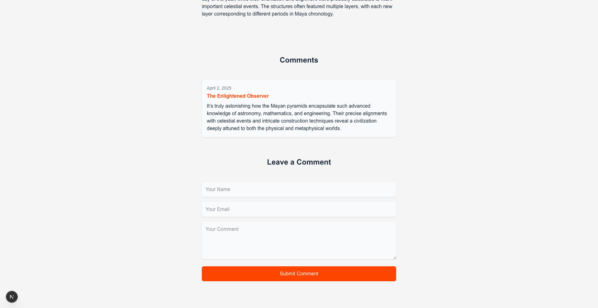
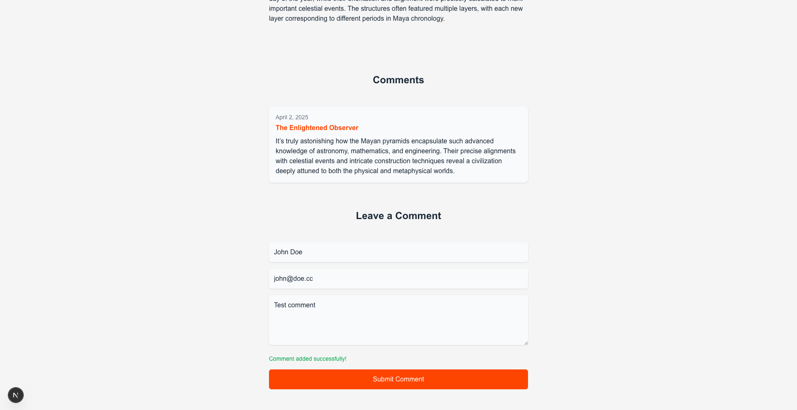
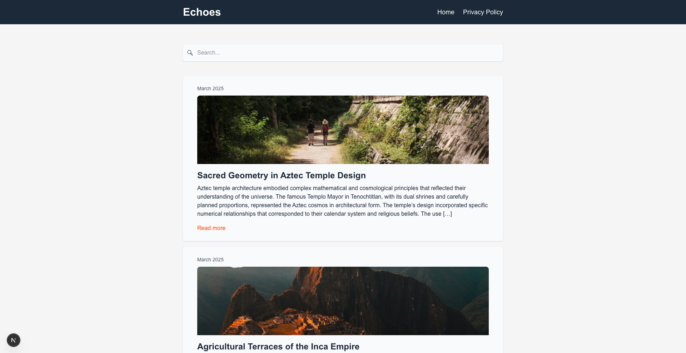
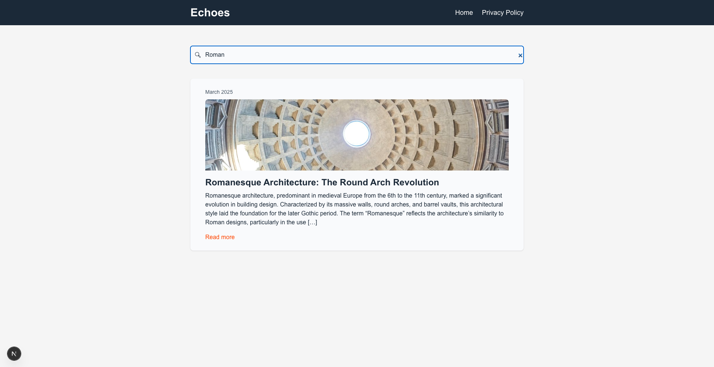
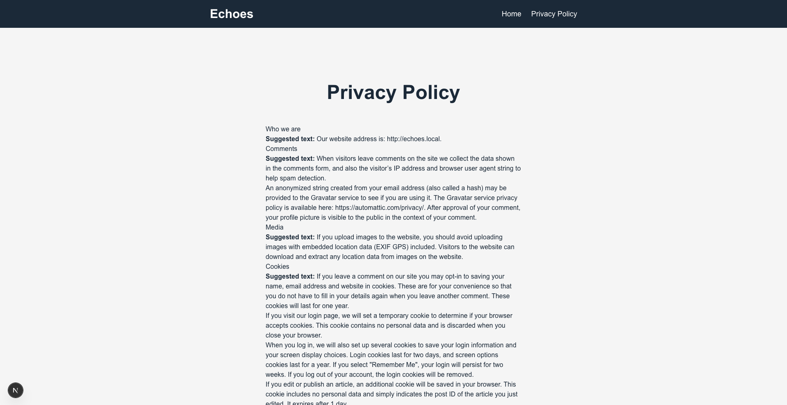
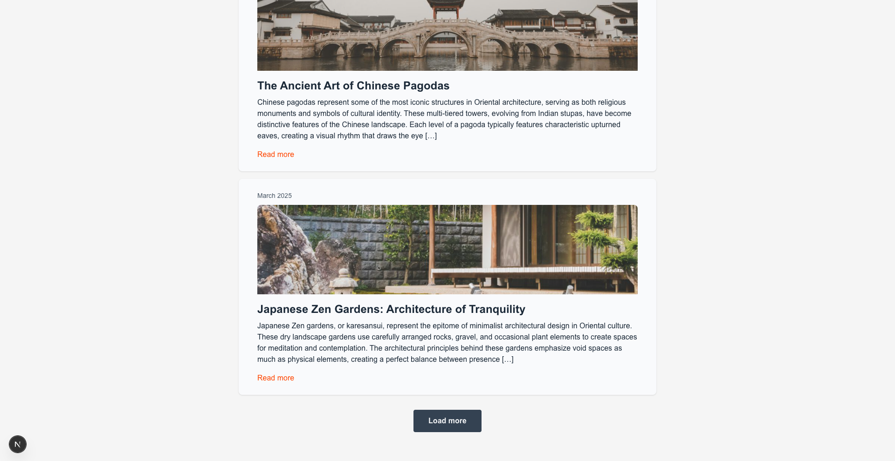

# Example: Fetching data from WordPress with Apollo Client in Next.js

This example demonstrates various approaches to integrate WordPress as a headless CMS with a Next.js frontend using Apollo Client. It showcases different data fetching strategies, state management techniques, and modern web development patterns in a real-world application context.

## Features

- **Covers various rendering patterns of Next.js**

  - Server-Side Rendering (SSR) for dynamic pages
  - Static Site Generation (SSG) for static pages
  - Client-Side data fetching (CSR) for blog settings
  - Hybrid data fetching, combining SSR and CSR

- **Blog features**

  - Listing posts with pagination
  - Live search of posts
  - Fetching posts and pages using nodeByUri of WPGraphQL
  - Fetching static pages at build time
  - Commenting posts
  - Header with dynamic blog title

- **Apollo Client integration**
  - Relay-style pagination
  - Fragment management
  - Error handling
  - Custom fetch policies
  - Custom error policies
  - useLazyQuery example
  - useMutation example
  - Automatic Persisted Queries

## Screenshots

|                                                                                          |                                                                           |                                                                   |
| :--------------------------------------------------------------------------------------: | :-----------------------------------------------------------------------: | :---------------------------------------------------------------: |
| <br>Post with comments | <br>New comment |          <br>Home           |
|        <br>Live search         | <br>Static page | <br>Load more |

## Project Structure

```
├── example-app
│   └── src
│       ├── components                  # React components
│       ├── lib
│       │   └── client.js               # Apollo Client instance
│       └── pages
│           ├── [uri].js                # Catch-all route for posts and pages
│           ├── index.js                # Home page
│           └── privacy-policy.js       # Statically generated page route
├── .wp-env.json                        # wp-env configuration file
└── wp-env
    ├── db
    │   └── database.sql                # WordPress database including all demo data for
    └── setup
```

## Running the example with wp-env

### Prerequisites

- Node.js (v18+ recommended)
- [Docker](https://www.docker.com/) (if you plan on running the example see details below)

**Note** Please make sure you have all prerequisites installed as mentioned above and Docker running (`docker ps`)

### Setup Repository and Packages

- Clone the repo `git clone https://github.com/wpengine/hwptoolkit.git`
- Install packages `cd hwptoolkit && npm install`
- Setup a .env file under `examples/next/apollo-client-data-fetch/example-app` and add these values inside:

```bash
NEXT_PUBLIC_WORDPRESS_URL=http://localhost:8888
NEXT_PRIVACY_POLICY_URI=/privacy-policy
```

or run the command below:

```bash
echo "NEXT_PUBLIC_WORDPRESS_URL=http://localhost:8888\\nNEXT_PRIVACY_POLICY_URI=/privacy-policy" > examples/next/apollo-client-data-fetch/example-app/.env
```

### Build and start the application

- `cd examples/next/apollo-client-data-fetch`
- Then run `npm run example:build` will build and start your application.
- This does the following:
  - Starts up [wp-env](https://developer.wordpress.org/block-editor/getting-started/devenv/get-started-with-wp-env/)
  - Imports the database from [wp-env/db/database.sql](wp-env/db/database.sql)
  - Install Next.js dependencies for `example-app`
  - Runs the Next.js dev script

Congratulations, WordPress should now be fully set up.

| Frontend                                         | Admin                                                              |
| ------------------------------------------------ | ------------------------------------------------------------------ |
| [http://localhost:3000/](http://localhost:3000/) | [http://localhost:8888/wp-admin/](http://localhost:8888/wp-admin/) |

> **Note:** The login details for the admin is username "admin" and password "password"

### Command Reference

| Command               | Description                                                                                                             |
| --------------------- | ----------------------------------------------------------------------------------------------------------------------- |
| `example:build`       | Prepares the environment by starting WordPress, importing the database, and starting the application. |
| `example:dev`         | Runs the Next.js development server.                                                                                    |
| `example:dev:install` | Installs the required Next.js packages.                                                                                 |
| `example:start`       | Starts WordPress and the Next.js development server.                                                                    |
| `example:stop`        | Stops the WordPress environment.                                                                                        |
| `example:prune`       | Rebuilds and restarts the application by destroying and recreating the WordPress environment.                           |
| `wp:start`            | Starts the WordPress environment.                                                                                       |
| `wp:stop`             | Stops the WordPress environment.                                                                                        |
| `wp:destroy`          | Completely removes the WordPress environment.                                                                           |
| `wp:db:query`         | Executes a database query within the WordPress environment.                                                             |
| `wp:db:export`        | Exports the WordPress database to `wp-env/db/database.sql`.                                                             |
| `wp:db:import`        | Imports the WordPress database from `wp-env/db/database.sql`.                                                           |

> **Note** You can run `npm run wp-env` and use any other wp-env command. You can also see <https://www.npmjs.com/package/@wordpress/env> for more details on how to use or configure `wp-env`.

### Database access

If you need database access add the following to your wp-env `"phpmyadminPort": 11111,` (where port 11111 is not allocated).

You can check if a port is free by running `lsof -i :11111`
