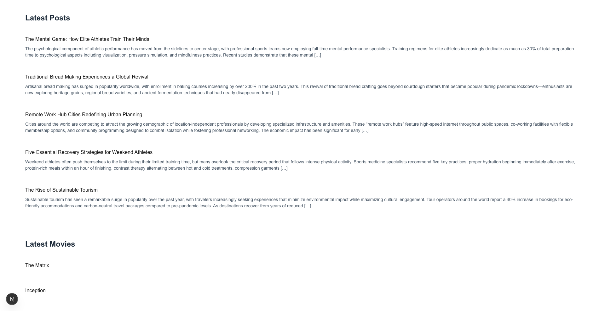

# Next.js + WPGraphQL Headless CMS

This is a [Next.js](https://nextjs.org) project integrated with **WPGraphQL** and **WPGraphQL for ACF** to build a headless WordPress-powered site.

## Screenshots

After following the installation steps, you should have the example pages as shown in the screenshots below:

|                                                           |                                                             |
| :-------------------------------------------------------: | :---------------------------------------------------------: |
|     <br>Home page      |         <br>Posts          |
| <br>Categories | <br>Category archive |
| <br>Custom post type  |    <br>Single post    |

## Project Structure

This project follows Next.js file-based routing. Based on the WordPress permalink structure, the key pages are:

```bash
src/pages
├── [slug].js         # Dynamic page for general posts or pages
├── _app.js           # Next.js global settings
├── _document.js      # Document structure
├── api
│   └── hello.js      # Example API route
├── category
│   ├── [category].js # Dynamic page for categories
│   └── index.js      # Categories index page
├── index.js          # Homepage (lists latest posts, movies, categories)
├── movies
│   ├── [slug].js     # Dynamic page for individual movies
│   └── index.js      # Movies listing page
└── posts
    ├── [slug].js     # Dynamic page for individual posts
    └── index.js      # Posts listing page
```

## Running the example with wp-env

### Prerequisites

- Node.js (v18+ recommended)
- [Docker](https://www.docker.com/) (if you plan on running the example see details below)

**Note** Please make sure you have all prerequisites installed as mentioned above and Docker running (`docker ps`)

### Setup Repository and Packages

- Clone the repo `git clone https://github.com/wpengine/hwptoolkit.git`
- Install packages `cd hwptoolkit && npm install`
- Setup a .env file under `examples/next/apollo-client-filesystem-routing/example-app` and add these values inside:

```
NEXT_PUBLIC_WORDPRESS_URL=http://localhost:8888
```

or run the command below:

```bash
echo "NEXT_PUBLIC_WORDPRESS_URL=http://localhost:8888" > examples/next/apollo-client-filesystem-routing/example-app/.env
```

### Build and start the application

- `cd examples/next/apollo-client-filesystem-routing`
- Then run `npm run example:build` will build and start your application.
- This does the following:
  - Starts up [wp-env](https://developer.wordpress.org/block-editor/getting-started/devenv/get-started-with-wp-env/)
  - Imports the database from [wp-env/db/database.sql](wp-env/db/database.sql)
  - Install Next.js dependencies for `example-app`
  - Runs the Next.js dev script

Congratulations, WordPress should now be fully set up.

| Frontend                                         | Admin                                                              |
| ------------------------------------------------ | ------------------------------------------------------------------ |
| [http://localhost:3000/](http://localhost:3000/) | [http://localhost:8888/wp-admin/](http://localhost:8888/wp-admin/) |

> **Note:** The login details for the admin is username "admin" and password "password"

### Command Reference

| Command               | Description                                                                                                             |
| --------------------- | ----------------------------------------------------------------------------------------------------------------------- |
| `example:build`       | Prepares the environment by starting WordPress, importing the database, and starting the application. |
| `example:dev`         | Runs the Next.js development server.                                                                                    |
| `example:dev:install` | Installs the required Next.js packages.                                                                                 |
| `example:start`       | Starts WordPress and the Next.js development server.                                                                    |
| `example:stop`        | Stops the WordPress environment.                                                                                        |
| `example:prune`       | Rebuilds and restarts the application by destroying and recreating the WordPress environment.                           |
| `wp:start`            | Starts the WordPress environment.                                                                                       |
| `wp:stop`             | Stops the WordPress environment.                                                                                        |
| `wp:destroy`          | Completely removes the WordPress environment.                                                                           |
| `wp:db:query`         | Executes a database query within the WordPress environment.                                                             |
| `wp:db:export`        | Exports the WordPress database to `wp-env/db/database.sql`.                                                             |
| `wp:db:import`        | Imports the WordPress database from `wp-env/db/database.sql`.                                                           |

> **Note** You can run `npm run wp-env` and use any other wp-env command. You can also see <https://www.npmjs.com/package/@wordpress/env> for more details on how to use or configure `wp-env`.

### Database access

If you need database access add the following to your wp-env `"phpmyadminPort": 11111,` (where port 11111 is not allocated).

You can check if a port is free by running `lsof -i :11111`
