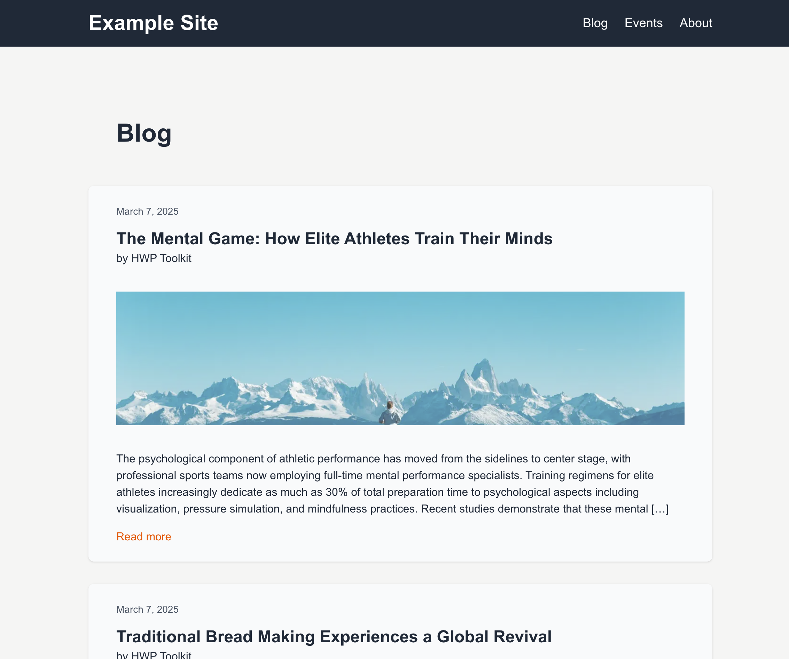
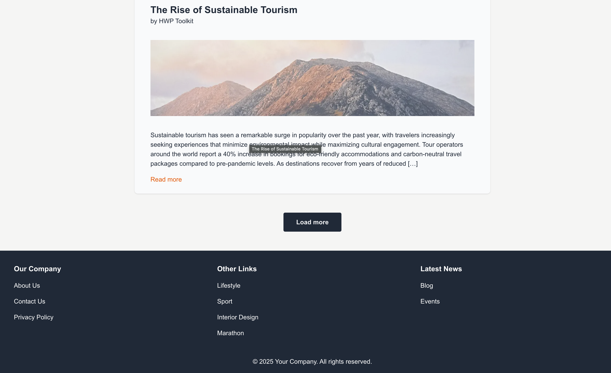
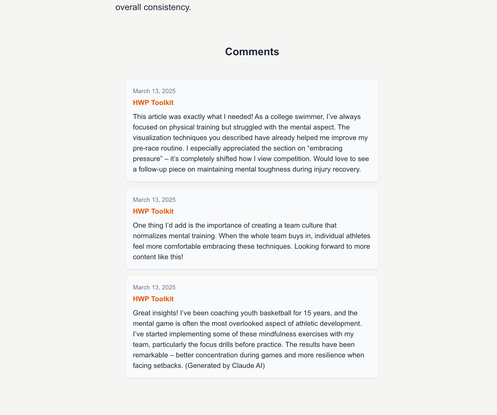
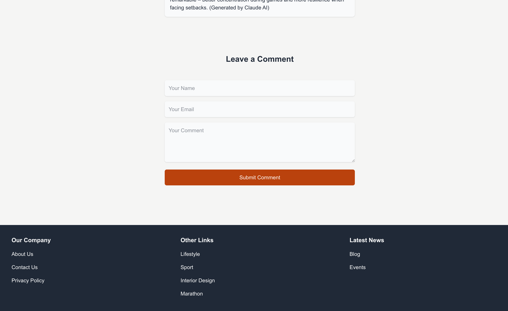
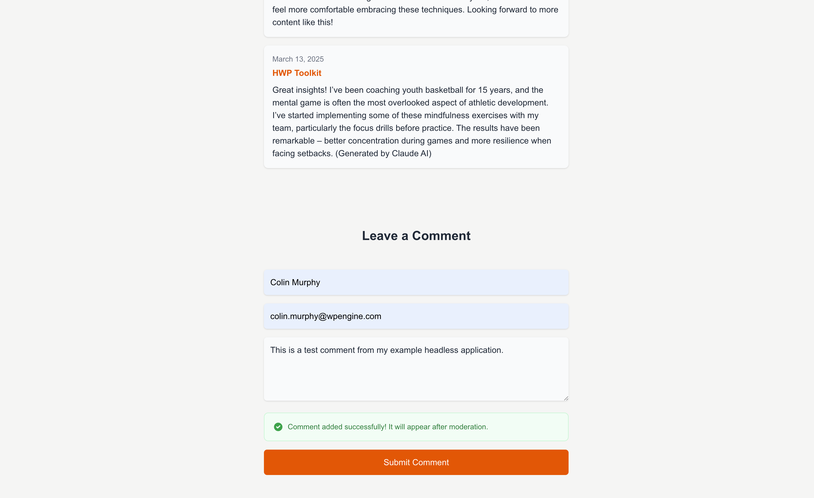
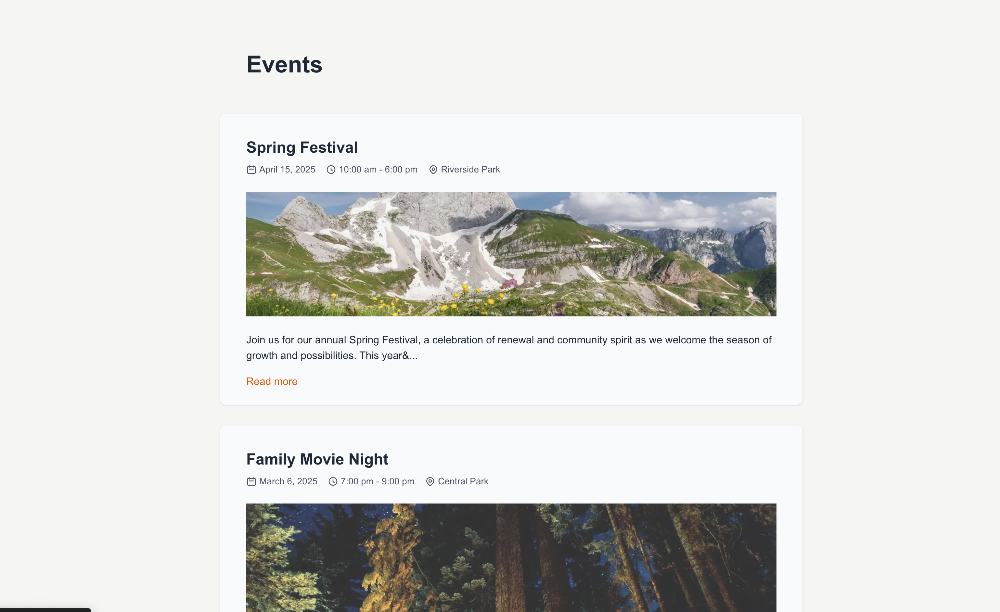
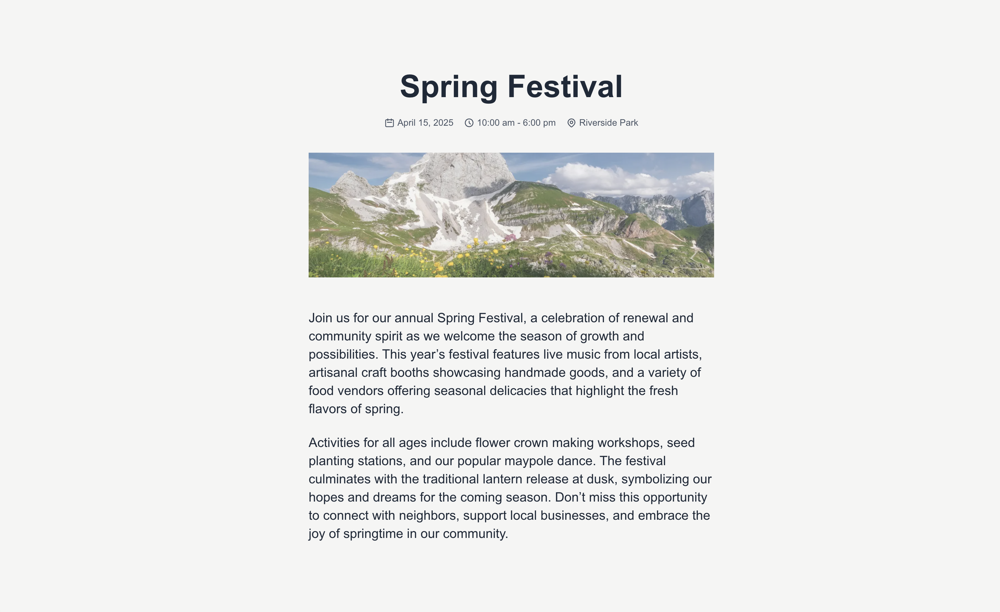

# Example: Next.js App Router using the Fetch API

An example headless WordPress application using Next.js App Router and the fetch API to fetch data from WordPress using WPGraphQL It showcases different data fetching strategies, state management techniques, and modern web development patterns in a real-world application context. This also contains a full example using wp-env and sample data.

## Prerequisites

- Node.js (v18+ recommended)
- [Docker](https://www.docker.com/) (if you plan on running the example see details below)


## Project Structure

```
/
├── example-app/            # Next.js App Headless Example Application
│   ├── app/                # Application-specific pages and routes
│   ├── components/         # Reusable UI components
│   ├── lib/                # Utility functions and libraries and WP GraphQL Fragments
|
|-- screenshots/            # Example screenshots for this README
|
├── wp-env/                 # WordPress local environment setup
│   ├── wp-env.json
│   ├── db/                 # Example database export to be imported for the example setup
│   ├── setup/              # .htaccess file to fix a CORS issue
│   ├── uploads/            # wp-content/uploads directory when the example application is run.
├── package.json            # Scripts for running the example application
```

## Features

- **Covers various rendering patterns of Next.js**

  - Server-Side Rendering (SSR) for dynamic pages
  - Static Site Generation (SSG) for static pages
  - Client-Side data fetching (CSR) for blog settings
  - Hybrid data fetching, combining SSR and CSR

- **Blog features**

  - Listing posts with pagination
  - Fetching posts and pages using nodeByUri of WPGraphQL
  - Fetching static pages at build time
  - Commenting posts
  - Header with dynamic blog title
  - Featured image
  - Includes category and tag blog post listings

- **Other Template Features**
  - Page template
  - CPT template with listings for a CPT events (can be adapted for other CPT)
  - Single CPT page with ACF custom meta fields

## Screenshots

Here are some screenshots of the application:

### Blog Listings



### Blog Post





### CPT




# Running the example with wp-env

## Prerequisites

**Note** Please make sure you have all prerequisites installed as mentioned above and Docker running (`docker ps`)

## Setup Repository and Packages

- Clone the repo `git clone https://github.com/wpengine/hwptoolkit.git`
- Install packages `cd hwptoolkit && npm install
- Setup a .env file under `examples/next/client-app-router-fetch-data/example-app` with `NEXT_PUBLIC_WORDPRESS_URL=http://localhost:8888`
e.g.

```bash
echo "NEXT_PUBLIC_WORDPRESS_URL=http://localhost:8888" > examples/next/client-app-router-fetch-data/example-app/.env
```

## Build and start the application

- `cd examples/next/client-app-router-fetch-data`
- Then run `npm run example:build` will build and start your application. 
- This does the following:
    - Starts up [wp-env](https://developer.wordpress.org/block-editor/getting-started/devenv/get-started-with-wp-env/)
    - Imports the database from [wp-env/db/database.sql](wp-env/db/database.sql)
    - Install Next.js dependencies for `example-app`
    - Runs the Next.js dev script

Congratulations, WordPress should now be fully set up.

| Frontend | Admin                        |
|----------|------------------------------|
| [http://localhost:3000/](http://localhost:3000/) | [http://localhost:8888/wp-admin/](http://localhost:8888/wp-admin/) |


> **Note:** The login details for the admin is username "admin" and password "password"


## Command Reference

| Command                | Description                                                                 |
|------------------------|-----------------------------------------------------------------------------|
| `example:build`        | Prepares the environment by starting WordPress, importing the database, and starting the application. |
| `example:dev`          | Runs the Next.js development server.                                       |
| `example:dev:install`  | Installs the required Next.js packages.                                    |
| `example:start`        | Starts WordPress and the Next.js development server.                       |
| `example:stop`         | Stops the WordPress environment.                                           |
| `example:prune`        | Rebuilds and restarts the application by destroying and recreating the WordPress environment. |
| `wp:start`             | Starts the WordPress environment.                                          |
| `wp:stop`              | Stops the WordPress environment.                                           |
| `wp:destroy`           | Completely removes the WordPress environment.                              |
| `wp:db:query`          | Executes a database query within the WordPress environment.                |
| `wp:db:export`         | Exports the WordPress database to `wp-env/db/database.sql`.                |
| `wp:db:import`         | Imports the WordPress database from `wp-env/db/database.sql`.              |

>**Note** You can run `npm run wp-env` and use any other wp-env command. You can also see <https://www.npmjs.com/package/@wordpress/env> for more details on how to use or configure `wp-env`.

### Database access

If you need database access add the following to your wp-env `"phpmyadminPort": 11111,` (where port 11111 is not allocated).

You can check if a port is free by running `lsof -i :11111`
