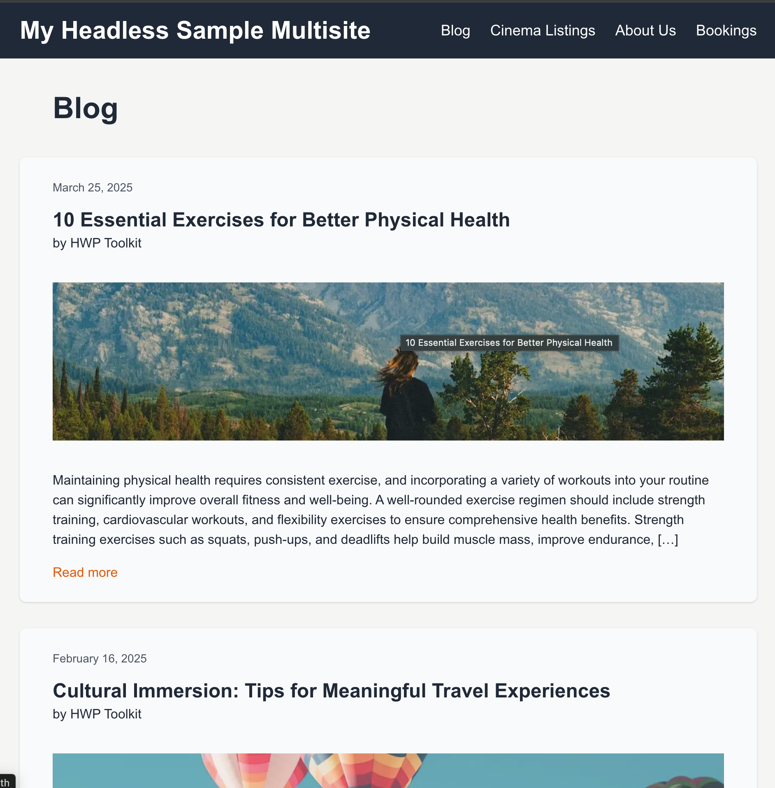
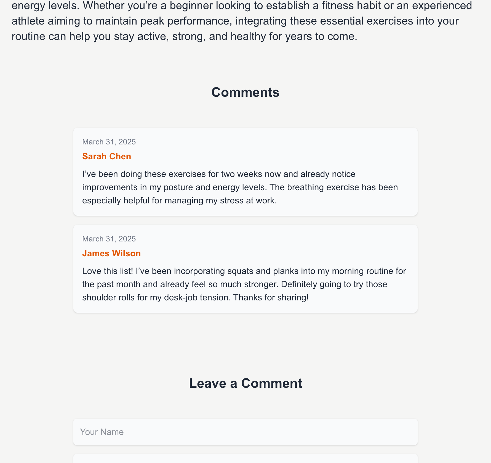
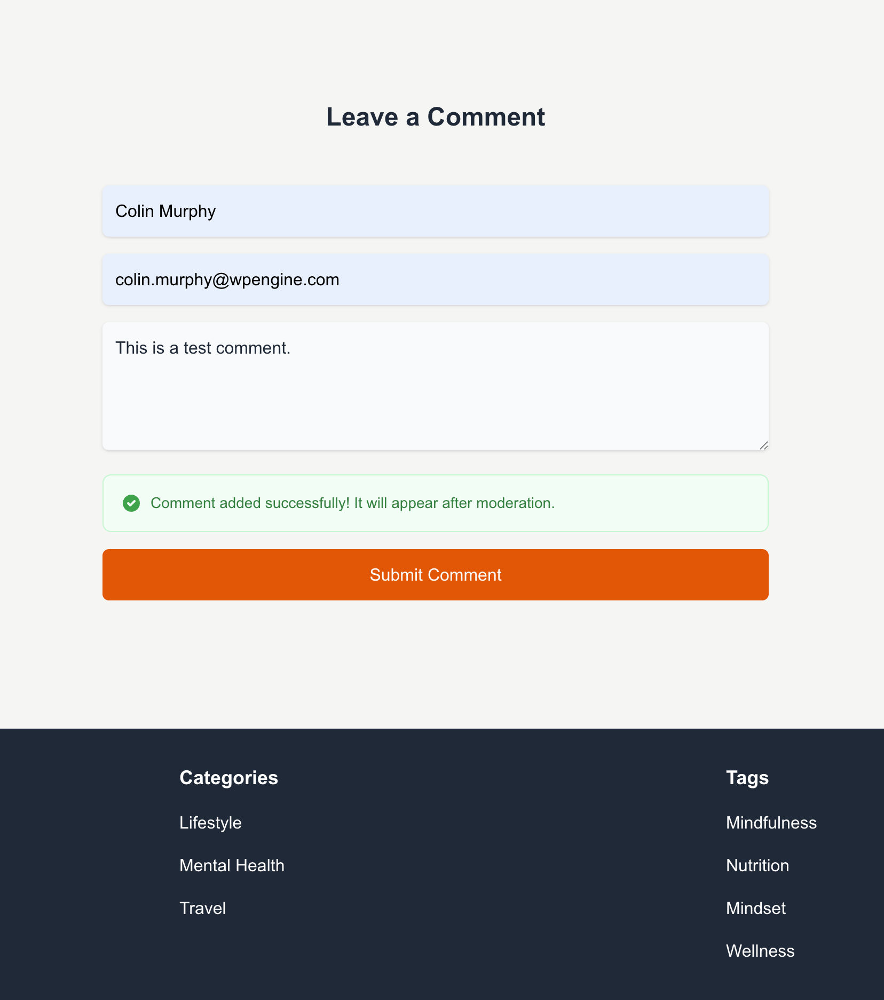
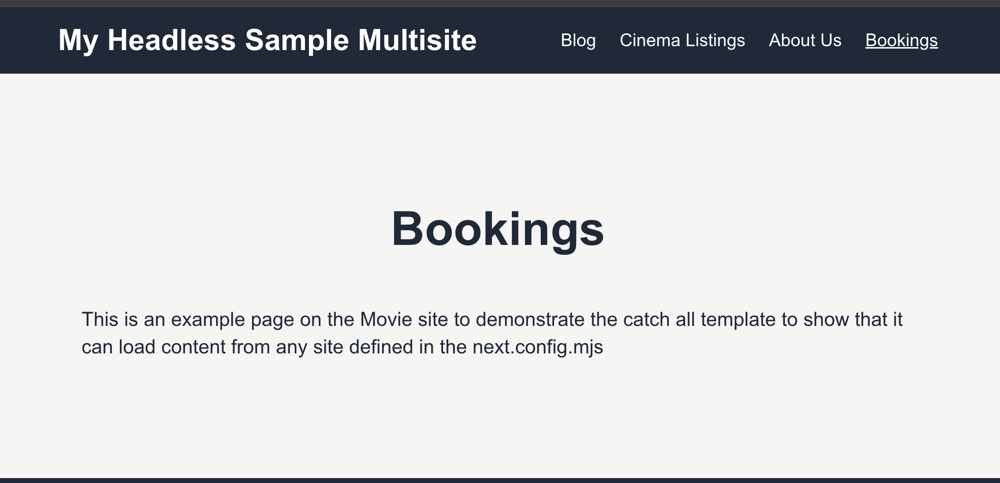

# Example: Multisite Next.js App Router using the Fetch API

# Table of Contents
- [Overview](#overview)
  - [Prerequisites](#prerequisites)
  - [Project Structure](#project-structure)
  - [Features](#features)
  - [Screenshots](#screenshots)
- [Running the Example with wp-env](#running-the-example-with-wp-env)
  - [Prerequisites](#prerequisites-1)
  - [Setup Repository and Packages](#setup-repository-and-packages)
  - [Build and Start the Application](#build-and-start-the-application)
  - [Command Reference](#command-reference)
  - [Database Access](#database-access)
  - [Adding More Sites to the Multisite Examples](#adding-more-sites-to-the-multisite-examples)


# Overview

An example mulitsite headless WordPress application using Next.js App Router and the fetch API to fetch data from WordPress using WPGraphQL. It showcases different data fetching strategies, state management techniques, and modern web development patterns in a real-world application context. This also contains a full example using wp-env and sample data.

## Prerequisites

- Node.js (v18+ recommended)
- [Docker](https://www.docker.com/) (if you plan on running the example see details below)


## Project Structure

```
/
├── example-app/            # Next.js App Headless Example Application
│   ├── app/                # Application-specific pages and routes
│   ├── components/         # Reusable UI components
│   ├── lib/                # Utility functions and libraries and WP GraphQL Fragments
|
|-- screenshots/            # Example screenshots for this README
|
├── wp-env/                 # WordPress local environment setup
│   ├── wp-env.json
│   ├── db/                 # Example database export to be imported for the example setup
│   ├── setup/              # .htaccess file to fix a CORS issue
|   |── log/                # Log file for wp-content/debug.log
│   ├── uploads/            # wp-content/uploads directory when the example application is run.
├── package.json            # Scripts for running the example application
```

## Features

- **Covers various rendering patterns of Next.js**

  - Server-Side Rendering (SSR) for dynamic pages
  - Static Site Generation (SSG) for static pages
  - Client-Side data fetching (CSR) for blog settings
  - Hybrid data fetching, combining SSR and CSR

- **Multisite Features**

  - Dynamic site management in next.config.mjs
  - Fetch data based off site key defined in next.config.mjs
  - Homepage dynamically fetches and displays data from multiple WordPress sites in the multisite network.

  - **Catch-All Template**

    - The catch-all template fetches data from all WordPress sites in the multisite network.
    - It loops through each site until it finds the relevant data to display.
    - Can be extended on a per site basis for querying different fragments

- **Blog features**

  - Listing posts with pagination
  - Fetching posts and pages using nodeByUri of WPGraphQL
  - Fetching static pages at build time
  - Commenting posts
  - Header with dynamic blog title
  - Featured image
  - Includes category and tag blog post listings

- **Other Template Features**
  - Page template
  - CPT template with listings for a CPT events (can be adapted for other CPT)
  - Single CPT page with ACF custom meta fields

## Screenshots











# Running the example with wp-env

## Prerequisites

**Note** Please make sure you have all prerequisites installed as mentioned above and Docker running (`docker ps`)

## Setup Repository and Packages

- Clone the repo `git clone https://github.com/wpengine/hwptoolkit.git`
- Install packages `cd hwptoolkit && npm install`
- Setup a .env file under `examples/next/client-multisite-app-router-fetch-data/example-app` with 

```
NEXT_PUBLIC_WORDPRESS_URL=http://localhost:8888
NEXT_PUBLIC_MOVIE_WORDPRESS_URL=http://localhost:8888/movies
```

e.g.

```bash
echo "NEXT_PUBLIC_WORDPRESS_URL=http://localhost:8888" > examples/next/client-multisite-app-router-fetch-data/example-app/.env
echo "NEXT_PUBLIC_MOVIE_WORDPRESS_URL=http://localhost:8888/movies" >> examples/next/client-multisite-app-router-fetch-data/example-app/.env
```

> [!IMPORTANT]
> The site configuration is based off values set in [example-app/next.config.mjs](example-app/next.config.mjs)
> If you want to add more sites please feel free to add more sites to your .env file and update the configuration in the next.config.mjs


## Build and start the application

- `cd examples/next/client-multisite-app-router-fetch-data`
- Then run `npm run example:build` will build and start your application.)
- This does the following:
    - Starts up [wp-env](https://developer.wordpress.org/block-editor/getting-started/devenv/get-started-with-wp-env/)
    - Imports the database from [wp-env/db/database.sql](wp-env/db/database.sql)
    - Sets the mulitisite wp-config.php variables
    - Install Next.js dependencies for `example-app`
    - Runs the Next.js dev script

Congratulations, WordPress should now be fully set up.

| Frontend | Admin                        |
|----------|------------------------------|
| [http://localhost:3000/](http://localhost:3000/) | [http://localhost:8888/wp-admin/](http://localhost:8888/wp-admin/) |

The login details for the admin is username "admin" and password "password"


> [!IMPORTANT]
There are issues with setting variables for multisite in .wp-env.json before converting the site to multisite. For this reason we set the variables after the sample database (which is multisite) is imported.
**You also need to update the port in wp:multisite:set:variables if you ever change 8888**

## Command Reference

| Command                     | Description                                                                 |
|-----------------------------|-----------------------------------------------------------------------------|
| `example:build`             | Prepares the environment by starting WordPress, importing the database, and starting the application. |
| `example:dev`               | Runs the Next.js development server.                                       |
| `example:dev:install`       | Installs the required Next.js packages.                                    |
| `example:start`             | Starts WordPress, sets the multisite variables, and starts the Next.js development server. |
| `example:stop`              | Stops the WordPress environment.                                           |
| `example:prune`             | Rebuilds and restarts the application by destroying and recreating the WordPress environment. |
| `wp:start`                  | Starts the WordPress environment.                                          |
| `wp:stop`                   | Stops the WordPress environment.                                           |
| `wp:multisite:set:variables`| Sets the variables for multisite in `wp-config.php`.                       |
| `wp:destroy`                | Completely removes the WordPress environment.                              |
| `wp:db:query`               | Executes a database query within the WordPress environment.                |
| `wp:db:export`              | Exports the WordPress database to `wp-env/db/database.sql`.                |
| `wp:db:import`              | Imports the WordPress database from `wp-env/db/database.sql`.              |

>**Note** You can run `npm run wp-env` and use any other wp-env command. You can also see <https://www.npmjs.com/package/@wordpress/env> for more details on how to use or configure `wp-env`.

### Database access

If you need database access add the following to your wp-env `"phpmyadminPort": 11111,` (where port 11111 is not allocated).

You can check if a port is free by running `lsof -i :11111`

### Adding more sites to the multisite examples

If you want to add more sites you need to do the followint

1. Add the variable to your .env next.js setup e.g. `NEXT_PUBLIC_SPORT_WORDPRESS_URL=http://localhost:8888/sport`
2. Update your next.config.mjs with a site key and this value e.g. 
```js
    WORDPRESS_SITES: JSON.stringify({
      main: process.env.NEXT_PUBLIC_WORDPRESS_URL + "/graphql",
      movie_site: process.env.NEXT_PUBLIC_MOVIE_WORDPRESS_URL + "/graphql",
      sport_site: process.env.NEXT_PUBLIC_SPORT_WORDPRESS_URL + "/graphql",
    }),
```

You then use the site key e.g. `sport_site` when fetching data with a template or the `fetchGraphQL` function

e.g. 

```
# example-app/src/app/sport-news/page.js
import { SportsListingsQuery } from "@/lib/queries/SportsListingsQuery";
import { CustomPostTypeTemplate } from "@/components/cpt/CustomPostTypeTemplate";

export default async function SportsListingsPage(params) {
  return CustomPostTypeTemplate(SportsListingsQuery, {
    params: params,
    customPostType: "sport", # Update CPT
    siteKey: "sport_site", # This is your site key
    title: "Sport News",
    cacheExpiry: 3600,
  });
}

```

**Note**

1. You need to add the query
2. You also need to update the Custom Post Type Template to include your listings template
