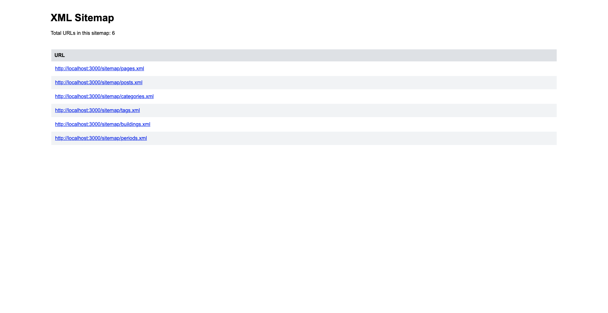
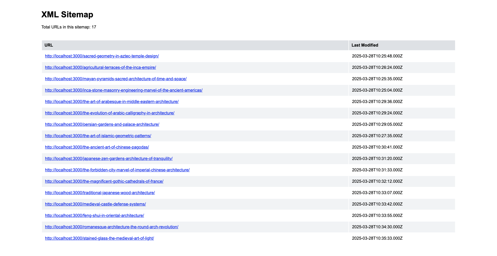
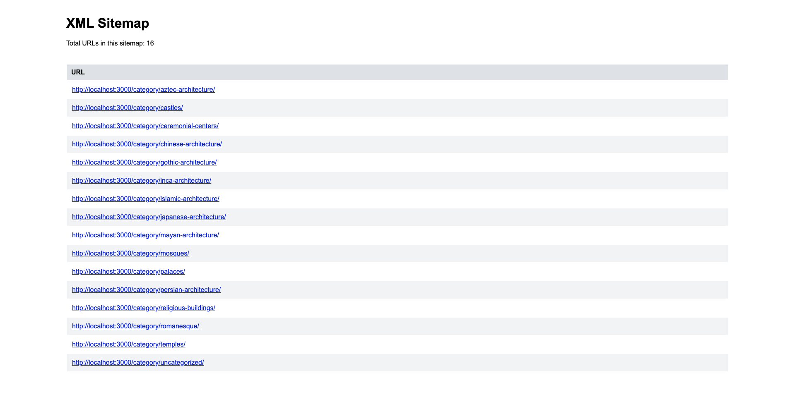
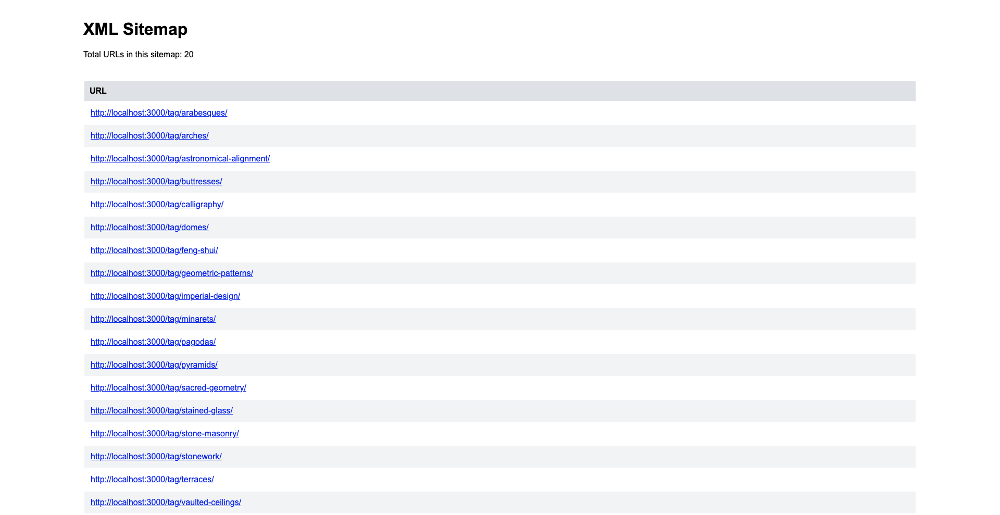
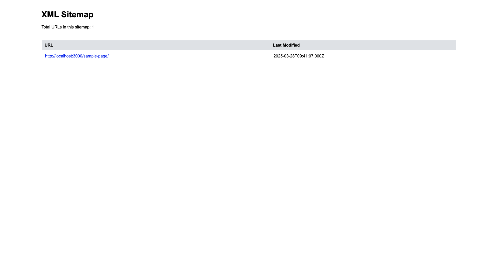
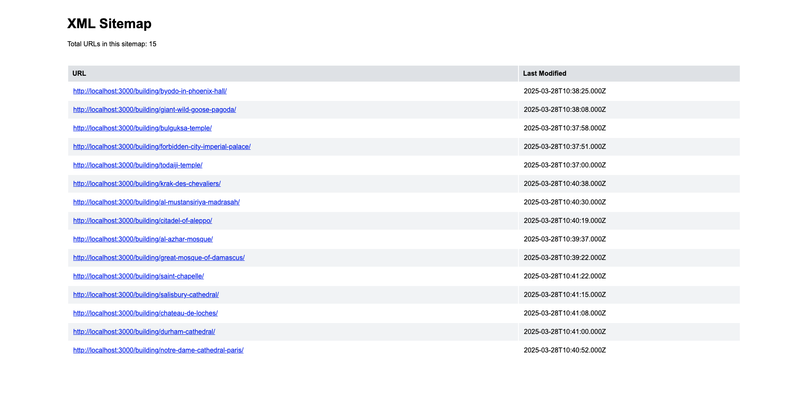

# Example: Create a custom WordPress sitemap with vanilla WPGraphQL and Apollo Client

## Overview

This example demonstrates how to generate a custom sitemap in a headless WordPress application using the Next.js framework. The example app fetches data from WordPress using Apollo Client and WPGraphQL. This example is using only the existing WPGraphQL endpoints, without extending it.

The example includes a wp-env setup, which will allow you to build and start this example quickly. With this wp-env setup, you don't need to have a separate WordPress instance or demo data to inspect the example.

## Features

1. Fetching sitemap data with the API allows maximum customizability
2. An identical WordPress sitemap structure in the headless setup
3. Custom XSLT styles
4. Configured WordPress instance with demo data and required plugins, using wp-env
5. Sitemaps for custom post and taxonomy types

## Screenshots

After following the installation steps, you should have the example sitemap pages as shown in the screenshots below:

|                                                                              |                                                                              |
| :--------------------------------------------------------------------------: | :--------------------------------------------------------------------------: |
|  <br>Sitemap index  |          <br>Posts           |
| <br>Categories |            <br>Tags             |
|           <br>Pages           | <br>Custom post type |

## Project Structure

```
├── example-app                                # Next.js application root
│   ├── public
│   │   └── sitemap.xsl                        # XSLT style file for the sitemap
│   └── src
│       ├── queries.js                         # Supported queries to fetch the nodes
│       ├── components
│       ├── lib
│       │   ├── client.js                      # Apollo Client instance
│       │   ├── renderEntries.js               # Turn query data into XML entries
│       │   ├── getPaginatedQuery.js           # Function to get and merge paginated queries recursively
│       │   └── generateSiteMap.js             # Helper function that generates the XML content
│       └── pages
│           ├── sitemap                        # Base path for sitemap subpages
│           │   └── index.js                   # Catch-all route for sitemap subpages
│           └── sitemap.xml.js                 # Index sitemap.xml page
├── .wp-env.json                               # wp-env configuration file
└── wp-env
    ├── db
    │   └── database.sql                       # WordPress database including all demo data for the example
    └── uploads                                # WordPress content to be used by wp-env
```

## Running the example with wp-env

### Prerequisites

- Node.js (v18+ recommended)
- [Docker](https://www.docker.com/) (if you plan on running the example see details below)

**Note** Please make sure you have all prerequisites installed as mentioned above and Docker running (`docker ps`)

### Setup Repository and Packages

- Clone the repo `git clone https://github.com/wpengine/hwptoolkit.git`
- Install packages `cd hwptoolkit && npm install`
- Setup a .env file under `examples/next/custom-sitemap-vanilla-wpgraphql/example-app` and add these values inside:

```
NEXT_PUBLIC_WORDPRESS_URL=http://localhost:8888
NEXT_PUBLIC_URL=http://localhost:3000
```

or run the command below:

```bash
echo "NEXT_PUBLIC_WORDPRESS_URL=http://localhost:8888\\nNEXT_PUBLIC_URL=http://localhost:3000" > examples/next/custom-sitemap-vanilla-wpgraphql/example-app/.env
```

### Build and start the application

- `cd examples/next/custom-sitemap-vanilla-wpgraphql`
- Then run `npm run example:build` will build and start your application.
- This does the following:
  - Starts up [wp-env](https://developer.wordpress.org/block-editor/getting-started/devenv/get-started-with-wp-env/)
  - Imports the database from [wp-env/db/database.sql](wp-env/db/database.sql)
  - Install Next.js dependencies for `example-app`
  - Runs the Next.js dev script

Congratulations, WordPress should now be fully set up.

| Frontend                                         | Admin                                                              |
| ------------------------------------------------ | ------------------------------------------------------------------ |
| [http://localhost:3000/](http://localhost:3000/) | [http://localhost:8888/wp-admin/](http://localhost:8888/wp-admin/) |

> **Note:** The login details for the admin is username "admin" and password "password"

### Command Reference

| Command               | Description                                                                                                             |
| --------------------- | ----------------------------------------------------------------------------------------------------------------------- |
| `example:build`       | Prepares the environment by starting WordPress, importing the database, and starting the application. |
| `example:dev`         | Runs the Next.js development server.                                                                                    |
| `example:dev:install` | Installs the required Next.js packages.                                                                                 |
| `example:start`       | Starts WordPress and the Next.js development server.                                                                    |
| `example:stop`        | Stops the WordPress environment.                                                                                        |
| `example:prune`       | Rebuilds and restarts the application by destroying and recreating the WordPress environment.                           |
| `wp:start`            | Starts the WordPress environment.                                                                                       |
| `wp:stop`             | Stops the WordPress environment.                                                                                        |
| `wp:destroy`          | Completely removes the WordPress environment.                                                                           |
| `wp:db:query`         | Executes a database query within the WordPress environment.                                                             |
| `wp:db:export`        | Exports the WordPress database to `wp-env/db/database.sql`.                                                             |
| `wp:db:import`        | Imports the WordPress database from `wp-env/db/database.sql`.                                                           |

> **Note** You can run `npm run wp-env` and use any other wp-env command. You can also see <https://www.npmjs.com/package/@wordpress/env> for more details on how to use or configure `wp-env`.

### Database access

If you need database access add the following to your wp-env `"phpmyadminPort": 11111,` (where port 11111 is not allocated).

You can check if a port is free by running `lsof -i :11111`
