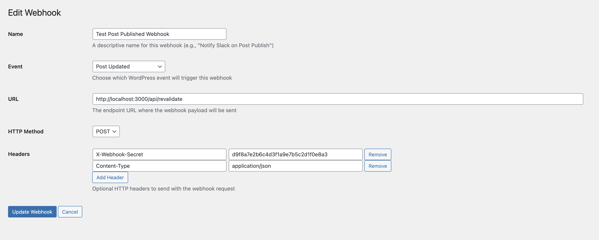

# WordPress to Next.js Webhooks Plugin Integration
## Overview
This integration enables seamless communication between a WordPress backend and a Next.js frontend using webhooks. When content updates occur in WordPress, webhooks notify the Next.js application to revalidate and update its cached pages, ensuring fresh and consistent content delivery.

## Features

* Incremental Static Regeneration (ISR) Showcase – Demonstrates Next.js ISR fully working with WordPress-triggered webhooks.

* On-Demand Revalidation – Webhooks notify Next.js to revalidate specific pages when WordPress content changes.

* Relative Path Payloads – Webhook payloads send clean relative paths (e.g., /posts/my-post) for accurate revalidation.

* Secure Webhook Requests – Uses secret tokens in headers to authenticate webhook calls.

* Flexible HTTP Methods & Headers – Supports POST requests with custom headers for integration flexibility.

* WordPress Native Integration – Uses WordPress Custom Post Types and hooks for managing webhooks.

* Extensible & Developer Friendly – Easily customizable payloads and event triggers via WordPress filters and actions.

## Prerequisites

* WordPress site with the wpgraphql-webhooks plugin installed.
* Next.js project (Node.js v18+ recommended).
* Environment variables configured for WordPress URL and webhook secret.

## Setup
### Environment Variables
Create or update your .env.local in your Next.js project:

```ini
NEXT_PUBLIC_WORDPRESS_URL=http://your-wordpress-site.com
WEBHOOK_REVALIDATE_SECRET=your_webhook_secret_token
```

### Creating a Webhook via the Admin UI
You can easily create and manage webhooks directly from the WordPress admin dashboard, without writing any code. The intuitive Webhooks UI allows you to specify the event, target URL, HTTP method, and custom headers for each webhook. This makes it simple to connect WordPress events to external services and automate your workflows.

Follow these steps to create a webhook using the UI:

1. **Navigate to the Webhooks Admin Page**
    In your WordPress dashboard, go to the sidebar and click on Webhooks.

2. **Click "Add New" or Edit an Existing Webhook**
    To create a new webhook, click the Add New button.
    To edit, click the webhook you want to update.

3. **Fill in the Webhook Details**
    * **Name**: Enter a descriptive name (e.g., Test Post Published Webhook).
    * **Event**: Select the event that will trigger the webhook (e.g., Post Updated).
    * **URL**: Enter the endpoint URL where the webhook payload should be sent (e.g., http://localhost:3000/api/revalidate).
    **HTTP Method**: Choose the HTTP method (e.g., POST).
    **Headers**: Add any HTTP headers required. For example:
        **X-Webhook-Secret**: d9f8a7e2b6c4d3f1a9e7b5c2df1f0e8a3
        **Content-Type**: application/json
    * Click Add Header to add more headers as needed.
4. **Save the Webhook**
    Click Create Webhook (or Update Webhook if editing) to save your settings.



## Modifying the Webhook Payload to Send Relative Paths
Add this filter to your WordPress plugin or theme to ensure the webhook payload sends a relative path (required by Next.js revalidate API):

```php
add_filter( 'graphql_webhooks_payload', function( array $payload, $webhook ) {
    error_log('[Webhook] Initial payload: ' . print_r($payload, true));
    if ( ! empty( $payload['post_id'] ) ) {
        $post_id = $payload['post_id'];
        error_log('[Webhook] Processing post ID: ' . $post_id);
        
        $permalink = get_permalink( $post_id );
        
        if ( $permalink ) {
            // Extract relative path from permalink URL
            $path = parse_url( $permalink, PHP_URL_PATH );
            $payload['path'] = $path;
            error_log('[Webhook] Added relative path: ' . $path);
        } else {
            error_log('[Webhook] Warning: Failed to get permalink for post ID: ' . $post_id);
        }
    } else {
        error_log('[Webhook] Notice: No post_id in payload');
    }

    // Log final payload state
    error_log('[Webhook] Final payload: ' . print_r($payload, true));
    
    return $payload;
}, 10, 2 );
```

## Testing the Integration with the Example Project

To verify that your webhook integration is working correctly, follow these steps:

1. Run the example project in production mode. (see ## Command Reference section)

2. In WordPress, update or create a new post, for example with the slug `/posts/new-post`.

3. Visit the corresponding page on your headless site at:

`http://localhost:3000/posts/new-post`


Refresh the page to see the updated content served via Incremental Static Regeneration (ISR).

4. Check the Next.js server logs. You should see logs indicating that the webhook revalidation request was received and processed successfully, similar to the following:

```bash
[Webhook] Received revalidation request
[Webhook] Secret from header: Provided
[Webhook] Expected secret is set: Yes
[Webhook] Secret token validated successfully
[Webhook] Request body parsed: {
  key: 'cG9zdDoyNDI=',
  path: '/posts/new-post/',
  graphql_endpoint: 'mysite.local/graphql',
  smart_cache_keys: [ 'cG9zdDoyNDI=' ],
  _webhook_meta: {
    sent_at: '2025-06-24 12:19:15',
    webhook_id: 254,
    webhook_name: 'Test Post Published Webhook',
    event_type: 'post_updated'
  }
}
[Webhook] Path to revalidate: /posts/new-post/
```

This confirms that the webhook triggered by your WordPress post update is successfully revalidating the page on your headless Next.js site.

## How It Works
This integration:

* When a post is updated in WordPress, the webhook triggers and sends a POST request to the Next.js revalidation API.
* The payload includes a relative path extracted from the post permalink.
* The Next.js API verifies the secret token from the header and calls res.revalidate(path) to refresh the cached page.
* This keeps your frontend content in sync with WordPress backend updates.

# Running the example with wp-env

## Prerequisites

**Note** Please make sure you have all prerequisites installed as mentioned above and Docker running (`docker ps`)

## Setup Repository and Packages

- Clone the repo `git clone https://github.com/wpengine/hwptoolkit.git`
- Install packages `cd hwptoolkit && pnpm install`
- Setup a .env file under `examples/next/webhooks-isr/example-app` with `NEXT_PUBLIC_WORDPRESS_URL=http://localhost:8888`
e.g.

```bash
echo "NEXT_PUBLIC_WORDPRESS_URL=http://localhost:8888" > examples/next/webhooks-isr/example-app/.env
echo "WEBHOOK_REVALIDATE_SECRET=your_webhook_secret_token" > examples/next/webhooks-isr/example-app/.env
```

## Build and start the application

- `cd examples/next/webhooks-isr`
- Then run `pnpm example:build` will build and start your application. 
- This does the following:
    - Unzips `wp-env/uploads.zip` to `wp-env/uploads` which is mapped to the wp-content/uploads directory for the Docker container.
    - Starts up [wp-env](https://developer.wordpress.org/block-editor/getting-started/devenv/get-started-with-wp-env/)
    - Imports the database from [wp-env/db/database.sql](wp-env/db/database.sql)
    - Install Next.js dependencies for `example-app`
    - Runs the Next.js dev script

Congratulations, WordPress should now be fully set up.

| Frontend | Admin                        |
|----------|------------------------------|
| [http://localhost:3000/](http://localhost:3000/) | [http://localhost:8888/wp-admin/](http://localhost:8888/wp-admin/) |


> **Note:** The login details for the admin is username "admin" and password "password"

## Command Reference

| Command                | Description                                                                 |
|------------------------|-----------------------------------------------------------------------------|
| `example:build`        | Prepares the environment by unzipping images, starting WordPress, importing the database, and starting the application. |
| `example:dev`          | Runs the Next.js development server.                                       |
| `example:dev:install`  | Installs the required Next.js packages.                                    |
| `example:start`        | Starts WordPress and the Next.js development server.                       |
| `example:stop`         | Stops the WordPress environment.                                           |
| `example:prune`        | Rebuilds and restarts the application by destroying and recreating the WordPress environment. |
| `wp:start`             | Starts the WordPress environment.                                          |
| `wp:stop`              | Stops the WordPress environment.                                           |
| `wp:destroy`           | Completely removes the WordPress environment.                              |
| `wp:db:query`          | Executes a database query within the WordPress environment.                |
| `wp:db:export`         | Exports the WordPress database to `wp-env/db/database.sql`.                |
| `wp:db:import`         | Imports the WordPress database from `wp-env/db/database.sql`.              |
| `wp:images:unzip`      | Extracts the WordPress uploads directory.                                  |
| `wp:images:zip`        | Compresses the WordPress uploads directory.                                |

>**Note** You can run `pnpm wp-env` and use any other wp-env command. You can also see <https://www.npmjs.com/package/@wordpress/env> for more details on how to use or configure `wp-env`.

### Database access

If you need database access add the following to your wp-env `"phpmyadminPort": 11111,` (where port 11111 is not allocated).

You can check if a port is free by running `lsof -i :11111`
