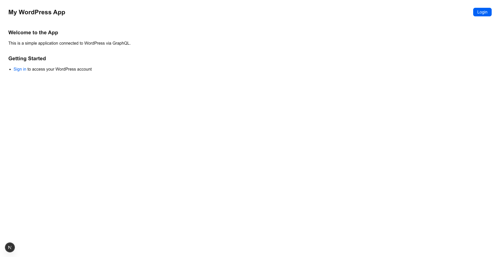
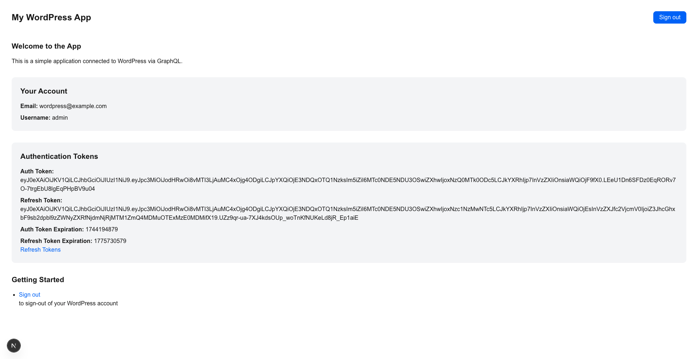
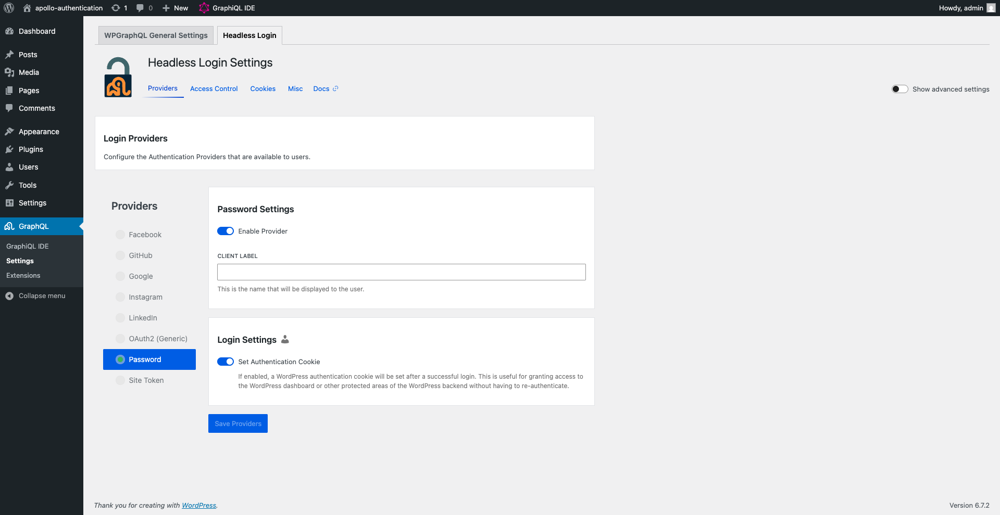

# Next.js WooCommerce example - template hierarchy, data fetching and authentication with Apollo
This example demonstrates a complete headless WooCommerce solution with Next.js, showcasing essential e-commerce functionality including shopping cart management, checkout flow, and user authentication. Built with WordPress template hierarchy and modern data fetching patterns using both native fetch and Apollo Client.

## Features

- **E-commerce Core**: Add to cart, remove items, checkout process, and thank you page
- **Authentication**: Username/password login in headless WordPress environment
- **Template Hierarchy**: WordPress template system integration with Next.js
- **Data Fetching**: Dual approach with native fetch and Apollo Client
- **GraphQL Integration**: Powered by WPGraphQL, WPGraphQL Headless Login, and WooGraphQL plugins

## Screenshots

After following the installation steps, you should have the example webpage as shown in the screenshots below:

|                                                 |                                                            |
| :---------------------------------------------: | :--------------------------------------------------------: |
| <br>Login page | <br>After login |

## Project Structure

```
.
├── example-app/                    # Next.js application folder containing frontend code
│   └── src/
│       ├── components/             # Reusable React components
│       ├── lib/                    # Apollo Client configuration, client and helpers
│       └── pages/                  # Next.js page routes
│       └── wp-templates/           # Next.js WordPress template hierarchy
├── .wp-env.json                    # wp-env configuration file
└── wp-env
    └── db
        └── database.sql            # WordPress database including all demo data for the example
```

## Quick Start with wp-env

### Prerequisites

- Node.js (v18+ recommended)
- [Docker](https://www.docker.com/) (required for wp-env)

**Note:** Ensure Docker is running (`docker ps`) before proceeding.

### Setup Repository and Packages

1. Clone the repository:
   ```bash
   git clone https://github.com/wpengine/hwptoolkit.git
   ```

2. Install dependencies:
   ```bash
   cd hwptoolkit && npm install
   ```

3. Configure environment variables:
   ```bash
   echo "NEXT_PUBLIC_WORDPRESS_URL=http://localhost:8890" > examples/next/woocommerce/example-app/.env
   ```

### Build and Start the Application

1. Navigate to the example directory:
   ```bash
   cd examples/next/woocommerce
   ```

2. Build and start everything:
   ```bash
   npm run example:build
   ```

This command will:
- Start [wp-env](https://developer.wordpress.org/block-editor/getting-started/devenv/get-started-with-wp-env/)
- Import the database from [wp-env/db/database.sql](wp-env/db/database.sql)
- Install Next.js dependencies
- Start the development server

### Access Your Application

| Frontend                                         | Admin                                                              |
| ------------------------------------------------ | ------------------------------------------------------------------ |
| [http://localhost:3000/](http://localhost:3000/) | [http://localhost:8890/wp-admin/](http://localhost:8890/wp-admin/) |

> **Admin Credentials:** Username: `admin` | Password: `password`

### Command Reference

| Command               | Description                                                                                                             |
| --------------------- | ----------------------------------------------------------------------------------------------------------------------- |
| `example:build`       | Prepares the environment by starting WordPress, importing the database, and starting the application. |
| `example:dev`         | Runs the Next.js development server.                                                                                    |
| `example:dev:install` | Installs the required Next.js packages.                                                                                 |
| `example:start`       | Starts WordPress and the Next.js development server.                                                                    |
| `example:stop`        | Stops the WordPress environment.                                                                                        |
| `example:prune`       | Rebuilds and restarts the application by destroying and recreating the WordPress environment.                           |
| `wp:start`            | Starts the WordPress environment.                                                                                       |
| `wp:stop`             | Stops the WordPress environment.                                                                                        |
| `wp:destroy`          | Completely removes the WordPress environment.                                                                           |
| `wp:db:query`         | Executes a database query within the WordPress environment.                                                             |
| `wp:db:export`        | Exports the WordPress database to `wp-env/db/database.sql`.                                                             |
| `wp:db:import`        | Imports the WordPress database from `wp-env/db/database.sql`.                                                           |

> **Tip:** Run `npm run wp-env` for additional wp-env commands. See the [official documentation](https://www.npmjs.com/package/@wordpress/env) for more details.

### Database Access

To access the database via phpMyAdmin, add this to your wp-env configuration:
```json
"phpmyadminPort": 11111
```

Check if port 11111 is available: `lsof -i :11111`

## Manual WordPress Setup

### Prerequisites

- **Node.js** (v18+ recommended)
- **Package manager**: npm, yarn, pnpm, or bun
- **WordPress instance** with required plugins with php 8.0 due to WPGraphQL for WooCommerce

### Required WordPress Plugins

Install and activate these plugins in your WordPress admin:

1. **WPGraphQL** - Exposes WordPress data via GraphQL
2. **WPGraphQL Headless Login** - Enables authentication for headless setups
3. **WPGraphQL for WooCommerce (WooGraphQL)** - Adds WooCommerce GraphQL support
4. **WooCommerce**

### Plugin Configuration

1. Navigate to **GraphQL** → **Settings** in your WordPress admin
2. Under **WPGraphQL Headless Login**, enable **Credentials Authentication**
3. When installing WooCommerce no extra additional plugins or add-ons are required.
4. [Optional] Go in WP Admin -> All Products -> Import and use the `sample_products.csv` from `/wp-env/` folder.


   

### Environment Setup

Create a `.env` file in the `example-app` directory:

```env
NEXT_PUBLIC_WORDPRESS_URL=http://localhost:8890
NEXT_PUBLIC_GRAPHQL_PATH=/graphql
SESSION_TOKEN_LS_KEY=woocommerce_session_token
REFRESH_TOKEN_LS_KEY=my_refresh_token
AUTH_TOKEN_LS_KEY=my_auth_token
AUTH_KEY_TIMEOUT=30000
```

> **Important:** Use your actual WordPress URL without a trailing slash.

### Getting Started

1. **Install dependencies:**
   ```bash
   npm install
   # or yarn install / pnpm install / bun install
   ```

2. **Start development server:**
   ```bash
   npm run dev
   # or yarn dev / pnpm dev / bun dev
   ```
### Notes
1. Single order (thank you page) can be accessed via http://localhost:3000/order-received/193?key=wc_order_UENFOwBPGaDlx. It's based on the wc_key instead of order id.