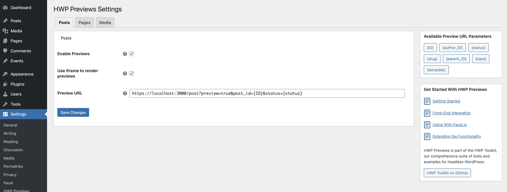
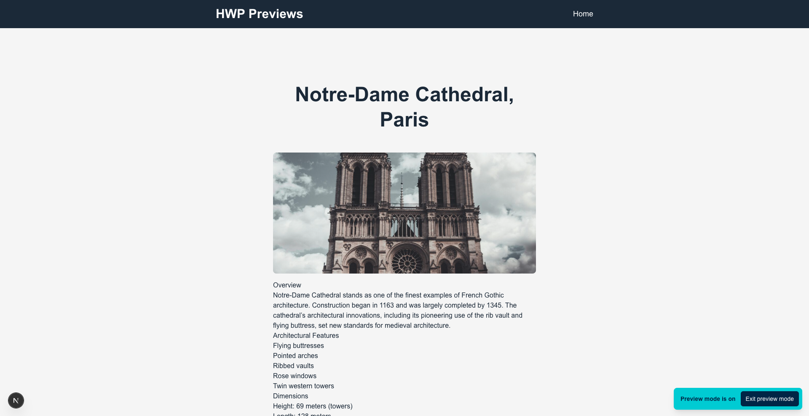
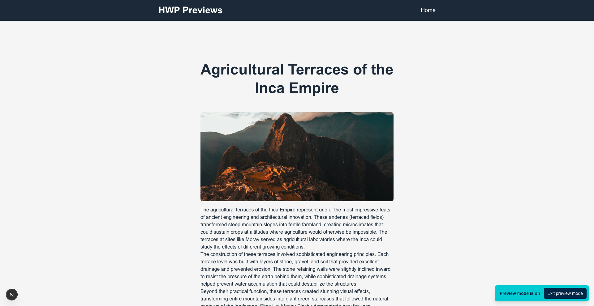
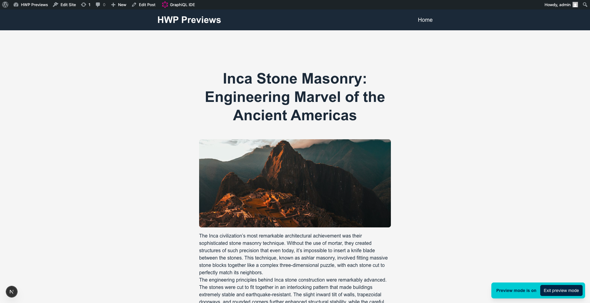
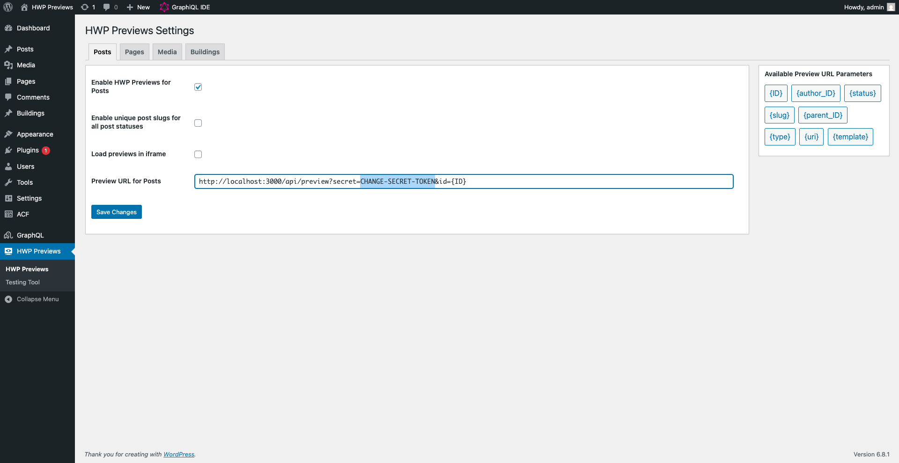
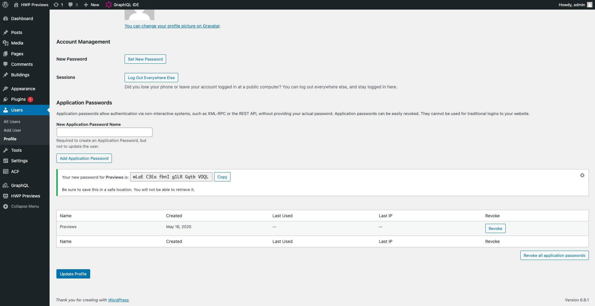

# HWP Previews

**Headless Previews** solution for WordPress: fully configurable preview URLs via the settings page which is framework agnostic.

* [Join the Headless WordPress community on Discord.](https://discord.gg/headless-wordpress-836253505944813629)
* [Documentation](#getting-started)


-----

[]()
[]()


[](https://github.com/wpengine/hwptoolkit/actions?query=workflow%3A%22Testing+Integration%22)
[](https://github.com/wpengine/hwptoolkit/actions?query=workflow%3A%22Code+Quality%22)
[](https://github.com/wpengine/hwptoolkit/actions?query=workflow%3A%22End-to-End+Tests%22)
-----


> [!CAUTION]
> This plugin is currently in an beta state. It's still under active development, so you may encounter bugs or incomplete features. Updates will be rolled out regularly. Use with caution and provide feedback if possible. You can create an issue at [https://github.com/wpengine/hwptoolkit/issues](https://github.com/wpengine/hwptoolkit/issues)

---

## Table of Contents

- [Overview](#overview)
- [Features](#features)
- [Getting Started](#getting-started)
- [Configuration](#configuration)
- [Front-End Integration](#front-end-integration)
- [Using With Faust.js](#using-with-faustjs)
- [Extending the Functionality](#extending-the-functionality)
- [Testing](#testing)

## Overview

HWP Previews is a robust and extensible WordPress plugin that centralizes all preview configurations into a user-friendly settings interface.
It empowers site administrators and developers to tailor preview behaviors for each public post type independently, facilitating seamless headless or decoupled workflows.
With HWP Previews, you can define dynamic URL templates, enforce unique slugs for drafts, allow all post statuses be used as parent and extend functionality through flexible hooks and filters, ensuring a consistent and conflict-free preview experience across diverse environments.


>[!IMPORTANT]
> For Faust users, HWP Previews integrates seamlessly, automatically configuring settings to match Faust's preview system. This allows you to maintain your existing preview workflow without additional setup.

---

## Features

- **Enable/Disable Previews**: Turn preview functionality on or off for each public post type (including custom types).
- **Custom URL Templates**: Define preview URLs using placeholder tokens for dynamic content.
- **Parent Status**: Allow posts of **all** statuses to be used as parent within hierarchical post types.
- **Highly Customizable**: Extend core behavior with a comprehensive set of actions and filters.
- **Faust Compatibility**: The plugin is compatible with [Faust.js](https://faustjs.org/) and the [FaustWP plugin](https://github.com/wpengine/faustjs/tree/canary/plugins/faustwp).


## Getting Started

This guide will help you set up your first headless preview link for the "Posts" post type.

1.  **Activate the Plugin:** Ensure "HWP Previews" is installed and activated.
2.  **Navigate to Settings:** Go to **Settings > HWP Previews** in your WordPress admin dashboard.
3.  **Enable for Posts:** On the "Posts" tab check the "Enable HWP Previews" box. If you have Faust installed this option will be enabled by default. Find more information about Faust integration below.
4.  **Set the Preview URL:** In the "Preview URL Template" field for Posts, enter the URL for your front-end application's preview endpoint. Use parameters to add dynamic information that you want to access.
5.  **Save and Test:** Save changes and go to any post, make a change, and click the "Preview" button. You should be redirected to the URL you just configured.

---

## Project Structure

```text
hwp-previews/
├── src/                        # Main plugin source code
│   ├── Admin/                  # Admin settings, menu, and settings page logic
│   ├── Hooks/                  # WordPress hooks and filters
│   ├── Integration/            # Integrations (e.g. Faust)
│   ├── Preview/                # Preview URL logic, template resolver, helpers
│   ├── Plugin.php              # Main plugin class (entry point)
│   └── Autoload.php            # PSR-4 autoloader
├── tests/                      # All test suites
│   ├── wpunit/                 # WPBrowser/Codeception unit 
├── [hwp-previews.php]
├── [activation.php]
├── [composer.json]
├── [deactivation.php]
├── [ACTIONS_AND_FILTERS.md]
├── [TESTING.md]
├── [README.md]
```

## Configuration

HWP Previews configuration located at **Settings > HWP Previews** page in your WP Admin. The settings are organized by post type.

### Settings

For each public post type, you can configure:

- **Enable HWP Previews:** This is the master switch for the post type. If disabled, WordPress will revert to its default preview behavior for these posts.
- **Allow All Statuses as Parent:** This option is only available for Pages type. By default, WordPress only allows published posts to be parents. Enable this to build parent-child relationships using draft or pending posts.
- **Load Previews in Iframe:** When enabled, the preview will be displayed directly within the WordPress editor in a sandboxed `<iframe>`. This provides a more integrated experience but requires your front-end to be configured to allow embedding. If disabled, clicking "Preview" will open a new browser tab.
- **Preview URL:** You will be redirected to this link, whenever you click the preview button for the enabled post type.

> [!NOTE]  
> Retrieving of settings is cached for performance.

### Parameters

You can use the parameters on the sidebar to add dynamic context info to your preview URL. This information can be used by your front-end application to better handle the preview requests.

Currently below parameters are available by default, but you can add your own parameters by extending the plugin via hooks. Check Extending the Functionality section for details.

- `{ID}` – Post ID
- `{author_ID}` – Post author’s user ID
- `{status}` – Post status slug
- `{slug}` – Post slug
- `{parent_ID}` – Parent post ID (hierarchical types)
- `{type}` – Post type slug
- `{template}` – Template filename

### Default Post Statuses Config:

Default post statuses are `publish`, `future`, `draft`, `pending`, `private`, `auto-draft` but these also modifiable via core hook.

---

## Front-End Integration

HWP Previews is framework and API agnostic, meaning you can integrate it with any front-end application and with any data-fetching method (WPGraphQL, REST).

To get started quickly you can use our [example based on Next.js and WPGraphQL](https://github.com/wpengine/hwptoolkit/tree/main/examples/next/hwp-preview-wpgraphql). This example uses the Draft Mode feature of Next.js.

To implement your own approach from scratch you can refer to the appropriate documentation pages for each framework. HWP Previews relies on custom preview URLs, allowing you to integrate any method. Below you can find the guides to implement framework-specific preview mode.

- [Next.js Draft Mode with Pages Router](https://nextjs.org/docs/pages/guides/draft-mode)
- [Next.js Draft Mode with App router](https://nextjs.org/docs/app/guides/draft-mode)
- [Nuxt usePreviewMode](https://nuxt.com/docs/api/composables/use-preview-mode)

---

## Using With Faust.js

This plugin is fully compatible with [Faust.js](https://faustjs.org/). It gives you the option to override Faust’s native preview system, providing granular control over preview URLs for use with any front-end framework.

### Automatic Integration

HWP Previews automatically detects when the Faust.js plugin is active to ensure a seamless integration. Upon detection, it pre-configures the following settings for all public post types:

- The "Enable HWP Previews" toggle is activated by default.
- The Preview URL is automatically updated to match Faust’s standard structure.

This out-of-the-box configuration allows your existing preview workflow to continue functioning, without manual setup. You can continue to use [Faust.js authentication](https://faustjs.org/docs/how-to/authentication/) to access the preview pages.

---

### Actions & Filters

See the [Actions & Filters documentation](ACTIONS_AND_FILTERS.md) for a comprehensive list of available hooks and how to use them.

---

## Testing

See [Testing.md](TESTING.md) for details on how to test the plugin.


## Screenshots

<details>
<summary>Click to expand screenshots</summary>


*Preview settings page.*


*Preview settings for a custom post type.*


*Preview button in the WordPress editor.*


*Preview loaded inside the WordPress editor using an iframe.*


*Preview token parameter for secure preview URLs.*


*App password setup for authentication.*

</details>
