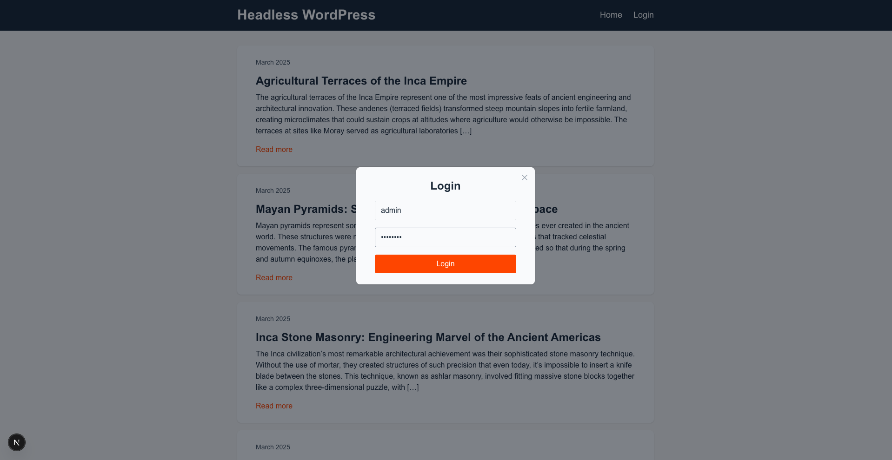
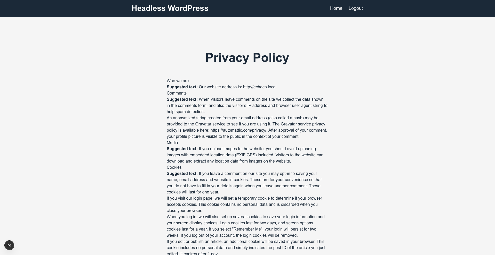

# Example: Headless WordPress Previews with Next.js App Router and REST API

> [!NOTE]
> Check out [HWP Previews WPGraphQL example](../hwp-preview-wpgraphql) if you need the previews implementation with Next.js pages router, Draft Mode or WordPress Application Passwords.

The purpose of this example is to showcase different use cases of HWP Previews. The example demonstrates the usage of [HWP Previews](https://github.com/wpengine/hwptoolkit/tree/main/plugins/hwp-previews) with Next.js App Router and REST API. Example uses credentials authentication to fetch the posts in draft status. Unlike [HWP Previews WPGraphQL example](../hwp-preview-wpgraphql) this example doesn't use [Draft Mode](https://nextjs.org/docs/pages/guides/draft-mode).

The example includes a wp-env setup, which will allow you to build and start this example quickly. With this wp-env setup, you don't need to have a separate WordPress instance or demo data to inspect the example.

## What does this example do

1. Preview posts, pages and custom post types using WordPress REST API
2. Use JWT authentication for secure access to draft content
3. Next.js App Router implementation without Draft Mode
4. Login modal for front-end authentication
5. Configured WordPress instance with demo data and required plugins, using wp-env.

## Screenshots

|                                              |                                                              |
| :------------------------------------------: | :----------------------------------------------------------: |
|  <br> Login |  <br> Page preview |

## Project Structure

```
├── example-app
├── src
│    ├── app
│    │   ├── page.js                           # Home page
│    │   ├── pages
│    │   │   └── [identifier]
│    │   │       └── page.jsx                  # Single pages and previews
│    │   └── posts
│    │       └── [identifier]
│    │           └── page.jsx                  # Single pages and previews
│    ├── components                            # Reusable components
│    └── lib
│        ├── AuthProvider.js                   # Auth logic and context
│        ├── authUtils.js                      # Utils for AuthProvider
│        └── fetchWP.js                        # WordPress REST API helper
├── .wp-env.json                               # wp-env configuration file
└── wp-env
    ├── db
    │   └── database.sql                       # WordPress database including all demo data for the example
    └── uploads.zip                            # WordPress content to be used by wp-env
```

## Running the example with wp-env

### Prerequisites

- Node.js (v18+ recommended)
- [Docker](https://www.docker.com/) (if you plan on running the example see details below)

**Note** Please make sure you have all prerequisites installed as mentioned above and Docker running (`docker ps`)

### 1. Setup Repository and Packages

- Clone the repo `git clone https://github.com/wpengine/hwptoolkit.git`
- Install packages `cd hwptoolkit && npm install`

### 2. Build and start the application

- `cd plugins/hwp-previews/examples/hwp-preview-rest`
- Then run `npm run example:build` will build and start your application.

This starts the wp-env instance and frontend application. You can access them now, but one more installation step remains.

> [!IMPORTANT]
> After logging in to the WordPress instance, ensure that all installed plugins are activated for this example to work properly.

| Frontend               | Admin                           |
| ---------------------- | ------------------------------- |
| http://localhost:3000/ | http://localhost:8888/wp-admin/ |

> **Note:** The login details for the admin is username "admin" and password "password"

### 3. Add environment variable to the Next.js application

Create a .env file under `plugins/hwp-previews/examples/hwp-preview-rest/example-app` and add the environment variable below:

```bash
NEXT_PUBLIC_WORDPRESS_URL=http://localhost:8888
```

> [!CAUTION]
> This setup is intended for demonstration purposes only. For production use, you should consider the security implications and implement appropriate measures based on your project's specific needs.

After completing this step, clicking the preview button in wp-admin should open the preview in your front-end app. Login with your admin credentials on the frontend to enable draft preview functionality.

If you want to learn more about the preview plugin, check out [the documentation](../../../../docs/plugins/hwp-previews/index.md).

### Command Reference

| Command               | Description                                                                                                             |
| --------------------- | ----------------------------------------------------------------------------------------------------------------------- |
| `example:build`       | Prepares the environment by unzipping images, starting WordPress, importing the database, and starting the application. |
| `example:dev`         | Runs the Next.js development server.                                                                                    |
| `example:dev:install` | Installs the required Next.js packages.                                                                                 |
| `example:start`       | Starts WordPress and the Next.js development server.                                                                    |
| `example:stop`        | Stops the WordPress environment.                                                                                        |
| `example:prune`       | Rebuilds and restarts the application by destroying and recreating the WordPress environment.                           |
| `wp:start`            | Starts the WordPress environment.                                                                                       |
| `wp:stop`             | Stops the WordPress environment.                                                                                        |
| `wp:destroy`          | Completely removes the WordPress environment.                                                                           |
| `wp:db:query`         | Executes a database query within the WordPress environment.                                                             |
| `wp:db:export`        | Exports the WordPress database to `wp-env/db/database.sql`.                                                             |
| `wp:db:import`        | Imports the WordPress database from `wp-env/db/database.sql`.                                                           |
| `wp:images:unzip`     | Extracts the WordPress uploads directory.                                                                               |
| `wp:images:zip`       | Compresses the WordPress uploads directory.                                                                             |

> **Note** You can run `npm run wp-env` and use any other wp-env command. You can also see <https://www.npmjs.com/package/@wordpress/env> for more details on how to use or configure `wp-env`.

### Database access

If you need database access add the following to your wp-env `"phpmyadminPort": 11111,` (where port 11111 is not allocated).

You can check if a port is free by running `lsof -i :11111`
