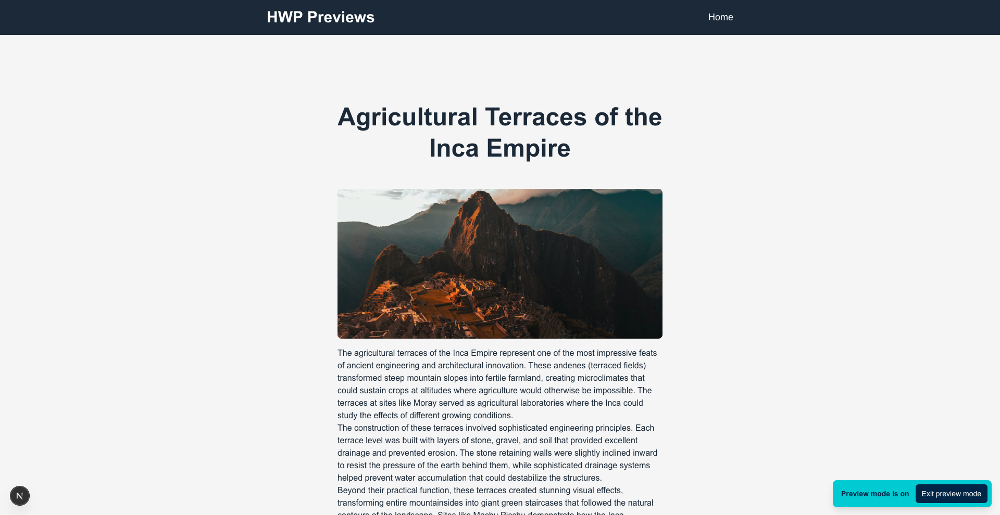
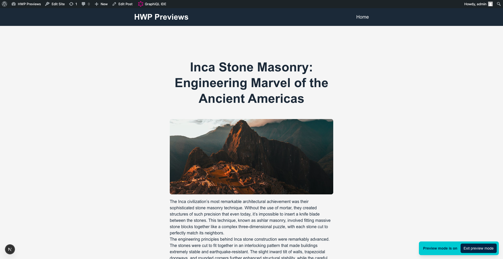
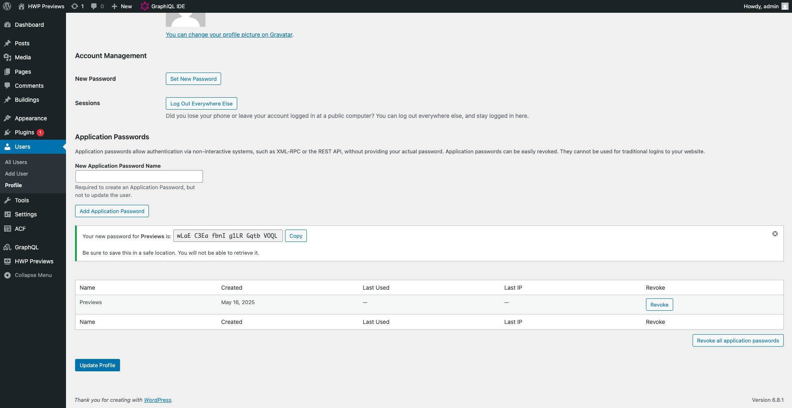
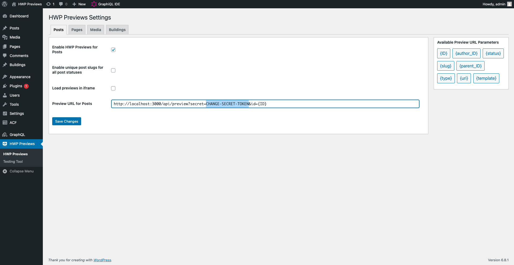

# Example: Headless WordPress Previews with Nextjs Draft Mode

This example shows the HWP Previews plugin in action. Example implements the [Draft Mode](https://nextjs.org/docs/pages/guides/draft-mode) of Next.js. It uses WordPress [Application Passwords](https://wordpress.com/support/security/two-step-authentication/application-specific-passwords/) for the authentication and WPGraphQL for data fetching.

The example includes a wp-env setup, which will allow you to build and start this example quickly. With this wp-env setup, you don't need to have a separate WordPress instance or demo data to inspect the example.

## What does this example do

1. `/api/preview/` route to enable Next.js Draft Mode
2. `/api/disable-preview` route to disable Next.js Draft Mode
3. Preview posts, pages and custom post types
4. Use WordPress Application Password as an authentication method
5. Configured WordPress instance with demo data and required plugins, using wp-env.

## Screenshots

|                                                                   |                                                                                              |                                                                                          |
| :---------------------------------------------------------------: | :------------------------------------------------------------------------------------------: | :--------------------------------------------------------------------------------------: |
|  <br> Post preview |  <br> Post preview in iframe |  <br> Custom post type preview |

## Project Structure

```
├── example-app
│   └── src
│       ├── components                         # Reusable React components
│       ├── lib
│       │   └── client.js                      # Apollo client instance
│       ├── pages
│       │   ├── [identifier].js                # Dynamic route to handle standard routes and previews
│       │   ├── api
│       │   │   ├── disable-preview.js         # Api route to disable Draft Mode
│       │   │   └── preview.js                 # Api route to enable Draft mode
│       │   └── index.js                       # Home page
│       └── utils
│           └── getAuthString.js               # Get Authorization string based on .env variables
├── .wp-env.json                               # wp-env configuration file
└── wp-env
    ├── db
    │   └── database.sql                       # WordPress database including all demo data for the example
    └── uploads.zip                            # WordPress content to be used by wp-env
```

## Running the example with wp-env

### Prerequisites

- Node.js (v18+ recommended)
- [Docker](https://www.docker.com/) (if you plan on running the example see details below)

**Note** Please make sure you have all prerequisites installed as mentioned above and Docker running (`docker ps`)

### 1. Setup Repository and Packages

- Clone the repo `git clone https://github.com/wpengine/hwptoolkit.git`
- Install packages `cd hwptoolkit && npm install`

### 2. Build and start the application

- `cd plugins/hwp-previews/examples/hwp-preview-wpgraphql`
- Then run `npm run example:build` will build and start your application.

This starts the wp-env instance and frontend application. You can access them now, but one more installation step remains.

> [!IMPORTANT]
> After logging in to the WordPress instance, ensure that all installed plugins are activated for this example to work properly.

| Frontend               | Admin                           |
| ---------------------- | ------------------------------- |
| http://localhost:3000/ | http://localhost:8888/wp-admin/ |

> **Note:** The login details for the admin is username "admin" and password "password"

### 3. Add environment variables to the Nextjs

In this step we will create an Application Password and a secret preview token for the previews. At the end we'll prepare a .env file for the Next.js application and put it inside `plugins/hwp-previews/examples/hwp-preview-wpgraphql/example-app` folder. Below are the step by step guide to achieve this.

1. Login to your newly created [wp-env instance](http://localhost:8888/wp-admin/). You can find the credentials above
2. a. Follow [these instructions](https://wordpress.com/support/security/two-step-authentication/application-specific-passwords/) to create an Application Password. At the end it should look like this:



2. b. Keep the password, we'll need it later.

3. Go to the HWP Previews settings and change the secret preview token.



4. Create a .env file under `plugins/hwp-previews/examples/hwp-preview-wpgraphql/example-app` and add these values inside:

```bash
NEXT_PUBLIC_WORDPRESS_URL=http://localhost:8888

WP_USERNAME=admin
WP_APP_PASSWORD=YOUR-APPLICATION-PASSWORD
WP_PREVIEW_SECRET=YOUR-SECRET-PREVIEW-TOKEN
```

> [!CAUTION]
> This setup is intended for demonstration purposes only. For production use, you should consider the security implications and implement appropriate measures based on your project’s specific needs.

After completing this step, clicking the preview button in wp-admin should open the preview in your front-end app.

If you want to learn more about the preview plugin, check out [the documentation](../../../../docs/plugins/hwp-previews/index.md).

### Command Reference

| Command               | Description                                                                                                             |
| --------------------- | ----------------------------------------------------------------------------------------------------------------------- |
| `example:build`       | Prepares the environment by unzipping images, starting WordPress, importing the database, and starting the application. |
| `example:dev`         | Runs the Next.js development server.                                                                                    |
| `example:dev:install` | Installs the required Next.js packages.                                                                                 |
| `example:start`       | Starts WordPress and the Next.js development server.                                                                    |
| `example:stop`        | Stops the WordPress environment.                                                                                        |
| `example:prune`       | Rebuilds and restarts the application by destroying and recreating the WordPress environment.                           |
| `wp:start`            | Starts the WordPress environment.                                                                                       |
| `wp:stop`             | Stops the WordPress environment.                                                                                        |
| `wp:destroy`          | Completely removes the WordPress environment.                                                                           |
| `wp:db:query`         | Executes a database query within the WordPress environment.                                                             |
| `wp:db:export`        | Exports the WordPress database to `wp-env/db/database.sql`.                                                             |
| `wp:db:import`        | Imports the WordPress database from `wp-env/db/database.sql`.                                                           |
| `wp:images:unzip`     | Extracts the WordPress uploads directory.                                                                               |
| `wp:images:zip`       | Compresses the WordPress uploads directory.                                                                             |

> **Note** You can run `npm run wp-env` and use any other wp-env command. You can also see <https://www.npmjs.com/package/@wordpress/env> for more details on how to use or configure `wp-env`.

### Database access

If you need database access add the following to your wp-env `"phpmyadminPort": 11111,` (where port 11111 is not allocated).

You can check if a port is free by running `lsof -i :11111`
