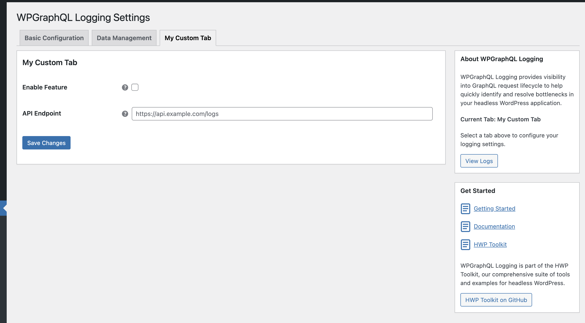

## How to add a new Settings tab to WPGraphQL Logging

This guide shows how to add your own settings tab and fields to the WPGraphQL Logging Admin using the `wpgraphql_logging_settings_field_collection_init` action.



*Example of a custom settings tab added to WPGraphQL Logging admin interface*


### Step 1 — Create a Tab class implementing `SettingsTabInterface`

Create a new class that implements the required static methods and returns the fields you want to render/save.

```php
<?php

namespace MyPlugin\Admin\Settings\Fields\Tab;

use WPGraphQL\Logging\Admin\Settings\Fields\Field\CheckboxField;
use WPGraphQL\Logging\Admin\Settings\Fields\Field\TextInputField;
use WPGraphQL\Logging\Admin\Settings\Fields\Tab\SettingsTabInterface;

class MyCustomTab implements SettingsTabInterface {
	public const ENABLE_FEATURE = 'my_custom_enable_feature';
	public const API_ENDPOINT   = 'my_custom_api_endpoint';

	public static function get_name(): string {
		return 'my_custom_tab';
	}

	public static function get_label(): string {
		return __( 'My Custom Tab', 'my-plugin' );
	}

	public function get_fields(): array {
		$fields = [];

		$fields[ self::ENABLE_FEATURE ] = new CheckboxField(
			self::ENABLE_FEATURE,
			self::get_name(),
			__( 'Enable Feature', 'my-plugin' ),
			'',
			__( 'Turn on a custom behavior for WPGraphQL Logging.', 'my-plugin' ),
	);

	$fields[ self::API_ENDPOINT ] = new TextInputField(
		self::API_ENDPOINT,
		self::get_name(),
		__( 'API Endpoint', 'my-plugin' ),
		'',
		__( 'Your service endpoint for processing log data.', 'my-plugin' ),
		__( 'https://api.example.com/logs', 'my-plugin' )
	);

		return $fields;
	}
}
```

Notes:

- `get_name()` is the tab identifier (slug).
- `get_label()` is the tab title shown in the UI.
- `get_fields()` returns an array of field objects keyed by a unique field ID. Available field types include `CheckboxField`, `TextInputField`, `SelectField`, and `TextIntegerField`.

### Step 2 — Register the tab via the action

Hook into the field collection and add your tab instance. The collection automatically registers your tab’s fields.

```php
add_action( 'wpgraphql_logging_settings_field_collection_init', function ( $collection ) {
	// Ensure your class is autoloaded or required before this runs
	$collection->add_tab( new \MyPlugin\Admin\Settings\Fields\Tab\MyCustomTab() );
}, 10, 1 );
```

### Step 3 — Reading saved values

Values are stored with the plugin’s option key (filterable via `wpgraphql_logging_settings_group_option_key`). A simple way to access them:

```php
namespace MyPlugin\Admin\Settings\Fields\Tab\MyCustomTab;
namespace WPGraphQL\Logging\Admin\Settings\ConfigurationHelper;
// You could also do this
// $options = get_option( 'wpgraphql_logging_settings', [] );
// $enabled = ! empty( $options['my_custom_tab']['enable_feature'] );
// $api_url = $options['my_custom_tab']['api_endpoint'] ?? '';

// Example: Show an admin notice based on the setting
add_action( 'admin_notices', function() use ( $enabled, $apiUrl ) {
	$helper  = ConfigurationHelper::get_instance();
	$tab 	 = 'my_custom_tab';
	$enabled = $helper->get_setting($tab, MyCustomTab::ENABLE_FEATURE, false);
	$api_url = $helper->get_setting($tab), MyCustomTab::API_ENDPOINT, '');


	if ( $enabled && empty( $api_url ) ) {
		echo '<div class="notice notice-warning"><p>';
		echo __( 'Custom feature is enabled but no API endpoint is configured.', 'my-plugin' );
		echo '</p></div>';
	} else {
		echo '<div class="notice notice-info"><p>';
		if ( $enabled ) {
			echo sprintf( __( 'Custom feature is enabled. API URL: %s', 'my-plugin' ), esc_html( $api_url ) );
		} else {
			echo __( 'Custom feature is disabled.', 'my-plugin' );
		}
		echo '</p></div>';
	}
});
```
