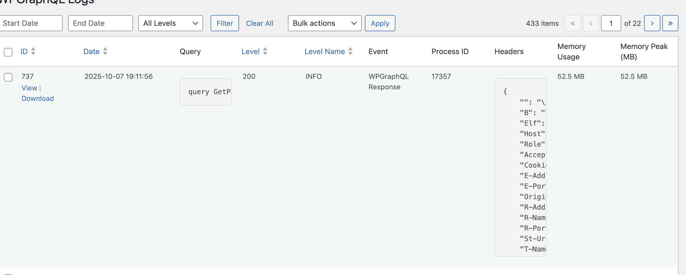

## How to add a new column to the Logs admin grid

This guide shows how to add a custom column to the Logs list table using the provided filters. We’ll add a Memory Peak Usage column sourced from the log entry’s `extra.memory_peak_usage`. 



*Example of a custom Memory Peak Usage column added to the WPGraphQL Logging admin table*


### Hooks overview

- `wpgraphql_logging_logs_table_column_headers`: modify the visible columns and sortable metadata
- `wpgraphql_logging_logs_table_column_value`: control how each column’s value is rendered

Source: `src/Admin/View/List/ListTable.php`

### Step 1 — Add the column header

```php
add_filter( 'wpgraphql_logging_logs_table_column_headers', function( $headers ) {
    if ( isset( $headers[0] ) && is_array( $headers[0] ) ) {
        $headers[0]['peak_memory_usage'] = __( 'Memory Peak (MB)', 'my-plugin' );
        // Optionally make it sortable by a DB column
        // $headers[2]['peak_memory_usage'] = [ 'memory_peak_usage', false ];
        return $headers;
    }

    // Fallback when filter is called for get_columns()
    $headers['peak_memory_usage'] = __( 'Memory Peak (MB)', 'my-plugin' );
    return $headers;
}, 10, 1 );
```

### Step 2 — Provide the cell value

Each row item is a `\WPGraphQL\Logging\Logger\Database\DatabaseEntity`. Memory data is stored in `$item->get_extra()['memory_peak_usage']`.

```php
add_filter( 'wpgraphql_logging_logs_table_column_value', function( $value, $item, $column_name ) {
    if ( 'peak_memory_usage' !== $column_name ) {
        return $value;
    }

    if ( ! $item instanceof \WPGraphQL\Logging\Logger\Database\DatabaseEntity ) {
        return $value;
    }

    $extra = $item->get_extra();
    $raw   = $extra['memory_peak_usage'] ?? '';
    if ( '' === $raw ) {
        return '';
    }

    // Normalize to MB if the stored value is in bytes
    if ( is_numeric( $raw ) ) {
        $mb = round( (float) $raw / 1048576, 2 );
        return sprintf( '%s MB', number_format_i18n( $mb, 2 ) );
    }

    // If already formatted (e.g., "24 MB"), just escape and return
    return esc_html( (string) $raw );
}, 10, 3 );
```
