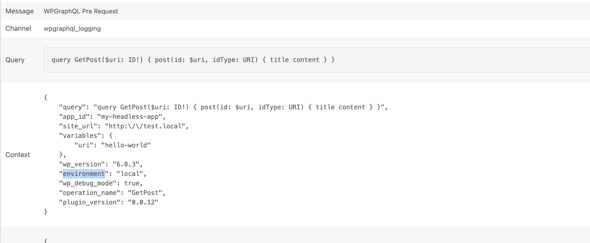

## How to add context data to a logged WPGraphQL event

This guide shows two supported ways to inject custom context data into events that WPGraphQL Logging records:

- Programmatic transform API (recommended for plugins/themes using PHP namespaces)
- WordPress filter API (easy to drop into any project)

Refer to the [Events Reference](../reference/events.md) for the list of available event names.



*Example of custom context data being added to a WPGraphQL event log entry*


### Option A — Programmatic transform API

Use the `WPGraphQL\Logging\Plugin::transform()` helper to mutate the event payload before it is logged and emitted.

```php
<?php
use WPGraphQL\Logging\Plugin;
use WPGraphQL\Logging\Events\Events;
use Monolog\Level;

// Add custom context to the PRE_REQUEST event
add_action( 'init', function() {
    Plugin::transform( Events::PRE_REQUEST, function( array $payload ): array {
        // $payload has keys: 'context' (array) and 'level' (Monolog\Level)
        $payload['context']['environment'] = wp_get_environment_type();
        $payload['context']['app_id']      = 'my-headless-app';

        // Optional: change the log level for this specific event
        // $payload['level'] = Level::Debug;

        return $payload;
    }, 10 );
} );
```

You can target any event constant from `WPGraphQL\Logging\Events\Events`, for example:

- `Events::PRE_REQUEST` (maps to `do_graphql_request`)
- `Events::BEFORE_GRAPHQL_EXECUTION` (maps to `graphql_before_execute`)
- `Events::BEFORE_RESPONSE_RETURNED` (maps to `graphql_return_response`)
- `Events::REQUEST_DATA` (filter `graphql_request_data`)
- `Events::REQUEST_RESULTS` (filter `graphql_request_results`)
- `Events::RESPONSE_HEADERS_TO_SEND` (filter `graphql_response_headers_to_send`)


### Option B — WordPress filter API

Every event also exposes a WordPress filter bridge you can hook into to modify the payload. The filter name pattern is:

- `wpgraphql_logging_filter_{event_name}`

Where `{event_name}` is the raw WPGraphQL hook name (the constant value). For example, to inject context before the response is returned:

```php
<?php
add_filter( 'wpgraphql_logging_filter_graphql_return_response', function( array $payload ) {
    // $payload has 'context' and 'level'
    $payload['context']['trace_id']    = uniqid( 'trace_', true );
    $payload['context']['feature_flag'] = defined('MY_FEATURE') ? (bool) MY_FEATURE : false;
    return $payload; // You must return the modified payload
}, 10, 1 );
```

Another example for the request data stage:

```php
<?php
add_filter( 'wpgraphql_logging_filter_graphql_request_data', function( array $payload ) {
    $payload['context']['client'] = [
        'ip'      => $_SERVER['REMOTE_ADDR'] ?? null,
        'agent'   => $_SERVER['HTTP_USER_AGENT'] ?? null,
    ];
    return $payload;
}, 10, 1 );
```
