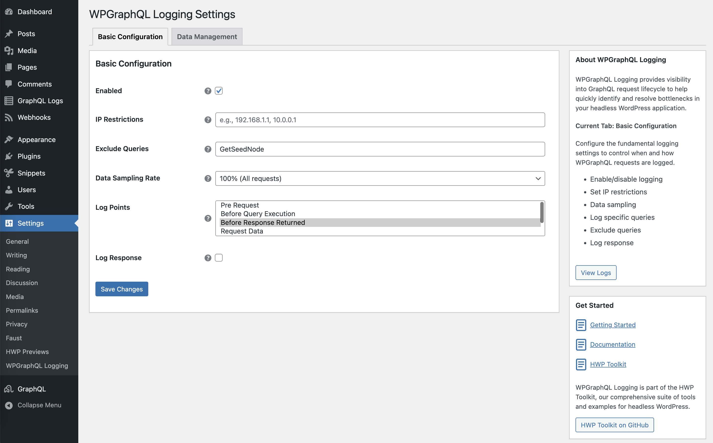

# WPGraphQL Logging

## Table of Contents

- [Project Structure](#project-structure)
- [Key Features](#key-features)
- [Installation](#installation)
- [Configuration](#configuration)
- [Admin Interface](#admin-interface)
- [Uninstallation and Data Cleanup](#uninstallation-and-data-cleanup)
- [How‑to Guides](#how‑to-guides)
- [Reference](#reference)

---


## Project Structure

```text
wpgraphql-logging/
├── docs/                       # Docs for extending the plugin. Contains developer docs.
├── src/                        # Main plugin source code
│   ├── Admin/                  # Admin settings, menu, and settings page logic
│   	├── Settings/             # Admin settings functionality for displaying and saving data.
│   ├── Events/                 # Event logging, pub/sub event manager for extending the logging.
│   ├── Logger/                 # Logging logic, logger service, Monolog handlers & processors
│   	├── Database/            	# Database Entity and Helper
│   	├── Handlers/            	# Monolog WordPress Database Handler for logging data
│   	├── Processors/           # Monolog Processors for data sanitzation and adding request headers.
│   	├── Rules/            		# Rules and Rule Manager on whether we log a query
│   	├── Scheduler/            # Automated data cleanup and maintenance tasks
│   ├── Plugin.php              # Main plugin class (entry point)
│   └── Autoload.php            # PSR-4 autoloader
├── tests/                      # All test suites
│   ├── wpunit/                 # WPBrowser/Codeception unit tests
├── [wpgraphql-logging.php]
├── [activation.php]
├── [composer.json]
├── [deactivation.php]
├── [TESTING.md]
├── [README.md]
```

---

## Key Features

- **End-to-end GraphQL lifecycle logging**
  - **Pre Request** (`do_graphql_request`): captures `query`, `variables`, `operation_name`.
  - **Before Execution** (`graphql_before_execute`): snapshots request `params`.
  - **Before Response Returned** (`graphql_return_response`): inspects `response`; auto-elevates level to Error when GraphQL `errors` are present (adds `errors` to context).

- **Developer-friendly pub/sub and transform system**
  - Programmatic API: `Plugin::on($event, $listener)`, `Plugin::transform($event, $callable)`, `Plugin::emit($event, $payload)`.
  - Prioritized execution: lower priority runs earlier for both subscribers and transforms.
  - WordPress bridges: actions `wpgraphql_logging_event_{event}` and filters `wpgraphql_logging_filter_{event}` to integrate with standard hooks.
  - Safe-by-default: exceptions in listeners/transforms are caught and logged; they do not break the pipeline.
  - See: Reference › Events (`docs/reference/events.md`) and How‑to guides (`docs/how-to/events_pub_sub.md`, `docs/how-to/events_add_context.md`).

- **Extensible Monolog pipeline**
  - Default handler: `WordPressDatabaseHandler` stores logs in `{$wpdb->prefix}wpgraphql_logging`.
  - Add handlers via filter `wpgraphql_logging_default_handlers` (e.g., file, Slack, HTTP, etc.).
  - Add processors via filter `wpgraphql_logging_default_processors` (e.g., enrich records with user/site data).
  - Customize `default_context` via `wpgraphql_logging_default_context`.
  - Use `LoggerService::get_instance()` to build custom channels, handlers, processors.

- **Configurable rule-based logging**
  - Built-in rules: enabled toggle, IP restrictions, exclude queries, sampling rate, null query guard, response logging toggle.
  - All rules are orchestrated by a `RuleManager` ensuring logs only emit when all rules pass.
  - Extend rules: hook `wpgraphql_logging_rule_manager` to add custom `LoggingRuleInterface` implementations.

- **Automated data management**
  - **Daily cleanup scheduler**: removes old logs based on retention.
  - **Configurable retention period**: choose days to keep (default 30).
  - **Manual cleanup**: trigger from the admin UI.
  - **Data sanitization**: built-in `DataSanitizationProcessor` removes/anonymizes/truncates sensitive fields with recommended or custom rules.

- **Admin UI for operations**
  - Logs list view with filters (level, date range) and CSV export.
  - Bulk delete actions and visibility controls.

- **Composable and testable architecture**
  - Clear separation: Events bus, Logger service, Rules, Processors, Handlers.
  - Designed for extension via interfaces, filters, and helper APIs.

---

## Setup

Once the plugin is activated, you can activate and configure the plugin under Settings -> WPGraphQL Logging

### Basic Configuration



- **Enabled**: The master switch to turn logging on or off.
- **IP Restrictions**: A comma-separated list of IPv4/IPv6 addresses. When set, only requests originating from these IPs will be logged. This is particularly useful for developers who wish to log only their own queries.
- **Exclude Queries**: A comma-separated list of GraphQL query or mutation names to be excluded from logging. This helps reduce noise by ignoring frequent or uninteresting operations.
- **Data Sampling Rate**: A dropdown to select the percentage of requests that will be logged. This is useful for managing log volume on high-traffic sites by only capturing a sample of the total requests.
- **Log Points**: A multi-select field to choose the specific WPGraphQL lifecycle events for which data should be logged.
- **Log Response**: A toggle to determine whether the GraphQL response body should be included in the log. Disabling this can reduce the size of your log data.

>[Note]
> The configuration for these rules are set in a rule manager service which checks to see if a event should be logged, based on whether it passes all rules or not. More docs on the rule manager can be found here @TODO

You want to add a new rule. See our guide here @TODO


### Data Management


- **Enable Data Deletion**: A toggle to enable a daily WP-Cron job that automatically deletes old log entries based on the retention period.
- **Log Retention Period**: Specify the number of days to keep log data before it is automatically deleted.
- **Enable Data Sanitization**: The master switch to turn data sanitization on or off. When enabled, sensitive data is cleaned from logs before being stored.
- **Data Sanitization Method**: Choose between two sanitization methods:
	- **Recommended Rules (Default)**: Uses pre-configured rules to automatically sanitize common sensitive fields in WordPress and WPGraphQL. The following fields are sanitized:
		- `request.app_context.viewer.data` (User data object)
		- `request.app_context.viewer.allcaps` (User capabilities)
		- `request.app_context.viewer.cap_key` (Capability keys)
		- `request.app_context.viewer.caps` (User capability array)
	- **Custom Rules**: Provides granular control over sanitization with the following options:
		- **Fields to Remove**: A comma-separated list of field paths (e.g., `request.app_context.viewer.data`) to completely remove from the log.
		- **Fields to Anonymize**: A comma-separated list of field paths whose values will be replaced with `***`.
		- **Fields to Truncate**: A comma-separated list of field paths whose string values will be truncated to 50 characters.


## Viewing Logs

Once configured to log data you can find logs under "GraphQL Logs" in the WordPress Menu.


This extends the WordPress WP List Table class but you can do the following.

### Download the log

You can download the log as CSV format e.g.

```csv
ID,Date,Level,"Level Name",Message,Channel,Query,Context,Extra
5293,"2025-10-06 15:41:34",200,INFO,"WPGraphQL Response",wpgraphql_logging,"{ posts(first: 10) ...""memory_peak_usage"":""18 MB""}"
```


### Filtering Logs

You can filter the log by

1. Level
2. Start Date
3. End Date


>[Note]
> We only show the `info` and `error` levels as these are the only levels logged out of the box. If you need to change this, you can update the admin template. See @TODO


### Bulk Actions

Currently you can delete selected or all logs.

If you want to customize this. @TODO


## Uninstallation and Data Cleanup

By default, WPGraphQL Logging preserves all logged data when the plugin is deactivated to prevent accidental data loss. If you want to completely remove all plugin data (including database tables) when deactivating the plugin, you must explicitly enable this behavior.

### Enabling Database Cleanup on Deactivation

To enable automatic database cleanup when the plugin is deactivated, add the following constant to your `wp-config.php` file or in a must-use plugin:

```php
define( 'WP_GRAPHQL_LOGGING_UNINSTALL_PLUGIN', true );
```

> [!WARNING]
> **Data Loss Warning**: When `WP_GRAPHQL_LOGGING_UNINSTALL_PLUGIN` is defined as `true`, deactivating the plugin will permanently delete all logged data and drop the plugin's database tables. This action is irreversible.


## How‑to Guides

### Admin
- [How to add a new Settings tab to WPGraphQL Logging](how-to/admin_add_new_tab.md)
- [How to add a new field to an existing tab and query it](how-to/admin_add_fields.md)
- [How to add a new column to the Logs admin grid](how-to/admin_add_view_column.md)

### Events
- [How to add context data to a logged WPGraphQL event](how-to/events_add_context.md)
- [How to use the WPGraphQL Logging events pub/sub system](how-to/events_pub_sub.md)

### Logging
- @TODO — add how‑to guides for LoggerService, handlers, processors, rules

## Reference

- Admin: [Actions/Filters](reference/admin.md)
- Events: [Actions/Filters](reference/events.md)
- Logging: [Actions/Filters](reference/logging.md)
