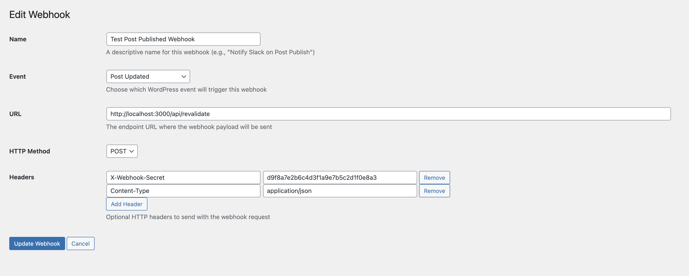

# WPGraphQL Webhooks Plugin Documentation

## Introduction

The **WPGraphQL Webhooks** plugin extends your WordPress site with powerful webhook management capabilities tailored for GraphQL-driven headless setups. It allows you to create, update, and manage webhooks that trigger on various WordPress and WPGraphQL events, enabling seamless integration with external services and static site generators.

This plugin is designed to work hand-in-hand with WordPress and WPGraphQL, providing a flexible and reliable way to automate workflows such as cache invalidation, content revalidation, and more.

## Features

- **Easy Webhook Management UI**: Create, update, and delete webhooks directly from the WordPress admin dashboard.
- **Event-Based Triggers**: Configure webhooks to fire on a variety of WordPress and WPGraphQL events.
- **Custom HTTP Methods and Headers**: Specify HTTP methods (POST, GET, etc.) and custom headers for your webhook requests.
- **Built-in Integration with WPGraphQL Smart Cache**: Leverages smart cache invalidation events for efficient revalidation.
- **Fallback Invalidation System**: If WPGraphQL Smart Cache is not installed, the plugin falls back to a simpler event invalidation mechanism.
- **Security**: Supports nonce verification and capability checks to secure webhook management.
- **AJAX Testing**: Test webhook endpoints directly from the admin UI.
- **Extensible**: Provides filters and actions for developers to customize behavior.

## Creating and Updating Webhooks

You can manage webhooks easily via the WordPress admin UI:

### Creating a Webhook

1. **Access the Webhooks Admin Page**
   - In your WordPress dashboard sidebar, click on **Webhooks**.

2. **Add a New Webhook**
   - Click the **Add New** button.

3. **Fill in Webhook Details**
   - **Name**: Enter a descriptive name for your webhook (e.g., `Post Published Webhook`).
   - **Event**: Select the event that triggers the webhook (e.g., `post_published`).
   - **URL**: Enter the target URL that will receive the webhook payload.
   - **HTTP Method**: Choose the HTTP method (default is `POST`).
   - **Headers**: Add any necessary HTTP headers (e.g., authentication tokens).

4. **Save the Webhook**
   - Click **Create Webhook** to save.

### Updating a Webhook

1. **Navigate to the Webhooks List**
   - Click on **Webhooks** in the admin sidebar.

2. **Edit an Existing Webhook**
   - Click the webhook you want to update.

3. **Modify the Details**
   - Change any fields like name, event, URL, method, or headers.

4. **Save Changes**
   - Click **Update Webhook** to apply the changes.

## Integration with WPGraphQL Smart Cache (Recommended)

The **WPGraphQL Webhooks** plugin has built-in integration with the [WPGraphQL Smart Cache](https://wordpress.org/plugins/wpgraphql-smart-cache/) plugin. This integration enables advanced smart cache invalidation events, allowing your webhooks to trigger only when necessary, improving performance and reducing unnecessary rebuilds or revalidations.

**Important:** It is strongly recommended to install and activate the WPGraphQL Smart Cache plugin alongside WPGraphQL Webhooks to take full advantage of these features.

If WPGraphQL Smart Cache is not installed, WPGraphQL Webhooks will gracefully fall back to a simpler event invalidation system, which may be less efficient but still functional.

## Where to Go Next

For a detailed reference of all available filters, actions, and hooks provided by WPGraphQL Webhooks, please see the [Reference Documentation](reference.md).

